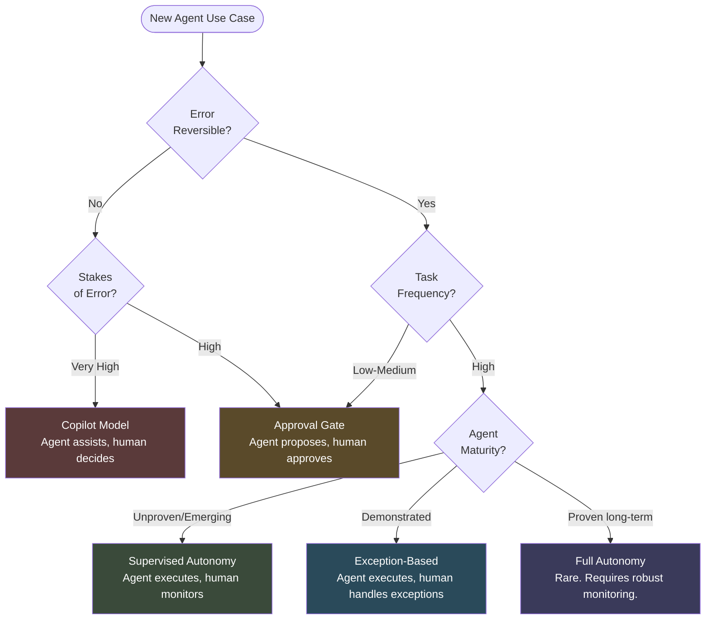

# Human-Agent Collaboration

The wrong question organizations ask when designing agentic systems is: "What should we automate?"

That framing assumes a binary: either humans do the task or agents do. It leads to agent deployments that are either under-scoped (the agent just suggests things humans already knew) or over-scoped (the agent acts autonomously in situations that require human judgment, and makes expensive mistakes).

The right question is: "What combination of human judgment and agent execution produces the best outcome for this task?"

That is a design question, not a deployment question. The answer depends on the nature of the task, the consequences of errors, and the operating context. Getting it right requires a framework.

---

## Five Collaboration Patterns

### 1. Agent Assists, Human Decides (Copilot Model)

The agent provides analysis, drafts, recommendations, or research. A human reviews everything and makes all decisions and actions.

**When to use:** High-stakes decisions where the cost of an error is significant. Novel situations where the agent lacks sufficient context. Decisions with reputational or legal exposure. Early-stage trust-building when you do not yet have confidence in agent reliability for a given task type.

**Examples:** Contract review where a lawyer makes the final call. Investment recommendations where a portfolio manager decides. Medical diagnosis support where a clinician interprets and acts.

**Risk:** Human review becomes rubber-stamping if the agent is consistently right. Automation bias sets in and the "human decides" becomes nominal.

---

### 2. Agent Proposes, Human Approves (Approval Gate)

The agent proposes a course of action and does not execute until a human explicitly approves. The agent may prepare everything needed for execution: drafts written, parameters set, systems ready. Approval triggers execution.

**When to use:** Consequential but well-understood decisions. Actions that are difficult but not impossible to reverse. Situations where the value is in agent preparation, not agent decision-making.

**Examples:** Procurement orders above a threshold requiring manager approval. Customer communications drafted by an agent and sent only after marketing review. Code changes proposed by an agent and deployed only after engineer sign-off.

**Risk:** Approval fatigue. If every agent action requires approval, the human becomes a bottleneck and the agent provides little efficiency gain. Approval gates work only when they are selective.

---

### 3. Agent Executes, Human Monitors (Supervised Autonomy)

The agent acts. Humans watch dashboards, review logs, and intervene when something looks wrong. Intervention capability is present and accessible, but not the default state.

**When to use:** High-volume, repetitive tasks where errors are detectable and correctable before material harm. Processes where human review of every action is cost-prohibitive. Mature deployments with demonstrated reliability.

**Examples:** Customer service agents handling routine inquiries with human supervisors monitoring for escalation patterns. Document processing agents with human QA sampling. Scheduling and logistics optimization running autonomously with operations staff on alert.

**Risk:** Alert fatigue. Humans stop paying attention. By the time they notice a problem, the agent has propagated the error across thousands of cases.

---

### 4. Agent Executes, Human Handles Exceptions (Exception-Based)

The agent handles the normal case autonomously. When it encounters something outside its confidence or authorization boundary, it escalates to a human. Humans are not monitoring continuously; they are on-call for exceptions.

**When to use:** Well-defined tasks with a clear exception boundary. High-volume workflows where the exception rate is low. Situations where the cost of human monitoring exceeds the value in the normal case.

**Examples:** Accounts payable processing where the agent handles standard invoices and escalates anomalies. IT ticket triage where the agent resolves L1 issues and routes complex cases to engineers. Onboarding workflows where the agent completes standard steps and flags non-standard situations.

**Risk:** Exception boundaries erode. Agents either escalate too much (defeating the efficiency gain) or too little (hiding problems that humans should see). Exception handling requires ongoing calibration.

---

### 5. Agent Executes Autonomously (Full Autonomy)

No human in the loop. The agent acts, completes tasks, and reports results. Human involvement is retrospective (reviewing logs, auditing outcomes) rather than prospective (approving or monitoring).

**When to use:** Rarely. Appropriate only for well-bounded, reversible, low-stakes tasks with mature agents that have demonstrated high reliability. Requires robust monitoring and rollback capability even if humans are not actively watching.

**Examples:** Automated data pipeline maintenance. Log analysis and alert generation. Routine database optimization. Infrastructure scaling in response to load.

**Risk:** Everything. This pattern should be the end state of a maturation journey, not the starting point. Deploying full autonomy before establishing reliability is how organizations create expensive, embarrassing failures.

:::warning
**The Full Autonomy Trap**

Full autonomy is the pattern most commonly pitched in agent demos and the pattern most commonly deployed prematurely. Requiring no human oversight is a feature of a well-matured system, not a design choice for a new one. Start with supervised autonomy at minimum.
:::

---

## Choosing the Right Pattern

Use this decision matrix to map task characteristics to collaboration patterns.

| Task Characteristic | Copilot | Approval Gate | Supervised Autonomy | Exception-Based | Full Autonomy |
|---|---|---|---|---|---|
| **Error reversibility** | Low (hard to reverse) | Medium | Medium-High | High | High |
| **Stakes of error** | Very high | High | Medium | Low-Medium | Low |
| **Task frequency** | Low | Medium | High | Very high | Very high |
| **Agent reliability** | Unproven | Emerging | Demonstrated | Mature | Proven, long track record |
| **Regulatory exposure** | High | Medium-High | Medium | Low | Very low |
| **Task novelty** | High | Medium | Low | Low | Very low |

The goal is to move tasks rightward over time as agent reliability is demonstrated and trust is established. A task that starts in the copilot model can migrate to approval-gate, then supervised autonomy, as the agent proves itself.

:::insight
**Pattern Migration**

Define explicit criteria for moving a task from one collaboration pattern to the next. What reliability rate, over what time period, with what audit coverage, justifies moving from approval-gate to supervised autonomy? Those criteria should be documented and reviewed by your governance team, not decided ad hoc.
:::

---

## The Mermaid Diagram: Collaboration Pattern Selection

---

## The Trust Calibration Problem

One of the most persistent challenges in human-agent collaboration is that humans are poor at calibrating trust in systems they do not fully understand.

The two failure modes are common and opposite:

**Over-trust:** Humans accept agent outputs without scrutiny. Automation bias sets in. The "human in the loop" becomes a rubber stamp. Errors propagate because no one catches them.

**Under-trust:** Humans second-guess agent outputs even when the agent is demonstrably more accurate than the human alternative. The efficiency gain evaporates. Teams revert to manual processes and report that "the AI doesn't work."

Neither is correct calibration. The goal is trust proportional to demonstrated reliability in a specific domain, for a specific task type, over a meaningful sample of cases.

Correct calibration requires:

- Visible track records. Users need to see how often the agent is right and wrong, not just be told it is "accurate."
- Clear exception signals. Agents should communicate their own uncertainty. "I am confident in this" and "I am uncertain, please review" are different outputs that should be designed explicitly.
- Gradual exposure. Users who see agents get easy cases right before handling hard cases develop better-calibrated trust than those who are handed full autonomy from day one.

---

## The Moderna Reference: Structural Redesign Around Collaboration

Moderna's decision to create a combined Chief People and Digital Technology Officer role is not primarily a story about efficiency. It is a story about recognizing that workforce design and technology design are the same problem when agents are involved.

You cannot design how agents and humans collaborate if the people accountable for your workforce and the people accountable for your technology stack are optimizing independently. The seam between those two functions is exactly where collaboration patterns break down.

Organizations that keep HR and technology in separate silos will design agent systems in one room and workforce structures in another, and then wonder why the two do not fit together.

---

## What Is Coming

By 2028, **15% of day-to-day work decisions will be made autonomously by agents** without human review (Gartner, 2025). That is not a distant projection. It is three years out.

The organizations that will handle that well are the ones building the collaboration infrastructure now: defining patterns, establishing trust criteria, designing exception boundaries, and creating the governance mechanisms that make autonomous decision-making auditable.

The organizations that will struggle are the ones treating collaboration patterns as implementation details to be figured out later.

Human-agent collaboration is a design discipline. It requires the same intentionality as user experience design, system architecture, or process engineering. Treat it that way.

---

## Sources

1. Gartner. "Identifies Critical GenAI Blind Spots That CIOs Must Urgently Address." November 2025.

For the complete source list and methodology, see [Sources & Methodology](../sources.md).
