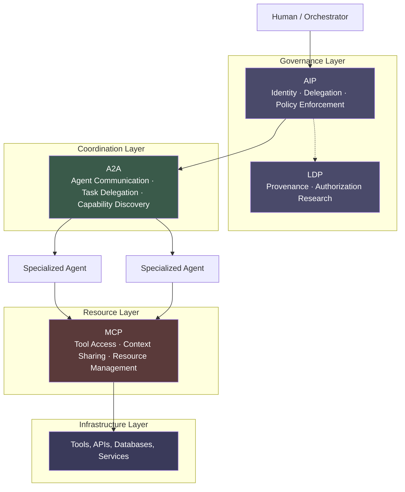

# Protocol Landscape

Multi-agent systems without protocols are point-to-point integrations at scale. Every agent talks to every other agent in a custom, undocumented, unauditable way. That is not an architecture. That is technical debt accumulating at the speed of your development team.

Protocols give multi-agent systems the same thing HTTP gave the web: a shared language that lets independently built components compose without requiring prior coordination. Enterprises that adopt protocol standards early will have infrastructure that is vendor-portable, auditable, and interoperable. Those that build proprietary integration layers will rebuild everything when they change vendors.

---

## The Emerging Protocol Stack

Four protocols have emerged as the foundation of enterprise multi-agent infrastructure. They are complementary, not competing.

### MCP: Model Context Protocol

Developed by Anthropic and now broadly adopted, MCP defines how agents access tools and share context. It is the interface layer between an agent and the resources it needs: databases, APIs, file systems, code execution environments.

**What MCP handles:**
- Tool discovery and invocation
- Context window management across tool calls
- Structured resource access with defined permissions
- Consistent interface regardless of underlying tool implementation

**Why it matters for enterprises:** Without a standard like MCP, every agent-to-tool integration is a custom implementation. MCP makes tools pluggable. You build a tool once with an MCP interface, and any MCP-compatible agent can use it. That is infrastructure leverage.

### A2A: Agent-to-Agent Protocol

Developed by Google and supported by a growing ecosystem, A2A defines how agents communicate with each other, delegate tasks, and coordinate on multi-step workflows.

**What A2A handles:**
- Task delegation between agents
- Capability discovery (what can this agent do?)
- Status reporting and handoff
- Structured communication between heterogeneous agent systems

**Why it matters for enterprises:** Complex workflows involve multiple agents with specialized capabilities. A2A means your orchestration agent does not need to be built by the same team as your execution agents. It enables composition across independently developed systems, which is how large organizations actually build software.

### AIP: Agent Identity Protocol

[AIP](https://sunilprakash.com/aip/) addresses a question MCP and A2A intentionally leave open: when an agent calls a tool or hands a task to another agent, who is acting, with what authority, and how is that authority verified at the boundary. The protocol defines signed identity tokens for agents, cryptographically chained delegation, scoped attenuation as authority moves down the chain, and policy verification at hook boundaries in the runtime.

**What AIP handles:**
- Signed agent identity tokens with explicit issuer, subject, and scope
- Delegation chains that cryptographically bind each handoff to its predecessor
- Scoped attenuation, so a delegated agent cannot widen the authority it received
- Hook-level policy verification inside the agent runtime, before a tool call or task handoff executes
- A2A task verification middleware that validates the inbound identity and chain on every received task

**Why it matters for enterprises:** Regulators, internal audit, and risk functions all need to answer the same question: who authorized this action, and what was the chain of authority behind it. AIP makes that question answerable with cryptographic evidence rather than log archaeology. It also removes the need for bilateral pre-coordination between agent systems. Two agents from different teams, or different vendors, can establish trust through a verifiable chain rather than through a private contract negotiated in advance.

**How AIP composes with MCP and A2A:** The three protocols sit at different layers and are designed to compose, not compete. MCP defines the tool and resource interface. A2A defines the agent-to-agent task interface. AIP defines the identity and policy layer that runs underneath both. An agent issuing an MCP tool call carries an AIP identity that the runtime can verify before the call reaches the tool. An agent sending an A2A task attaches a delegation chain that the receiving agent's middleware verifies before accepting the work. Identity and policy are concerns AIP handles once, instead of being re-invented inside each protocol.

**Implementation maturity:** Reference implementations exist across the major agent ecosystems. Python (`aip-core`, `aip-agents`), Rust (the `aip` crate), and TypeScript (`@aip-sdk/*`) cover the SDK surface. An OpenClaw plugin and a Claude Code plugin demonstrate the hook-level policy verification model inside real agent runtimes. A separate policy gateway (`aip-gateway`) acts as a drop-in MCP and A2A proxy that enforces YAML-defined policy, which is the pattern most useful for retrofitting existing deployments without changing application code.

**Standards path:** AIP is on the IETF draft track (the `draft-prakash-aip-NN` series), with the specification developed in the open. That matters for enterprise adoption because the identity and authorization layer for autonomous systems is the part of the stack least tolerable as a proprietary dependency. An identity protocol that one vendor controls is not a trust layer; it is a single point of failure.

### LDP: LLM Delegate Protocol

LDP addresses the governance layer that MCP and A2A leave open: identity, authorization, and provenance in multi-agent systems. When Agent A delegates a task to Agent B, and Agent B calls a tool, the audit trail needs to answer: who authorized this action, under what conditions, and what is the chain of delegation that led here?

**What LDP handles:**
- Cryptographically verifiable delegation chains
- Agent identity and authorization scope
- Provenance tracking for actions taken by autonomous systems
- Governance-compatible audit trails

**Why it matters for enterprises:** Regulators do not accept "the agent did it" as an explanation. LDP makes the delegation chain auditable and verifiable. For regulated industries, this is not optional infrastructure. It is a compliance requirement dressed in technical clothing.

:::insight
**LDP Research Background**

LDP originated from academic research on the provenance paradox in multi-agent systems: the challenge of maintaining meaningful human accountability when chains of agent delegation obscure who authorized what. See: arXiv:2603.08852 (protocol) and arXiv:2603.18043 (provenance paradox).
:::

---

## How the Protocols Compose

These protocols operate at different layers of the stack. They are designed to work together.

**Reading the diagram:**

- A human or orchestrating system initiates a workflow. AIP attaches a signed identity and a scoped delegation to that initiation.
- A2A handles the coordination between agents: who does what, in what sequence, with what handoff conditions. Each handoff carries the AIP chain forward.
- MCP handles each agent's access to the tools and data it needs to execute. Each tool call carries the AIP identity that the runtime can verify at the hook boundary.
- LDP sits alongside AIP at the governance layer as the research foundation on provenance and authorization in multi-agent systems.
- Every layer is observable, auditable, and standards-compliant.

This composition gives you a multi-agent system where every action is attributable, every delegation is authorized, and every tool call is mediated through a defined interface.

---

## Why Protocol Choice Has Strategic Consequences

### Interoperability

Proprietary agent-to-agent communication locks you into a single vendor's ecosystem. When you need to swap a model provider, integrate an acquired company's agent infrastructure, or adopt a new specialized tool, proprietary protocols make every integration a bespoke project.

Standard protocols make your infrastructure composable by default.

### Vendor Independence

The AI vendor landscape is moving fast. The model that is best for your use case today may not be best in eighteen months. Organizations that build on standard protocols can swap components without rebuilding orchestration layers.

This is not theoretical. Organizations that built deeply proprietary RAG pipelines in 2023 are now rebuilding them to be model-agnostic.

### Audit Trails

In regulated environments, audit trails are non-negotiable. Standard protocols, especially AIP, are designed with auditability as a first-class concern. The delegation chain is the audit trail. Proprietary systems require custom audit infrastructure built on top of an opaque foundation.

:::warning
**The Proprietary Lock-In Risk**

Several major platform vendors are offering "managed agent orchestration" with proprietary communication protocols. The switching cost of these platforms is the entire multi-agent infrastructure you build on them. Evaluate carefully before committing.
:::

---

## The Integration Question

The practical question for most enterprises is not which protocol to adopt in isolation. It is how to introduce protocol-aware infrastructure into an existing technology estate.

Most organizations will start with MCP because tool access is the immediate need. A2A becomes relevant when you have multiple agents coordinating on complex tasks. AIP and LDP become non-negotiable when you need to answer regulators, auditors, or executives about who authorized an action taken by an autonomous system, and the audit trail needs to be cryptographically verifiable rather than reconstructed from logs.

The sequencing typically looks like this:

1. **MCP first:** Standardize tool access for your first agent deployments. Build your tool library against MCP interfaces from day one.
2. **A2A when coordinating:** As you build workflows that span multiple specialized agents, adopt A2A for coordination rather than building custom orchestration.
3. **AIP from the start for regulated workloads:** Identity, delegation, and policy enforcement are the parts of the stack that are most expensive to retrofit. Introduce signed identity and verifiable delegation chains before the first production agent ships, not after. A policy gateway in front of existing MCP and A2A endpoints is the lowest-friction starting point.

---

## What Enterprises Should Do Now

**Adopt standards early.** The protocols described here are not speculative. They have production implementations, active development communities, and growing enterprise adoption. Early adoption means your infrastructure is forward-compatible.

**Audit your current agent builds for protocol alignment.** If you have agents in production or pilots underway, map what protocols they use for tool access, coordination, and governance. Identify where proprietary dependencies exist and assess the switching cost.

**Build protocol-aware infrastructure.** Your developer platforms, CI/CD pipelines, and monitoring infrastructure should be designed to work with these protocols natively, not as afterthoughts.

**Require protocol compliance in vendor evaluations.** When evaluating agent platforms, orchestration tools, or managed agent services, require MCP compatibility, A2A support, AIP-compatible identity and delegation, and audit trails that preserve the delegation chain. Vendors who resist this are selling proprietary lock-in.

The protocol layer is boring infrastructure work. It is also the foundation that determines whether your multi-agent architecture is maintainable, auditable, and vendor-portable five years from now.
