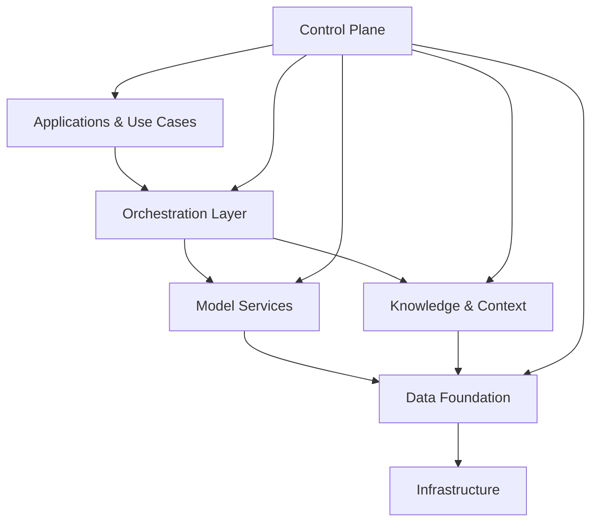

# Enterprise AI Target Architecture

Transformation eventually becomes a design problem. Strategy tells you what to change. Architecture tells you what to build.

Most AI transformation programs stall not because the strategy is wrong but because there is nothing coherent to build toward. Teams make local decisions, vendors fill gaps with point solutions, and the result is a collection of AI components with no operating logic holding them together. Architecture is what prevents that outcome. Not a vendor diagram. A capability and control architecture that defines what the enterprise AI operating system looks like and how its layers relate.

## The Full Stack

The stack reads top to bottom as delivery and bottom to top as dependency. The Control Plane is not a layer in the sequence. It is the governance and observability surface across all layers.

## What This Section Covers

**[Capability Stack](capability-stack.md)** — What each layer does, who owns it, and what goes wrong without it.

**[Systems Model](systems-model.md)** — Four enterprise systems (Record, Engagement, Intelligence, Action) and why the architecture challenge is integration between them, not intelligence alone.

**[Control Architecture](control-architecture.md)** — The technical control plane: identity, entitlements, audit, policy enforcement, human override, and observability.

**[Operating Architecture](operating-architecture.md)** — Team structure and decision ownership: platform teams, domain AI teams, governance function, production support, and incident ownership.

**[Reference Patterns](reference-patterns.md)** — Four deployment patterns (assistive, workflow automation, agentic, regulated human-in-loop) with their control requirements and maturity thresholds.

---

:::note
**Data Architecture**

For a comprehensive treatment of enterprise data architecture including data products, mesh patterns, quality frameworks, and platform design, see [Enterprise Data Architecture](https://sunilprakash.com/enterprise-data-architecture/).
:::
