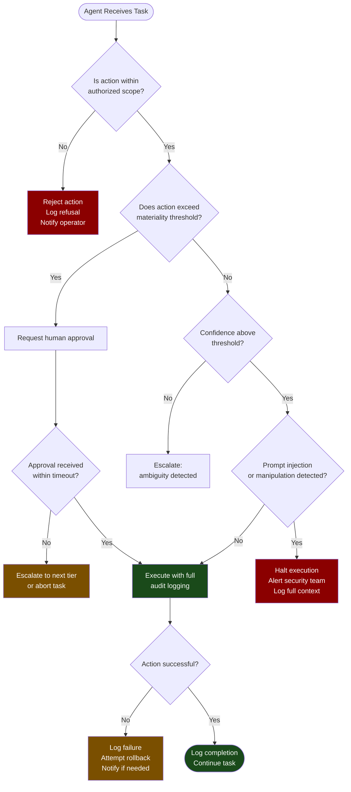

# Agent Governance

Only 21% of organizations have mature governance for autonomous agents (Deloitte, 2026). Meanwhile, 75% plan to deploy agents within two years. That combination describes the clearest governance crisis in enterprise AI right now.

The urgency is already validating. 51% of organizations report negative AI incidents, including unauthorized actions by AI systems (McKinsey, 2025). These are not edge cases. They are early signals of a category of risk that most governance frameworks are not built to handle.

## Why Agents Are Categorically Different

Every governance framework built for predictive ML or assistive GenAI rests on one assumption: the model makes recommendations, humans make decisions.

Agents break that assumption by design.

An agent does not recommend that you send an email. It sends the email. It does not suggest a code change. It opens a pull request, adds reviewers, and waits for CI to pass. It does not propose a database query. It executes the query, reads the result, and acts on it.

The shift from recommendation to action changes the risk profile entirely. A bad recommendation from a traditional model is caught at the human decision point. A bad action from an agent is already in the world before anyone reviews it. The blast radius of an error is no longer bounded by human approval latency.

This is not a reason to avoid agents. Agents are where the highest-leverage enterprise AI value lives. But it is a categorical reason to govern them differently.

:::warning
**The Action-Recommendation Gap**

Governance frameworks designed for assistive AI (chatbots, copilots, summarizers) do not transfer to agentic AI. Applying the same oversight model to both is the primary source of the agent governance crisis. An agent with the governance model of a chatbot is a system that can take real-world actions with no meaningful human checkpoint.
:::

## The Agent Governance Framework

Effective agent governance requires six distinct controls. Each addresses a specific failure mode that emerges when software takes real-world actions autonomously.

### 1. Authorization: What Actions Can Agents Take Without Human Approval?

Authorization is the foundation. Before an agent is deployed, its action space must be explicitly defined and bounded.

This means specifying:

- **Permitted actions**: what the agent can do without asking (read files, call approved APIs, generate drafts)
- **Restricted actions**: what the agent must request approval for before doing (send external communications, modify production data, make purchases)
- **Prohibited actions**: what the agent can never do regardless of instruction (access systems outside its designated scope, escalate its own permissions, disable its own monitoring)

The default posture must be: deny unless explicitly permitted. An agent should not be able to do something simply because it has not been told not to. Allowlists, not blocklists.

| Action Category | Examples | Governance Requirement |
|---|---|---|
| Read-only data access | Query internal databases, read documents | Permitted within defined namespaces |
| External API calls | Weather, public search, approved third-party services | Permitted for pre-approved APIs only |
| Internal communications | Slack messages, calendar invites to existing attendees | Requires human review for external recipients |
| Data modification | Update records, write to databases | Requires explicit authorization per action type |
| External communications | Email to customers, vendor communications | Requires human approval before send |
| Financial actions | Purchase orders, contract execution | Requires human approval above defined threshold |
| System access changes | Permission modifications, new service accounts | Prohibited without explicit human request |

### 2. Escalation: What Triggers Handoff to Human Judgment?

Even within its authorized action space, an agent will encounter situations where it should stop and ask. The escalation framework defines these triggers explicitly.

Escalation triggers should include:

- **Confidence threshold**: the agent's confidence in the correct action falls below a defined level
- **Novel situation**: the situation does not match patterns in the agent's training or instructions
- **High-stakes action**: the action has consequences that exceed a defined materiality threshold (financial impact, customer-facing communication, irreversible data changes)
- **Ambiguous instruction**: the agent receives instructions that conflict with its authorization policy
- **Detected manipulation**: the agent detects signs of prompt injection or instruction override attempts

Escalation must be fast enough to be useful. An escalation path that takes 24 hours to resolve makes agents unusable for time-sensitive tasks. Build tiered escalation: first to an immediate supervisor or product owner, then to a governance body for systemic issues.

### 3. Audit Trails: What Record Exists of Agent Decisions and Actions?

An agent operating without a complete audit trail is ungovernable. When something goes wrong, you need to be able to reconstruct exactly what the agent did, why it did it, and what inputs led to that decision.

The audit trail must be:

- **Immutable**: agents cannot modify or delete their own audit logs
- **Complete**: every action, tool call, external API call, data access, and decision branch is recorded
- **Timestamped**: actions are recorded with enough precision to reconstruct the sequence
- **Contextual**: the audit trail includes the instructions the agent received and the reasoning it produced, not just the outputs
- **Queryable**: the audit trail can be searched and analyzed, not just stored

:::warning
**Logs Are Not Audit Trails**

Application logs record what happened. Audit trails record what happened, why, under what instructions, and with what decision logic. For regulatory compliance and incident investigation, the difference is significant. Design agent audit trails explicitly; do not assume standard application logging covers the requirement.
:::

### 4. Incident Response: What Happens When an Agent Takes Unauthorized Action?

Unauthorized agent actions will occur. The question is not whether to prepare for them but how fast you can contain and recover.

The incident response playbook for agents must address:

- **Detection**: how do you know an unauthorized action occurred? Automated monitoring, user reports, or audit trail review?
- **Containment**: how do you stop further actions immediately? Every agent needs a kill switch that halts all actions without requiring system-wide downtime.
- **Rollback**: which actions can be reversed, and what is the process? Data modifications, sent emails, and executed transactions have different rollback characteristics.
- **Notification**: who is notified when an unauthorized action occurs, and on what timeline? Regulatory requirements may mandate customer or authority notification.
- **Root cause**: after containment, what investigation process determines what happened and why?
- **Policy update**: how does the incident inform changes to the authorization framework?

The kill switch is non-negotiable. Every deployed agent must have a mechanism that halts its action execution immediately, without requiring code deployment. This should be a first-class operational capability, tested regularly.

### 5. Trust Boundaries: Which Agents Can Access Which Data and Systems?

Agents should operate with least-privilege access. An agent designed to manage calendar scheduling should not have access to financial systems. An agent processing customer support tickets should not have access to internal engineering systems.

Trust boundaries operate at two levels:

**Data boundaries**: define which data namespaces the agent can read from and write to. Enforce this at the infrastructure level, not just in the agent's instructions. An agent that has been instructed not to access HR data but technically has credentials to do so is not governed. The access must be technically impossible, not just discouraged.

**System boundaries**: define which tools, APIs, and systems the agent can call. Use a capability allowlist enforced by the agent runtime, not by the agent's own judgment about what it should do.

:::insight
**Multi-Agent Trust Amplification**

In multi-agent systems, trust boundaries compound. If Agent A can instruct Agent B, Agent B's action space becomes Agent A's effective action space. Governance must address the full agent graph, not just individual agents. An orchestrator agent with broad permissions that can spawn sub-agents with additional permissions creates a privilege escalation path.
:::

### 6. Cost Controls: Runtime Budget Enforcement

Autonomous agents can consume API credits, compute, and external service quotas at rates no human operator would. Without runtime cost controls, an agent loop error can generate thousands of API calls in minutes.

Cost controls must be enforced at runtime, not just as suggested limits in the system prompt:

- **Per-session budget**: maximum spend or API calls per agent session
- **Per-task budget**: maximum spend for a single task or subtask
- **Time-box limits**: maximum runtime for any single agent execution
- **Rate limits**: maximum actions per minute or hour to prevent runaway loops
- **Anomaly detection**: automated alerts when consumption deviates significantly from baseline

These are not nice-to-haves. A production agent system without runtime cost controls has experienced a runaway cost incident or will.

## Authorization and Escalation Flow

The decision logic for every agent action should follow a structured authorization and escalation path:

## Governance Maturity Levels

The 79% of organizations without mature agent governance are not at zero. They are at different stages of the maturity curve. Understanding where you are determines what to build first.

| Maturity Level | Characteristics | Priority Action |
|---|---|---|
| Level 1: Ad hoc | No defined authorization scope; governance applied retroactively if at all | Define authorization framework and audit trail requirements before next deployment |
| Level 2: Defined | Authorization policies exist; not technically enforced; audit trails incomplete | Implement technical enforcement of access controls and kill-switch capability |
| Level 3: Managed | Authorization technically enforced; audit trails complete; no escalation framework | Build escalation paths and incident response playbooks |
| Level 4: Measured | Full controls in place; monitored continuously; incident response tested | Extend to multi-agent governance and trust boundary management |
| Level 5: Optimized | Governance embedded in agent development lifecycle; continuous improvement | Industry leadership position; focus on emerging agent capabilities |

## Getting Started

The gap between 21% mature and the 75% planning deployment will not close by the time those deployments arrive. That is the governance crisis in concrete terms.

For organizations planning agent deployment in the next 12 months, the minimum viable governance posture is:

1. Define and technically enforce the authorization scope for every agent before deployment
2. Implement a kill switch and test it
3. Build an audit trail that captures inputs, reasoning, and actions
4. Define the escalation path for high-stakes and ambiguous situations
5. Set runtime cost controls enforced at the infrastructure level

That is not the complete framework. It is the floor below which no agent should be deployed in a production environment.

---

## Sources

1. Deloitte. "State of AI in the Enterprise, 7th Edition." March 2026.
2. McKinsey & Company. "The State of AI in 2025: Agents, Innovation, and Transformation." 2025.

For the complete source list and methodology, see [Sources & Methodology](../sources.md).
