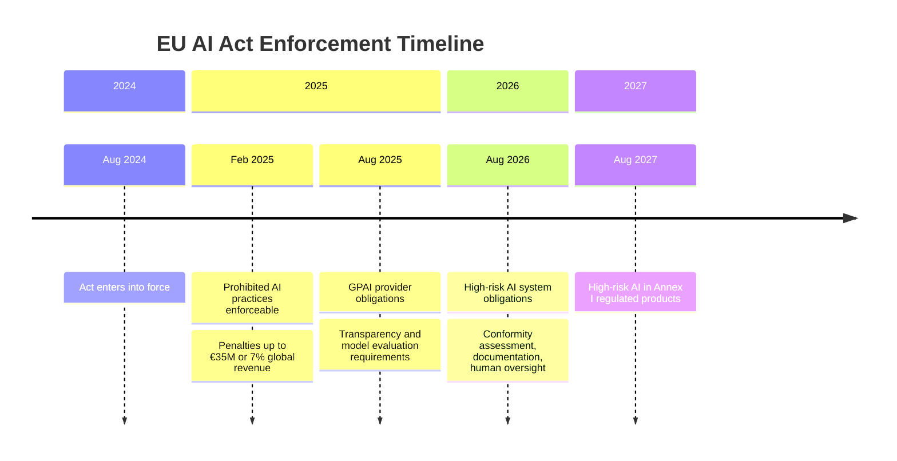

# Regulatory Readiness

The regulatory environment for enterprise AI has moved from theoretical to enforceable. The EU AI Act is the clearest signal, but it is not the only one. Every major economy is building AI-specific regulatory obligations, and the window between "we are working on compliance" and "we are out of compliance" is closing.

Most enterprises are not ready. The most telling indicator: most organizations cannot produce a complete inventory of what AI systems they have running in production right now. That is the starting point for every AI regulatory framework. Organizations that cannot answer the inventory question cannot demonstrate compliance with any of the frameworks that follow from it.

## EU AI Act: The Timeline That Is Already Running

The EU AI Act is not a future obligation. It has been phasing into force since 2024, and the enforcement timelines are structured so that the heaviest obligations arrive last, after organizations have had time to prepare. Most organizations are using that time poorly.

### What Is Already Enforceable

Since February 2025, the prohibited AI practices provisions are enforceable. Penalties reach up to €35 million or 7% of global annual revenue, whichever is higher.

Prohibited practices include:

- Subliminal manipulation of behavior that causes or is likely to cause harm
- Exploitation of vulnerabilities of specific groups (children, persons with disabilities)
- Social scoring by public authorities
- Real-time biometric identification in public spaces by law enforcement (with narrow exceptions)
- Emotion recognition in workplaces and educational institutions
- Biometric categorization from sensitive characteristics

If your organization operates AI systems that touch any of these categories, the review should have already happened.

### GPAI Provider Obligations (August 2025)

General-purpose AI model providers face specific obligations around transparency, capability evaluations, and systemic risk assessment. Organizations deploying GPAI models (GPT-4, Claude, Gemini, and equivalents) need to understand their obligations both as deployers and, if they fine-tune or distribute models, potentially as providers.

### High-Risk AI Obligations (August 2026)

The high-risk provisions are the most operationally demanding. High-risk AI systems include AI used in:

- Critical infrastructure management
- Education and vocational training
- Employment, worker management, and access to self-employment
- Essential private and public services (credit scoring, insurance)
- Law enforcement
- Migration, asylum, and border control
- Administration of justice

If you operate in any of these domains, the August 2026 deadline requires:

- A comprehensive risk management system
- Data governance documentation
- Technical documentation meeting AI Act standards (significantly more detailed than standard software documentation)
- Logging and audit trail capabilities
- Transparency and instructions for users
- Human oversight mechanisms
- Accuracy, robustness, and cybersecurity standards

:::warning
**Standard Software Documentation Fails the AI Act Test**

The technical documentation requirements in the EU AI Act are materially different from standard software documentation. They require documentation of the training data, the development methodology, the intended purpose and foreseeable misuse cases, the performance metrics across different populations, and the monitoring approach post-deployment. Most enterprises have none of this for AI systems they deployed two years ago. The documentation gap is the most common audit failure point.
:::

## Compliance Readiness Checklist

The following checklist covers the minimum readiness requirements for organizations subject to the EU AI Act. It is not a substitute for legal review; it is a starting point for the internal assessment.

### Foundation: AI System Inventory

- [ ] Maintain a complete, current inventory of all AI systems in production
- [ ] Classify each system by EU AI Act risk category (unacceptable, high-risk, limited risk, minimal risk)
- [ ] Document the intended purpose, inputs, outputs, and decision scope for each system
- [ ] Identify which systems are covered by existing sector-specific regulation (financial services, medical devices, etc.)
- [ ] Assign accountability owners for each high-risk or prohibited-practice-adjacent system

### Prohibited Practices Review

- [ ] Audit all AI systems for proximity to prohibited practice categories
- [ ] Obtain legal opinion on any system operating in ambiguous territory
- [ ] Document the review and conclusions for each system reviewed

### High-Risk System Requirements (for systems meeting the threshold)

- [ ] Risk management system implemented and documented
- [ ] Technical documentation meeting AI Act Annex IV standards produced
- [ ] Training data documented: sources, curation process, known limitations
- [ ] Human oversight mechanisms implemented and tested
- [ ] Logging and audit trail capabilities operational
- [ ] Accuracy and performance metrics documented across relevant demographic groups
- [ ] Conformity assessment completed (internal or third-party, depending on category)
- [ ] Register entry submitted to EU database (required for certain high-risk categories)

### GPAI Usage

- [ ] Identified all GPAI model deployments in your environment
- [ ] Reviewed vendor compliance documentation for GPAI providers you use
- [ ] Assessed your obligations as a deployer vs. a provider (if fine-tuning or distributing)

### Ongoing Operations

- [ ] Incident monitoring and reporting process defined
- [ ] Post-market monitoring plan in place for high-risk systems
- [ ] Governance process for new AI system deployment reviews Act classification before deployment

## Data Sovereignty: The Emerging Parallel Obligation

The EU AI Act is one dimension of regulatory pressure. Data sovereignty is a parallel and rapidly growing dimension.

A significant share of enterprises are building AI stacks that favor local or regional vendors, driven by regulatory and sovereignty concerns. Vendor country-of-origin is now a factor in infrastructure selection decisions for a majority of enterprise AI decision-makers, according to survey data from Deloitte (2024). Gartner projected in 2024 that by 2028, a majority of national governments will have introduced explicit technological sovereignty requirements -- the trend is directionally clear even where exact figures vary by survey methodology.

This is not just European. It spans every major economy:

| Region | Sovereignty Concern | Current Mechanism |
|---|---|---|
| European Union | Data localization, processing restrictions | GDPR, Data Act, AI Act, proposed Data Sovereignty requirements |
| United States | Supply chain security, foreign adversary access | CLOUD Act, FedRAMP, executive orders on AI |
| China | Data localization, algorithmic regulation | PIPL, Algorithm Recommendation Regulation, Generative AI Measures |
| India | Data localization, model fine-tuning on Indian data | Digital Personal Data Protection Act, forthcoming AI policy |
| Saudi Arabia / UAE | Strategic autonomy, domestic AI investment | National AI strategies, data residency requirements |

For enterprise AI architects, sovereignty requirements translate directly into infrastructure decisions: where data is stored, where models run, which vendors can be in the stack, and what contractual data handling commitments are required.

:::insight
**Sovereignty Is an Infrastructure Decision Made Early**

Retrofitting data sovereignty requirements onto an AI stack designed for global cloud convenience is expensive. The decisions about data residency, vendor country-of-origin, and infrastructure geography are made at architecture time. Organizations that have not addressed sovereignty in their AI architecture design are accumulating a debt they will pay when regulations tighten or a specific incident triggers review.
:::

## Global Regulatory Landscape

The EU AI Act gets the most coverage, but enterprise AI operates across multiple jurisdictions with distinct and sometimes conflicting requirements.

### United States

The US does not have a comprehensive federal AI law equivalent to the EU AI Act. The regulatory environment is sector-specific and executive-order-driven. Key elements:

- **Executive Order 14110 (Oct 2023)**: directed NIST to develop AI safety standards, required safety testing reporting for frontier models, initiated sector-specific guidance across federal agencies. Partially rescinded and replaced by subsequent executive orders; the policy environment remains in flux.
- **NIST AI Risk Management Framework (AI RMF)**: voluntary but widely adopted, increasingly referenced in procurement and sector regulation
- **Sector-specific AI regulation**: financial services (OCC, FDIC, Federal Reserve guidance), healthcare (FDA AI/ML action plan), federal contracting (FAR AI provisions)
- **State-level legislation**: Colorado AI Act, California CPPA AI regulations, and active legislation in 30+ states creating a complex compliance patchwork

The US approach favors sector-specific voluntary frameworks over horizontal mandatory regulation, but enforcement actions through existing FTC, CFPB, and EEOC authority are active.

### China

China has moved faster than most jurisdictions on specific AI regulation:

- **Algorithm Recommendation Regulations (2022)**: transparency and user rights requirements for algorithmic recommendation systems
- **Deep Synthesis Regulations (2022)**: labeling requirements for AI-generated content
- **Generative AI Measures (2023)**: content requirements, training data sourcing, and registration for GPAI services

China's AI regulatory framework applies to AI services deployed in China, which creates obligations for multinational organizations.

### United Kingdom

Post-Brexit, the UK has taken a sector-led, voluntary framework approach rather than horizontal legislation:

- The AI Safety Institute focuses on frontier model evaluation
- The 2023 AI White Paper established principles without creating immediate legal obligations
- Sector regulators (FCA, ICO, CMA, Ofcom) are developing sector-specific AI guidance
- The UK has signaled intent to legislate but has not finalized a framework

The UK's approach creates lower immediate compliance burden but higher uncertainty about future requirements.

### Singapore

Singapore has published the Model AI Governance Framework and the AI Verify testing toolkit. Compliance is currently voluntary but the frameworks are technically sophisticated and widely referenced in Asia-Pacific. Singapore is positioning itself as an AI governance laboratory, and enterprise compliance with Singapore frameworks provides useful preparation for stricter requirements elsewhere.

## The Vendor Lock-in Dimension

Regulatory readiness has a strategic dependency that is frequently underestimated: single-vendor AI dependency creates regulatory and strategic risk that cannot be mitigated by governance policies alone.

The risks compound:

**Regulatory arbitrage risk**: if your entire AI stack runs through a single cloud provider or model vendor, that vendor's regulatory standing becomes your regulatory risk. A model ban, a data handling enforcement action, or a sanction against a foreign technology company can make your AI stack non-compliant overnight.

**Data portability risk**: under GDPR, the EU AI Act, and analogous data protection laws, organizations have data portability obligations. If your AI system cannot export its data, models, and logs in a usable format, you may be unable to fulfill these obligations or to migrate to a compliant alternative when required.

**Audit right risk**: AI regulations increasingly require organizations to be able to audit the AI systems they deploy. If you are deploying a black-box model from a vendor that does not provide audit documentation, and a regulator requires an audit, you face a gap you cannot close without vendor cooperation.

**Negotiating leverage**: organizations with multi-vendor AI architectures have leverage to negotiate data handling terms, audit rights, and contract provisions that single-vendor organizations do not. Regulators are increasingly scrutinizing vendor contracts as part of AI governance assessments.

:::warning
**Vendor Contracts Are a Governance Document**

AI vendor contracts are not procurement documents. They are governance documents. The provisions around data handling, model updates, audit rights, indemnification for AI outputs, and exit/portability directly determine your regulatory posture. Legal and compliance must be involved in AI vendor contracting, not just procurement.
:::

The practical implication for AI architecture: design for portability from the start. Use abstraction layers that allow model substitution. Avoid proprietary data formats that cannot be exported. Negotiate explicit audit rights and data handling commitments before signing. These are not theoretical best practices. They are regulatory risk controls.

## Getting Ahead of the Curve

The organizations that will navigate the regulatory environment successfully are not the ones with the best lawyers. They are the ones with the cleanest AI systems: well-documented, well-monitored, with clear accountability chains and technically enforced controls.

There is a real tradeoff between compliance investment now and regulatory risk later. Early compliance is expensive, the regulatory guidance is still maturing in several areas, and there is a genuine risk of investing heavily in the wrong controls before requirements are finalized. Late compliance carries different costs: penalty exposure, forced retrofitting of systems not designed for auditability, and the reputational damage of a public enforcement action. Neither extreme is right. The practical answer is to sequence compliance investment by enforcement date and risk category. The prohibited practices provisions are already enforceable. The high-risk system obligations land in August 2026. Build to those deadlines rather than trying to be comprehensively compliant on day one.

Regulatory readiness is a governance architecture problem. The same investment in AI governance architecture that improves operational performance also produces the documentation, audit trails, and monitoring capabilities that regulators require. These are not separate workstreams.

Start with the inventory. Everything else follows from knowing what you have.

---

## Sources

1. Cloud Security Alliance. "EU AI Act High-Risk Compliance Deadline." March 2026.
2. Deloitte. "State of AI in the Enterprise, 7th Edition." March 2026.
3. Gartner. "Forecasts Worldwide GenAI Spending to Reach $644 Billion in 2025." March 2025.

For the complete source list and methodology, see [Sources & Methodology](../sources.md).
