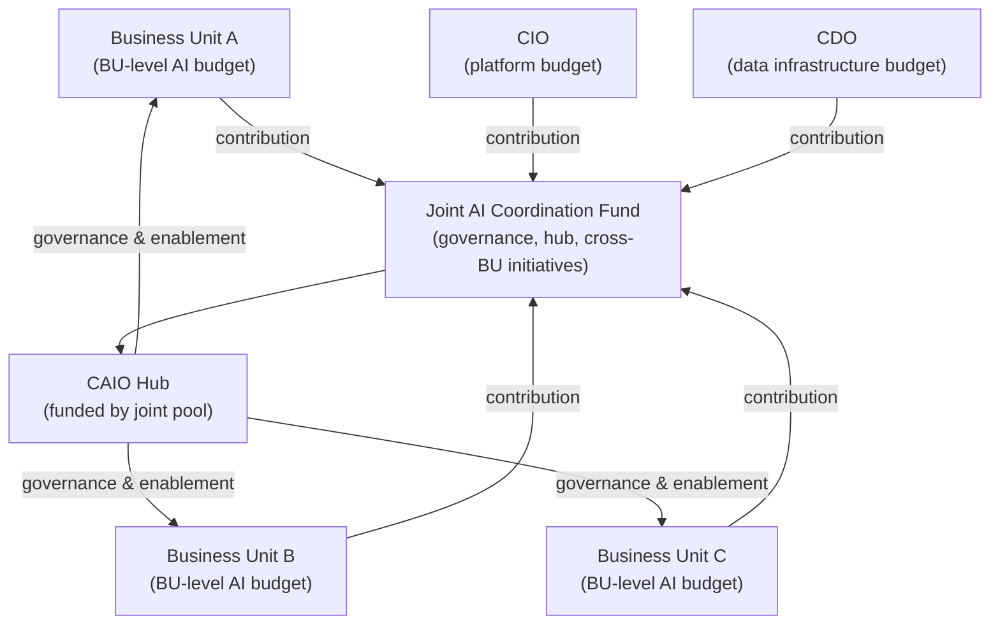

# Cross-Functional Coordination

AI transformation fails most often at the seams between functions, not inside any single function. The technology team builds a platform that the data team cannot feed properly. The governance framework that Legal wants creates a process that business units route around. The workforce plan that CHRO would own is never written because CHRO was not in the room when the AI roadmap was built.

Each function is doing its job. Nobody is coordinating.

This is the problem that cross-functional coordination mechanisms are designed to solve. Not by eliminating functional independence, but by creating explicit structures where the functions that must align actually do.

---

## How Each Function Behaves in Isolation

Understanding the failure modes starts with understanding what each function does when left to its own agenda.

### CIO: Infrastructure and Platforms

The CIO focus is on building and securing the AI infrastructure layer: cloud platform selection, data pipeline architecture, security perimeter, developer tooling, and API governance. The CIO often defines AI success as platform adoption, not business outcome delivery.

The isolation risk: the CIO builds a platform that is technically sound but misaligned with what business units actually need to run AI workloads. Procurement decisions favor enterprise vendors that the CIO already has relationships with. Business units that need to move faster find the platform inadequate and build outside it.

### CDO: Data Quality and Strategy

The CDO focus is on data as an enterprise asset: data quality standards, data governance frameworks, master data management, and analytics infrastructure. The CDO is typically measured on data availability and quality metrics, not on AI outcomes.

The isolation risk: AI models get built on data that the CDO team has not reviewed for suitability. Data governance frameworks designed for analytics do not address AI-specific requirements like training data lineage, feature store management, or model drift monitoring. The CDO is engaged after a model fails due to data quality problems rather than before.

### CAIO: Strategy, Governance, and Portfolio

The CAIO focus is on AI portfolio sequencing, governance standards, model inventory, and cross-functional alignment. The CAIO is in the best position to coordinate but cannot do so without explicit coordination mechanisms and authority.

The isolation risk: the CAIO produces strategy documents and governance frameworks that sit in SharePoint. Without enforcement mechanisms and active coordination structures, the CAIO function is advisory in practice even when it is designed to be accountable.

### Business Units: Vendor Experiments and Shadow AI

Business units are closest to the problems AI can solve and most motivated to move quickly. In the absence of a functioning central process, they sign vendor agreements for AI-enabled SaaS tools, run pilots with minimal oversight, and build local data science capability that duplicates work happening elsewhere.

The isolation risk: 69% of organizations suspect their employees are using prohibited AI tools (IBM IBV, 2025). This is not a security failure. It is a demand signal. Business units are telling the organization that the central process is not meeting their needs. Treating it as a security problem without addressing the underlying demand guarantees continued shadow AI growth.

### Legal and Compliance: Late Engagement, Bottleneck Role

Legal typically engages with AI projects at two points: contract review for vendor agreements and incident response when something goes wrong. Compliance engages for regulated use cases when the business unit remembers to involve them.

The isolation risk: Legal becomes a bottleneck because they see AI risk for the first time during contract review, with no context for what the system does or how it has been governed. Compliance retroactively identifies requirements that require rework. Both functions develop a reputation for slowing AI down, which makes the next business unit less likely to involve them early.

:::warning
**The Late Legal Problem**

Legal that engages late does not have less work. It has harder work. Reviewing a contract for an AI system already in production requires understanding a system that was built without Legal's input, often by a vendor who has already been paid. The cost of retroactive legal review is multiples of the cost of early involvement.
:::

---

### Finance and CFO: Disconnected from AI Measurement

The CFO is responsible for capital allocation and ROI accountability. In most enterprises, the CFO is also the function most skeptical of AI investment claims. The disconnect is structural: AI investment proposals use technology metrics (models deployed, accuracy scores, inference speed), while the CFO needs business metrics (revenue impact, cost reduction, risk reduction, productivity).

The isolation risk: AI investments are approved based on projected ROI that nobody is accountable for measuring. Post-deployment, Finance does not have a framework to assess whether AI investments are performing. The result is a portfolio of AI projects with no financial accountability, which eventually triggers a CFO-led rationalization that kills projects across the board rather than pruning the underperformers.

### CHRO: Absent from AI Planning

This is the most consistent and consequential coordination gap in enterprise AI. Only 46% of organizations integrate workforce planning into their AI roadmaps (IBM IBV, 2025). The CHRO is responsible for the people dimension of the transformation: role redesign, reskilling investment, change management, and workforce planning as AI changes the demand for specific skills.

Without CHRO involvement, AI projects are deployed without considering how they change workflows, what happens to the people whose tasks are automated, and what new skills are required to operate AI-assisted processes. The result is resistance, attrition, and adoption failure that technology teams attribute to "change management problems" rather than to the structural absence of the function that owns change management.

---

## The Coordination Mechanisms That Work

### AI Steering Committee

A standing executive-level committee that meets regularly, owns the AI portfolio roadmap, and makes cross-functional decisions that no single function can make unilaterally. This is not a project review meeting. It is a governance body with decision authority.

Membership: CAIO (chair), CIO, CDO, CISO, CFO, CHRO, General Counsel, and rotating business unit heads. Quorum requirements should be defined. Decisions made by the committee should be binding, with defined escalation to CEO or board for decisions outside committee authority.

Agenda structure: portfolio status and sequencing decisions; risk and incident review; cross-functional blockers; regulatory and policy updates; investment allocation decisions.

Cadence: monthly at minimum for most organizations. Quarterly for mature portfolios with stable governance.

:::insight
**Steering Committee vs. Advisory Council**

The distinction between a governance body with decision authority and an advisory council that reviews and recommends is the most important design decision in setting up the steering committee. Advisory councils feel productive but produce no binding outcomes. Governance bodies require more political will to establish but actually move the organization.
:::

---

### Shared OKRs

Functions that are measured independently will optimize independently. Shared OKRs create a structural reason for coordination by aligning at least some portion of each function's success metrics to shared outcomes.

Effective shared OKRs for AI transformation typically include:

- Time from approved use case to production deployment (measures the end-to-end process that spans multiple functions)
- Percentage of AI portfolio with current model monitoring (requires CIO platform, CAIO standards, and BU engagement)
- AI ROI realization rate (requires Finance measurement, BU execution, and CAIO portfolio management)
- Workforce AI readiness score (requires CHRO engagement and BU adoption)
- Shadow AI reduction rate (measures whether the central process is meeting demand)

The design principle: each shared OKR should be one that no single function can achieve by optimizing alone. If a function can hit its OKR targets without coordinating with others, the OKR is not a coordination mechanism.

---

### Joint Funding Models

Budget structures that keep AI investment entirely within individual function budgets create funding incentives that work against coordination. The CIO funds the platform. The CDO funds data infrastructure. Business units fund their own AI projects. Nobody funds the shared governance work that makes all of it work together.

Joint funding models address this by creating a shared pool, contributed to by multiple functions, that funds the coordination infrastructure: the hub in a hub-and-spoke model, the model inventory tooling, the cross-functional AI team that handles use cases that span multiple business units.

The CFO must be the architect of the joint funding model. Without CFO design and enforcement, the joint pool is raided under budget pressure and the coordination infrastructure is the first thing cut.

---

### Integrated Roadmap

The integrated AI roadmap is a single document that shows the AI portfolio sequencing, the underlying platform and data dependencies, the workforce impact timeline, and the regulatory milestones. It is built by the CAIO with mandatory input from CIO, CDO, CHRO, Legal, and Finance. It is not a CIO technology roadmap with AI use cases appended.

The test of an integrated roadmap: can you look at any use case in the portfolio and immediately see the data dependency it has on CDO infrastructure, the platform capability it requires from CIO, the workforce change it requires from CHRO, and the regulatory review timeline Legal has committed to? If not, the roadmap is not integrated.

Integrated roadmaps require a governance process to maintain. They need a quarterly review cycle, an owner for each dependency row, and a mechanism to surface conflicts between function timelines before they become blockers.

---

## Shadow AI as a Demand Signal

69% of organizations suspect that their employees are using AI tools that are prohibited by policy (IBM IBV, 2025). The instinct is to treat this as a security and compliance problem, to tighten access controls, increase monitoring, and communicate policy more aggressively.

This approach will not work. It does not address the reason employees are using prohibited tools.

Shadow AI is a demand signal. It tells you that the approved tool set does not meet the needs of a significant portion of your workforce. Employees are using prohibited tools because the tools solve real problems that the approved stack does not solve. Blocking access without addressing the underlying need creates resentment and more sophisticated evasion, not compliance.

The correct response has two components. First, treat shadow AI data as product feedback. What tools are being used? For what tasks? By which roles? The answers tell you where the approved AI portfolio has gaps. Second, accelerate the process for evaluating and approving tools that meet the evident demand. If 30% of your workforce is using an unapproved AI writing tool, the right response is to evaluate and approve a compliant alternative, not to declare war on the behavior.

:::note
**Shadow AI Inventory**

The first step in converting shadow AI from a security problem to a demand signal is building an inventory of what is actually in use. Network monitoring, expense report analysis (many employees expense AI subscriptions), and manager surveys can surface the pattern. This inventory is uncomfortable to produce because it often reveals that senior leaders are among the shadow AI users. Produce it anyway.
:::

---

## Coordination Failure Patterns

The mechanisms above are well-understood. Most organizations know they need them. Most organizations do not implement them effectively. The failure patterns are predictable:

**The steering committee that becomes a status meeting.** Membership is high, authority is low, and decisions that require trade-offs are deferred to working groups that never report back. Attendance drops. The CAIO stops surfacing difficult items because they go nowhere.

**Shared OKRs that are shared in name only.** Functions adopt OKRs with the shared label but weight them minimally against individual function targets. No function is willing to sacrifice its core metrics to support a shared metric. The OKRs measure outcomes that happen anyway rather than outcomes that coordination produces.

**Joint funding that disappears under budget pressure.** The joint pool is established in good times and is the first cut when budget cycles tighten. Each contributing function withdraws its contribution and reallocates to internal priorities. The hub loses funding and reduces scope.

**Integrated roadmaps built once and never maintained.** The integrated roadmap is produced as a deliverable for a board presentation. It is not updated when platform timelines slip, data projects are reprioritized, or regulatory deadlines change. Within two quarters it is inaccurate and no function references it.

The pattern across all four failure modes is the same: coordination mechanisms require ongoing executive attention and enforcement. They do not sustain themselves. The CAIO's job is not to build these mechanisms once. It is to run them continuously.

---

## Coordination State Assessment

Use this table to assess the current coordination state of your organization and identify the highest-priority gaps.

| Coordination Area | Healthy Signal | Warning Signal | Failure Signal |
|---|---|---|---|
| CIO-CAIO alignment | Shared platform roadmap with AI priorities | Platform built without AI input | CIO and CAIO have competing platform visions |
| CDO-CAIO alignment | Data requirements built into use case intake | Data issues discovered during model development | Models deployed on unreviewed data |
| Legal engagement timing | Legal in use case intake process | Legal engaged at contract stage | Legal engaged post-deployment |
| Finance integration | AI ROI tracked against projections quarterly | AI ROI not measured systematically | AI investment decisions made without ROI framework |
| CHRO involvement | Workforce impact in every use case plan | CHRO consulted for major use cases only | CHRO not in AI governance structures |
| Shadow AI treatment | Shadow AI inventory used to improve approved stack | Shadow AI monitored but not acted on | Shadow AI treated as pure compliance violation |
| Steering committee | Monthly meetings with binding decisions | Quarterly meetings with recommendations | No standing committee |
| Roadmap integration | Single roadmap with cross-function dependencies | Multiple functional roadmaps with coordination points | No integrated roadmap |

---

---

## Sources

1. IBM Institute for Business Value. "How Chief AI Officers Deliver AI ROI." 2025.

For the complete source list and methodology, see [Sources & Methodology](../sources.md).
