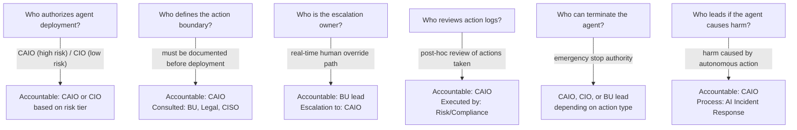

# Decision Rights

Governance frameworks fail most often not because the policies are wrong but because nobody is clearly accountable for enforcing them. Decision rights answer the question every governance framework must answer: who makes which call, and who cannot be overruled?

In AI, this question is harder than it looks. Decisions span technical, commercial, legal, and operational dimensions simultaneously. Multiple functions have legitimate interests in every major decision. Without explicit rights allocation, each function assumes it has veto power. Nothing moves. Or worse, everything moves without coordination.

---

## The "No Single Owner" Problem

When everyone is responsible, nobody is accountable. This is not a philosophical observation. It is the operational reality in most large enterprises making AI decisions today.

Consider a typical scenario: a business unit wants to deploy a vendor AI tool for customer service decisioning. The CIO team reviews the infrastructure requirements. The CISO reviews the data access and security posture. Legal reviews the vendor contract and liability terms. The CDO assesses data quality and lineage. Finance evaluates the budget request. The CAIO reviews strategic alignment and risk classification. Every function has a concern. No function has the authority to clear the decision.

The result is one of two failure modes. Either the decision stalls indefinitely in a committee loop with no one willing to make the final call. Or the business unit gets impatient and deploys anyway, triggering the security and compliance problems the review process was designed to prevent.

Explicit decision rights eliminate this dynamic by naming a single accountable owner for each decision category, with defined consulting and informing parties.

---

## Decision Rights Matrix

The matrix below uses a RACI-derived structure: **R** = Responsible (does the work), **A** = Accountable (owns the outcome, one per decision), **C** = Consulted (input required before decision), **I** = Informed (notified after decision).

| Decision | CAIO | CIO | CDO | CISO | Business Unit | Legal | Finance |
|---|---|---|---|---|---|---|---|
| Use case approval (strategic fit) | **A** | C | C | I | R | I | I |
| Use case approval (risk classification) | **A** | C | C | C | C | C | I |
| Model selection (build vs. buy) | **A** | C | C | I | C | I | C |
| Vendor AI tool approval | C | C | C | **A** | R | C | I |
| Vendor contract (AI terms) | C | I | I | C | I | **A** | C |
| Deployment authorization (low risk) | C | **A** | C | C | R | I | I |
| Deployment authorization (high risk) | **A** | C | C | C | R | C | I |
| AI budget allocation (enterprise) | **A** | C | I | I | C | I | C |
| AI budget allocation (BU-level) | C | I | I | I | **A** | I | C |
| Model monitoring standards | **A** | C | C | C | I | I | I |
| Incident classification and response | **A** | C | I | C | I | C | I |
| Data governance for AI (standards) | C | I | **A** | C | I | I | I |
| Data access for AI models | C | C | **A** | C | I | C | I |
| AI policy and regulatory compliance | **A** | I | I | C | I | C | I |
| Workforce impact decisions | C | I | I | I | C | I | **A**\* |

*\*CHRO holds accountability for workforce impact decisions in organizations where the CHRO is included in the AI governance structure. In organizations where CHRO is absent from AI planning (46% of organizations, IBM IBV 2025), Finance or CAIO typically absorbs this by default.*

---

## Decision Categories in Detail

### Use Case Approval

Every AI use case that enters the enterprise portfolio requires two separate approvals: strategic fit and risk classification. These are different decisions and should not be conflated.

Strategic fit is a portfolio decision. Does this use case align with enterprise AI priorities? Is this the right sequence given dependencies and resource constraints? The CAIO owns this decision because it requires a cross-portfolio view that no single function has.

Risk classification is a governance decision. Is this use case low, medium, or high risk based on the type of decision being automated, the data involved, and the potential impact of failure? Risk classification drives the approval path: low-risk use cases may be approved by the CIO with CAIO notification; high-risk use cases require CAIO approval with Legal and CISO input.

:::insight
**Risk Classification Framework**

Define risk tiers before you need them. A simple three-tier framework works for most organizations. Tier 1: decisions with no direct human impact, reversible, low data sensitivity. Tier 2: decisions that influence human outcomes, moderate data sensitivity, auditable. Tier 3: decisions with direct material impact on individuals (credit, employment, healthcare, public safety), high data sensitivity, regulatory exposure. Tier 3 requires the full approval path.
:::

---

### Model Selection

The build vs. buy vs. partner decision for AI models is frequently made by whoever has the most momentum. Business units favor buying because it is faster. Engineering teams favor building because it is more controllable. Vendors propose partnership models that lock in relationships.

The CAIO owns this decision because model selection has downstream consequences that individual functions cannot fully assess. A purchased model becomes part of the model inventory and must be monitored, documented, and potentially explained to regulators. A built model requires ongoing engineering and data science resources. A partnership model creates vendor dependency and data sharing obligations.

---

### Vendor AI Tool Approval

Vendor selection for AI-enabled software sits differently from model selection. The CISO owns the approval decision because the primary gatekeeping concern is data security: what data does the vendor tool access, where does it go, how is it retained, and what are the breach notification obligations?

The CAIO and CIO are consulted because the tool must be compatible with the enterprise AI architecture and governance framework. Legal owns the contract terms.

:::warning
**The Vendor AI Clause Problem**

Most enterprise software contracts now include AI processing terms buried in data processing addenda. These terms frequently include model training rights over customer data. Legal must review AI-specific contract language, not just standard SaaS terms. This review should happen before the business unit has already committed to the vendor.
:::

---

### Deployment Authorization

Deployment authorization is the final gate before a model goes into production. The accountable party depends on risk tier. For low-risk deployments, the CIO or technical platform team can authorize after confirming the model meets minimum testing and monitoring standards. For high-risk deployments, the CAIO must authorize, with input from CISO and Legal.

The critical design principle: there must be a defined authorization checklist that the accountable party executes, not a judgment call made in isolation. What tests were run? What monitoring is configured? What is the rollback plan? These questions must have documented answers before authorization is granted.

---

### AI Budget Allocation

Enterprise-level AI investment decisions sit with the CAIO. This includes the platform budget, the CoE or hub staffing, and the allocation of AI investment capacity across the portfolio.

Business-unit-level AI budgets are owned by the business unit, with Finance input and CAIO consultation. The CAIO consultation ensures that BU-level investments align with enterprise architecture and do not create duplicate capability.

This split creates the right incentive structure: business units own their execution budgets and are accountable for their results, but enterprise infrastructure is not held hostage to BU politics.

---

## Decision Rights for Agentic Systems

Agentic AI systems, those that take sequences of actions autonomously, require a separate decision rights layer. The decisions they make in operation are not fully specified at deployment time. This creates accountability gaps that static RACI frameworks do not address.

For agentic systems, the following decisions require explicit authority assignment before deployment:

:::warning
**The Agentic Accountability Gap**

When an AI agent takes an action that causes harm, the instinct is to treat it as a technology failure. It is not. It is a governance failure. Someone authorized the agent. Someone defined its action boundary. Someone decided the monitoring was sufficient. Those people are accountable. The decision rights framework must name them before deployment, not after the incident.
:::

---

### Action Boundary Authorization

Every agentic system must have a documented action boundary: the set of actions it is authorized to take autonomously, the conditions under which it must escalate to a human, and the hard stops that prevent it from taking certain actions regardless of the task.

The CAIO owns the authorization of this boundary for high-risk agents. For lower-risk agents with bounded, reversible actions (scheduling, document retrieval, data formatting), the CIO or technical lead may authorize with CAIO notification.

The action boundary must be reviewed whenever the agent's task scope changes. A boundary set for one use case does not automatically extend to a modified use case.

---

### Human Escalation Path

Every agentic system must have a named human escalation path: the specific person or role who receives escalation when the agent encounters a situation outside its defined boundary.

This is not a generic "contact the IT helpdesk" instruction. It is a named person, with a backup, who understands the agent's task domain and has the authority to make decisions in real time. For customer-facing agents, this is typically the BU lead. For enterprise process agents, this is the process owner.

---

## Enforcement Mechanisms

Decision rights without enforcement are suggestions. The enforcement mechanisms that work in practice:

**Intake gates.** Use case intake forms that route to the correct approval authority based on risk tier. No intake, no resource allocation. Business units that bypass intake do not receive platform access.

**Deployment checklists.** Deployment authorization requires a signed checklist. Missing line items block promotion to production. The checklist is not optional for high-risk deployments.

**Model registry enforcement.** Models that are not registered in the model inventory do not receive production infrastructure. The platform enforces this technically, not just by policy.

**Quarterly rights review.** Decision rights assignments are reviewed quarterly as the portfolio evolves. Rights that made sense at 10 models in production may need recalibration at 100.

:::note
**Rights vs. Process**

Decision rights define who is accountable. Process defines how the decision is made. Both are necessary. Rights without process produce decisions that are owned but not made well. Process without rights produces decisions that are made but not owned. Most governance frameworks build extensive process and neglect rights assignment.
:::

---

---

## Sources

1. IBM Institute for Business Value. "How Chief AI Officers Deliver AI ROI." 2025.

For the complete source list and methodology, see [Sources & Methodology](../sources.md).
