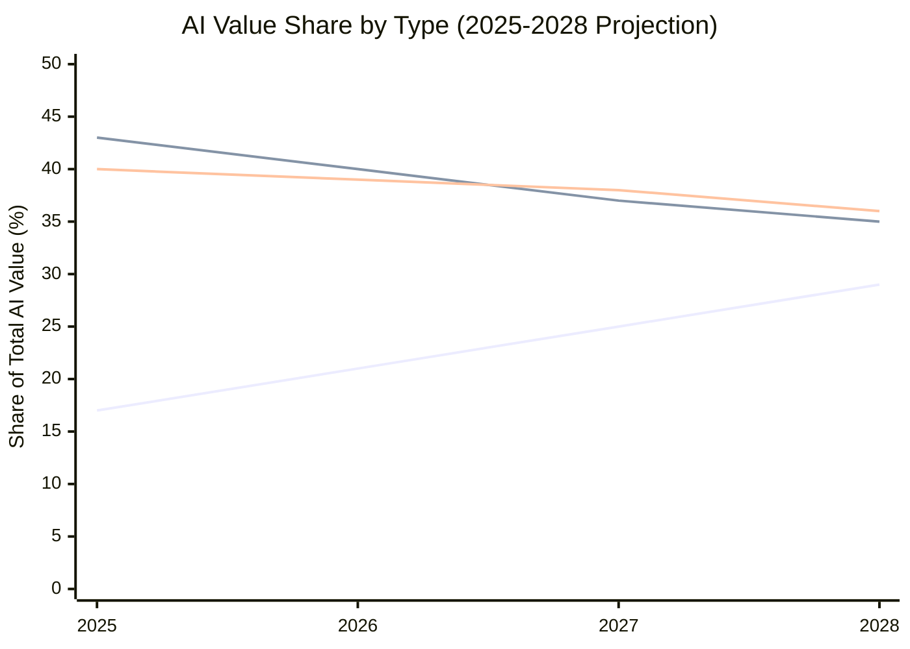
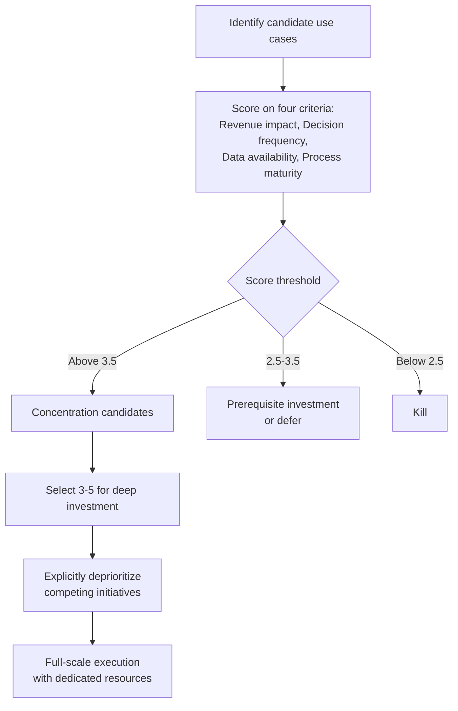

# Value Concentration

The organizations generating the most value from AI are not the ones doing the most. They are the ones doing the least, with greater depth.

This is counterintuitive to most leadership teams, who associate AI ambition with breadth of deployment. The instinct is to deploy widely: as many tools as possible, across as many functions as possible, as fast as possible. The instinct is wrong. It produces fragmented capability, diluted expertise, and a portfolio of use cases none of which are deep enough to generate transformational value.

The research on this is consistent. BCG identifies a category of "future-built" companies that are outperforming peers on AI returns by a significant margin. Their distinguishing characteristic is not AI budget. It is AI concentration.

:::note
**The BCG finding**

"Future-built" companies spend 120% more on AI than their peers on average, but they concentrate that investment. They are not running 50 pilots. They are running 3-5 deeply resourced, strategically aligned use cases that they execute with discipline and scale. BCG, 2025.
:::

---

## Where the Value Actually Is

Knowing where to concentrate requires knowing where AI value is generated. The distribution is not uniform across business functions.

| Function | Share of Total AI Value Potential | Concentration in Most Portfolios |
|----------|----------------------------------|----------------------------------|
| Sales and commercial | 22% | Low |
| Manufacturing and operations | 20% | Low |
| Supply chain and logistics | 17% | Low |
| Pricing and revenue management | 11% | Very low |
| Finance (core, not support) | 9% | Medium |
| Customer service | 8% | High |
| HR and talent | 5% | High |
| IT and infrastructure | 4% | High |
| Legal and compliance | 4% | Medium |

Source: BCG AI value analysis, 2025.

The pattern is stark. The functions with the highest AI value potential (sales, manufacturing, supply chain, pricing) are underrepresented in most enterprise AI portfolios. The functions with the lowest AI value potential (HR, IT, legal) are overrepresented. The gap between where AI is concentrated and where value is concentrated explains a large portion of the AI ROI disappointment visible across industries.

---

## The Rise of Agents

Agentic AI is changing the value concentration calculus. Agents, systems that act autonomously across tools, systems, and workflows to accomplish multi-step goals, are disproportionately valuable in exactly the functions where human decision-making is most intensive and most consequential.

The data reflects this shift:

- Agents accounted for approximately 17% of total enterprise AI value generated in 2025 (BCG)
- That share is projected to reach 29% by 2028 (BCG)
- The compound growth rate of agentic AI value is significantly higher than that of copilot and automation AI

The implication for value concentration: the organizations building depth in agentic capability now are positioning for the majority of AI value growth over the next three years. Organizations that have spread their investment across copilot tools and departmental automation will find themselves needing to rebuild their approach to compete.

*Lines represent: Agentic AI (growing), Copilot/Productivity AI (declining share), Process Automation AI (stable). Source: BCG, 2025-2028 projection.*

---

## The Portfolio of One Pattern

The organizations that have generated the most documented AI value share a counterintuitive portfolio structure. Instead of 30-50 use cases across the business, they have 3-5 use cases with deep investment, disciplined execution, and explicit sequencing.

Call this the "portfolio of one" pattern, by analogy to the product strategy principle of extreme focus. The successful organizations are not managing AI portfolios. They are running AI programs with a primary thesis: a specific capability, in a specific function, that creates a specific competitive advantage.

**What this looks like in practice:**

A manufacturing company decides its thesis is that AI-optimized production scheduling, combined with supplier risk prediction, will reduce operational cost by 15% while improving delivery reliability. Everything else is secondary. That thesis gets deep investment: data engineering, process redesign, a dedicated ML team, change management, and executive accountability. Eighteen months later, the capability is in production and the results are measurable.

Meanwhile, the same company's competitor launched 40 AI initiatives across the business. None reached full production. The AI budget was consumed by coordination overhead, pilot management, and technical debt from projects that never scaled.

:::insight
**The concentration test**

Ask your AI leadership team to name the three use cases that your organization is committed to scaling to full production in the next 18 months, regardless of other competing priorities. If they name more than five, or if there is disagreement among the leadership team, you do not have concentration. You have spread.
:::

---

## How to Identify High-Value Use Cases

Concentration only works if you concentrate in the right places. Four criteria determine whether a use case has genuine high-value potential:

### 1. Revenue Impact

High-value use cases are directly connected to revenue generation, margin improvement, or cost at scale. The test is simple: if this use case performs as designed, what changes in the P&L, and is that change material?

Use cases that improve productivity without a traceable connection to revenue or cost reduction are not high-value in this sense. They are useful but not transformational.

**Signals of genuine revenue impact:**
- The use case operates in a revenue-generating workflow (pricing decisions, deal qualification, demand planning)
- The improvement is measurable in basis points of margin or percentage of revenue
- Business unit leaders are willing to put their name on the expected outcome

### 2. Decision Frequency

High-frequency decisions compound. A 3% improvement in a decision made once a month is worth far less than a 3% improvement in a decision made thousands of times per day. The value of AI in high-frequency decision contexts is geometric, not linear.

**High-frequency, high-value decision types:**
- Real-time pricing adjustments
- Supply chain routing and exception handling
- Customer next-best-action in commercial workflows
- Manufacturing process parameter optimization
- Credit or risk scoring in transaction flows

### 3. Data Availability

A high-value use case with poor data availability is a strategic bet, not a near-term priority. Data availability assessment is not about whether data exists. It is about whether data is accessible, governed, of sufficient quality, and available at the latency the use case requires.

See [Data Readiness](../assessment/data-readiness.md) for the full assessment framework.

### 4. Process Maturity

AI cannot improve a process that is not stable enough to measure. Process maturity assessment determines whether the underlying workflow is documented, standardized enough to train a model on, and stable enough that the model will remain relevant post-deployment.

High-value use cases in functions with low process maturity require process investment before AI investment. The sequencing matters: process first, AI second.

---

## The Concentration Decision

Making the concentration decision requires answering two questions with honesty and specificity:

**Question 1: What are the two or three business outcomes that AI is uniquely positioned to deliver in our organization, where success would be unambiguously material to our competitive position?**

Not "improve efficiency." Not "become AI-first." Specific outcomes: "Reduce supply chain disruption cost by $X over 24 months" or "Increase commercial win rates in our enterprise segment by Y%."

**Question 2: What would we have to stop doing, or do significantly less of, to concentrate investment at the level required to achieve those outcomes?**

Concentration requires tradeoffs. If the answer to question 2 is "nothing, we can do all of this," you have not made the concentration decision. You have added more to an already spread portfolio.

---

## What Concentration Looks Like Operationally

Concentration is not just a strategic decision. It has operational implications that most organizations underestimate:

**Dedicated team.** High-value use cases at concentration-level investment require a dedicated team: data engineers, ML engineers, domain experts, and a program lead who owns nothing else. Shared-resource models produce shared mediocrity.

**Executive attention.** The most senior executive accountable for the business outcome (not the AI program) should be reviewing progress monthly. If the CISO or VP of Supply Chain is not in the room, the use case is not truly in the concentrated portfolio.

**Data investment upstream.** Concentrated use cases get prioritized data engineering support. The data platform investment is not spread evenly across all use cases. It is directed at the 3-5 that matter most.

**Change management as a program component.** Concentrated use cases have change management resources assigned from the start, not bolted on after technical delivery. Adoption is planned before the system is built.

**Explicit governance.** Concentrated use cases have defined success criteria, review cadence, kill criteria, and an executive who owns the decision to continue or stop. This is not administrative overhead. It is how you prevent a high-value use case from becoming a zombie project.

---

## Related Topics

- [Use Case Prioritization](prioritization.md): The scoring framework for identifying concentration candidates
- [From Pilot to Production](pilot-to-production.md): How concentrated investment moves through the stage-gate framework
- [AI Maturity Model](../assessment/maturity-model.md): Why concentration is a characteristic of Level 3 and above organizations

---

## Sources

1. Boston Consulting Group. "Are You Generating Value from AI? The Widening Gap." September 2025.

For the complete source list and methodology, see [Sources & Methodology](../sources.md).
