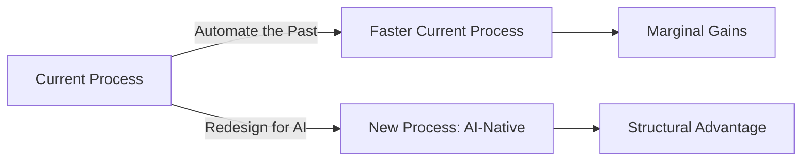
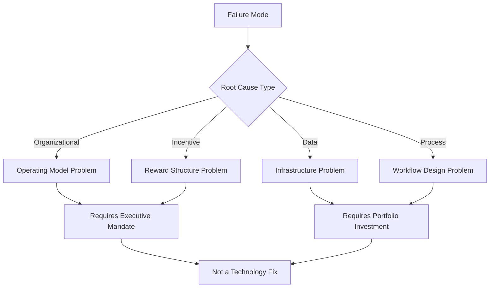

# Seven Failure Modes

Understanding why AI programs fail is prerequisite to building ones that succeed. These seven failure modes appear repeatedly across industries, company sizes, and maturity levels. They are not random. They have structural causes, and they respond to structural interventions.

Most programs experience more than one simultaneously. The combination is what makes them hard to diagnose from inside.

---

## Failure Mode 1: The Pilot Purgatory Loop

**What it looks like:** The organization runs pilots continuously. Results are promising. Stakeholders are engaged. Budgets are approved for the next pilot. Nothing reaches production at scale.

**Root cause:** The organizational pathway from POC to production was never designed. The pilot was treated as the deliverable rather than as the first step toward a deliverable. Nobody owns the transition. Production deployment requires different teams, different governance, different data infrastructure, and different success criteria than the pilot, and none of those were aligned in advance.

**The structural tell:** A portfolio where the number of active pilots consistently exceeds the number of production deployments. A roadmap that keeps adding use cases without retiring or scaling the ones already in flight.

**What to do instead:** Before any pilot launches, define the production pathway. Name the team that owns deployment. Identify the data requirements for production scale. Specify the governance sign-offs required. Set a hard time limit: if a use case cannot reach production within a defined window after a successful pilot, it is deprioritized. Treat the pilot-to-production transition as the primary organizational design problem.

:::warning
**The Vanity Metric Trap**

Pilots generate impressive outputs: accuracy rates, time-saved-per-task estimates, user satisfaction scores. None of these are business outcomes. A pilot that saves a task 40% of the time in a controlled environment may deliver zero P&L impact if that time is reabsorbed into other low-value work. Design measurement before the pilot begins.
:::

---

## Failure Mode 2: The Vanishing Productivity Gap

**What it looks like:** AI is deployed. Users adopt it. Productivity metrics look good in the first 90 days. Then the gains disappear. The time saved is simply filled with more of the same work, more email, more meetings, more requests. The P&L does not move.

**Root cause:** Productivity gains from AI are not self-converting. Time freed by automation does not automatically redirect into higher-value work. Without deliberate workflow redesign and explicit redeployment decisions, the productivity gain is absorbed by organizational entropy.

**The structural tell:** Users report that AI "saves time" but nothing downstream has changed: headcount, output quality, revenue, or cost. The productivity was real at the task level and invisible at the business level.

**What to do instead:** Define before deployment what will happen with the time or capacity freed by AI. This is a management decision, not a technology decision. If the answer is "we will do more of the same work," that is a valid choice but not a transformation. If the answer is "we will redeploy capacity toward higher-value activities," name those activities, measure them, and design the transition. The productivity gain only converts to business value when the redeployment is explicit and managed.

---

## Failure Mode 3: Automating the Past

**What it looks like:** The organization digitizes and automates existing processes using AI, making them faster without questioning whether they are the right processes. Broken workflows become faster broken workflows. Silos are automated rather than eliminated.

**Root cause:** AI is applied to what exists rather than to what should exist. The path of least resistance is to take a current workflow and ask: "how do we AI-enable this?" The harder and more valuable question is: "if we were designing this process from scratch with AI native to the design, what would it look like?"

**The structural tell:** Use cases are defined by current process steps rather than by desired outcomes. The AI system mirrors the existing org chart and its silos. Users adopt the tool but the end-to-end process time or cost does not change substantially.

**What to do instead:** Start from outcomes, not processes. Define the business result required and design the workflow that achieves it with AI as a native component, not a bolt-on. This requires cross-functional authority. A single team automating its own process cannot fix a process that spans three departments. End-to-end workflow redesign requires executive sponsorship and organizational mandate.

---

## Failure Mode 4: Middle Management Passive Resistance

**What it looks like:** Leadership announces an AI initiative. Individual contributors are trained. Tooling is deployed. Adoption is low. When investigated, the blocker is middle management: they are not reinforcing the new behavior, not measuring with the new tools, not changing team rituals, and in some cases actively discouraging use.

**Root cause:** 89% of employees express concern about job security in the context of AI (McKinsey, 2024). Middle managers face a specific version of this concern: AI that increases individual contributor productivity reduces the number of people a manager needs to manage, and in many organizations, span of control is the primary basis for compensation and status. Resistance is rational given the incentive structure.

**The structural tell:** Adoption metrics look fine at the team level (accounts created, trainings completed, licenses activated) but behavioral change is not visible in how work is reviewed, reported, or rewarded. The AI tool is available but not integrated into the workflow that managers actually govern.

**What to do instead:** Change the incentive structure before deploying the tool. Middle managers need to see a credible path where AI adoption improves their team's outcomes and their own standing, not threatens it. This requires redefining what managers are accountable for: not the number of people they supervise, but the quality of output and the strategic decisions their team makes. It also requires including middle managers in use case definition, not just announcing the tool to them.

:::insight
**The Manager Design Principle**

If managers are not involved in designing the workflow change, they will not reinforce it. Adoption is not a communication problem. It is a design problem. Middle managers who co-own the solution will drive it. Middle managers who receive it as a mandate will route around it.
:::

---

## Failure Mode 5: FOMO-Driven Investment

**What it looks like:** Tools are purchased before outcomes are defined. AI capabilities are added to the technology stack because competitors appear to be adding them, because a vendor made a compelling demo, or because the board asked about the AI strategy and the answer needed to include product names. The result is a collection of expensive, underused platforms with no coherent logic connecting them to business goals.

**Root cause:** The pressure to demonstrate AI activity is immediate. The ability to demonstrate AI outcomes takes 12 to 24 months. In the gap, organizations substitute tool acquisition for strategic clarity. The CIO or CAIO can always point to a vendor contract as evidence of progress. Pointing to P&L impact requires a different kind of work.

**The structural tell:** A technology portfolio with multiple overlapping AI platforms, low utilization rates across the portfolio, and no clear owner for each tool's business outcome. Vendors are managed by procurement; business outcomes are managed by nobody.

**What to do instead:** Define outcomes before evaluating tools. The procurement decision should be the last step, not the first. Start with: what business result do we need? What workflow change would produce that result? What capability does that workflow change require? Only then evaluate tools against that capability requirement. This sequence sounds obvious but is violated routinely under competitive pressure.

---

## Failure Mode 6: Data That Isn't Ready

**What it looks like:** Use cases are identified. Business cases are approved. Technical teams begin implementation. Then the data problems surface: fragmented sources, inconsistent schemas, missing labels, governance gaps that prevent data sharing across business units, and quality issues that were not visible until AI started making decisions based on the data.

**Root cause:** 57% of organizations say their data is not AI-ready (Gartner, 2024). Most organizations know this abstractly but underestimate it concretely. A data warehouse that supports excellent reporting can be completely inadequate for AI. Reporting tolerates stale, incomplete, and inconsistently defined data in ways that AI cannot. AI surfaces data quality problems that existed for years but were never visible because humans were filling in the gaps.

**The structural tell:** Use cases stall in the data preparation phase. Data engineering becomes the bottleneck for every AI initiative. The same data problems appear in different forms across multiple use cases. Each initiative builds its own data preparation layer rather than fixing the underlying issue.

**What to do instead:** Treat data readiness as a portfolio-level investment, not a per-use-case tax. Assess data readiness against the target use case portfolio before approving use case development budgets. Where data is not ready, sequence investments: data infrastructure first, use cases second. This requires CDO and CAIO alignment, which in many organizations does not yet exist as a working relationship.

---

## Failure Mode 7: Process Debt Exposed Too Late

**What it looks like:** AI is deployed into a business process. Adoption begins. Within weeks, the AI surfaces a problem: the process as documented does not match the process as practiced. Exceptions are numerous, undocumented, and handled by experienced employees whose judgment is not captured anywhere. The AI fails on the cases that matter most.

**Root cause:** Most enterprise processes have significant informal components: knowledge held by specific individuals, workarounds for edge cases that exist in email threads and tribal memory, judgment calls that are made by experienced employees without documented criteria. These informal components are invisible in process documentation. They are invisible in the data that was used to design the AI system. They surface immediately when AI tries to replace or augment the work.

**The structural tell:** AI performs well in testing, where the test cases reflect documented process, and poorly in production, where the actual edge cases accumulate. Experienced employees express frustration that the system "doesn't understand how we actually work." The implementation team is surprised by exceptions that the operations team considers routine.

**What to do instead:** Before designing any AI system for a process, conduct process mining and ethnographic observation alongside documentation review. The goal is to understand the process as practiced, not the process as documented. Shadow the people who handle exceptions. Map the informal decision criteria. Treat the gap between documented and actual process as the primary design input, not an afterthought. This adds time upfront and removes far more time downstream.

---

## The Pattern Across All Seven

Every failure mode in this list has a technical surface and an organizational root. The technology symptoms are what get reported. The organizational causes are what need to be addressed.

This is why technology-first approaches to AI transformation systematically underperform. You cannot tool your way out of an operating model problem. The seven failure modes are organizational problems that require organizational solutions.

---

## Sources

1. McKinsey & Company. "The State of AI in 2025: Agents, Innovation, and Transformation." 2025.
2. Gartner. "Lack of AI-Ready Data Puts AI Projects at Risk." February 2025.

For the complete source list and methodology, see [Sources & Methodology](../sources.md).
