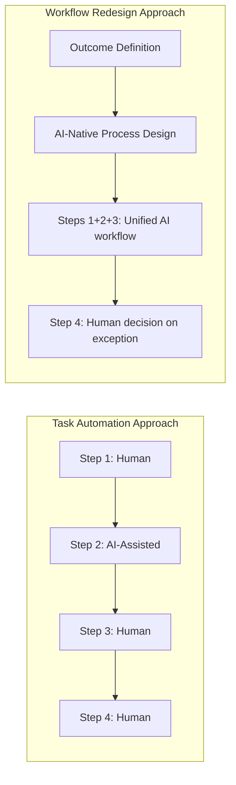
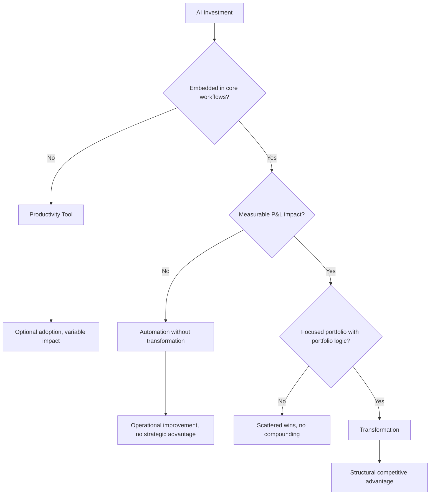

# What Transformation Actually Means

The word "transformation" is used to describe almost everything AI-related in the enterprise. A chatbot on the helpdesk is called transformative. A contract review tool is called transformative. An AI-generated first draft of a quarterly report is called transformative.

None of these are transformation.

They are useful. Some are genuinely valuable. But applying the word transformation to task-level automation creates strategic confusion. It lets organizations declare victory on measures that have nothing to do with the business outcomes they actually need.

Clarity on terminology is not semantic hygiene. It determines where you invest, how you measure, and how you know whether the program is working.

---

## Three Things That Are Not the Same

| Concept | Definition | What changes | P&L impact |
|---------|------------|--------------|------------|
| **Optimization** | Making an existing process faster or cheaper without changing its structure | Speed, cost, or error rate within a defined task | Incremental: margin improvement, unit cost reduction |
| **Automation** | Replacing human effort in a defined task or decision with a system | Who or what does the work | Potentially significant if the task represents meaningful labor cost; zero if the time is reabsorbed |
| **Transformation** | Redesigning the operating model to embed AI as a structural component of how the business creates and delivers value | How the business is organized, what decisions are made where, how value flows | Structural: new capabilities, new competitive position, new unit economics |

Optimization and automation are necessary and valuable. Transformation is rare and difficult. The distinction matters because they require different investments, different timelines, different governance, and different executive ownership.

A company that has automated 30 tasks has not transformed. A company that has redesigned its core operating workflows with AI embedded has transformed. The question is not how many AI tools you have deployed. The question is whether the fundamental way the business creates value has changed.

---

## The Five Characteristics of High-Performing AI Programs

BCG and McKinsey research on the 5% of enterprises that qualify as future-built converges on five structural characteristics. These are not practices in isolation. They form a system. Organizations that adopt two or three but not all five generally perform at the 39% EBIT impact threshold, not above it.

### 1. Top-Down Portfolio Logic, Not Bottom-Up Experimentation

High-performing programs start with a board- or C-suite-level view of where AI can create the most strategic value. They define a portfolio of bets with clear prioritization logic: where is the competitive pressure greatest, where does AI capability align with genuine business need, where does the organization have the data and process maturity to deploy responsibly.

Bottom-up experimentation, the model where teams propose use cases and leadership approves a collection of them, produces the pilot purgatory pattern. The resulting portfolio is a set of disconnected experiments with no cumulative logic. Each pilot is individually defensible. The portfolio as a whole does not add up to a strategic position.

The top-down model is harder to execute because it requires executives to make explicit prioritization decisions with incomplete information. It is also the only model that produces a portfolio with compound value.

:::note
**Portfolio Logic in Practice**

Top-down does not mean centrally controlled. It means that the criteria for what gets funded, sequenced, and scaled are set at the portfolio level, not negotiated use-case by use-case. Individual teams still propose and execute. The difference is that their proposals are evaluated against a strategic framework, not on their individual merits in isolation.
:::

### 2. End-to-End Workflow Redesign, Not Task Automation

High-performing programs take a workflow-first view. The unit of analysis is a business process from initiation to outcome, not an individual task within the process.

This distinction changes the design question. Task automation asks: "how do we make this step faster?" Workflow redesign asks: "given AI capability, what is the optimal way to achieve this outcome end-to-end, and how do we organize people, systems, and decisions to achieve it?"

The workflow redesign approach surfaces handoff problems, organizational boundary problems, and data flow problems that task automation never reaches. It also tends to reveal that the biggest gains come not from automating individual tasks but from eliminating steps that existed only because of the limitations of previous systems.

### 3. Governance as Operating System, Not Compliance Exercise

Governance in most organizations is a gating function. Use cases are reviewed by a committee. Risks are identified. Approval or rejection is issued. This is compliance governance. It is reactive, slow, and does not scale.

High-performing programs treat governance as operating infrastructure. Governance defines the standards, risk classifications, and accountability structures that allow teams to move fast within guardrails rather than waiting for approval on every decision. Governance is embedded in the development process, not appended to it.

The operational difference is significant. Compliance governance creates queues and bottlenecks. Infrastructure governance creates velocity within defined boundaries.

This requires a different investment. Compliance governance requires a committee and a review process. Infrastructure governance requires policy frameworks, automated controls, monitoring systems, and clear accountability at every level of the organization. It is more expensive to build and dramatically more valuable at scale.

### 4. Measurement Frameworks Established Before Deployment

In high-performing programs, the measurement framework for a use case is defined before the use case enters development, not after deployment. This is a discipline that most organizations say they practice and most do not.

Defining measurement after deployment creates a specific problem: you can only measure what the system produces, not what the business needed. You end up measuring outputs (AI-generated content volume, task completion rates, time-per-task) rather than outcomes (revenue impact, cost reduction, quality improvement, customer satisfaction).

Pre-deployment measurement design forces a conversation that most organizations avoid: what exactly are we trying to change, and how will we know we changed it? That conversation is uncomfortable because it surfaces disagreement about what the use case is actually for. That discomfort is valuable. It is far better to have that conversation before spending 18 months on development than after.

:::insight
**The Measurement Design Test**

If you cannot write down the measurement framework for a use case in one page before development begins, you do not yet understand the use case well enough to build it. The measurement document is not a reporting artifact. It is a design document.
:::

### 5. Human-Agent Collaboration Designed Deliberately

High-performing programs make explicit decisions about where humans remain in the workflow and why. They design the human-agent interface as carefully as they design the AI system itself.

Most programs do not do this. They deploy AI and assume that humans will figure out how to work with it. This assumption produces two failure patterns: over-reliance, where humans trust AI output without appropriate verification, and under-utilization, where humans distrust AI output and route around it entirely.

Deliberate human-agent collaboration design means answering specific questions for each use case: at what point does the AI output reach a human, in what form, with what context, and what decision does the human make? What verification is required before AI output is acted upon? What authority does the AI have to act autonomously versus triggering human review?

These are not technology questions. They are organizational design questions. They require input from the people doing the work, not just the people building the system.

---

## What "Done" Looks Like

Transformation is not a state of 100% AI adoption. It is not a state where every process has been AI-enabled. It is not defined by the number of tools deployed or the percentage of employees trained.

Transformation is measurable P&L impact from a focused portfolio of AI capabilities embedded in core operating workflows.

That definition has three components:

**Measurable P&L impact.** Not projected savings. Not pilot-phase estimates. Not productivity metrics that have not been connected to business outcomes. Actual revenue growth, cost reduction, margin improvement, or risk reduction that is attributable to AI deployment and visible in financial reporting.

**Focused portfolio.** Not every use case that could be AI-enabled. A deliberate selection of use cases where AI creates the most strategic value, sequenced and resourced in a way that builds organizational capability cumulatively rather than spreading effort across too many simultaneous bets.

**Core operating workflows.** Not peripheral experiments. Not edge cases. The central processes by which the business creates and delivers value. AI that is embedded in how the business actually operates, not available as an optional tool that motivated individuals choose to use.

The 5% who are future-built have reached J on this diagram. The 95% are distributed across C, F, and I. Each position requires different interventions, and the path from each position to transformation is different.

The first step is being honest about where you are.

---

## Sources

1. Boston Consulting Group. "Are You Generating Value from AI? The Widening Gap." September 2025.
2. McKinsey & Company. "The State of AI in 2025: Agents, Innovation, and Transformation." 2025.

For the complete source list and methodology, see [Sources & Methodology](../sources.md).
