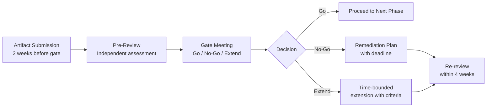

# Phase Gates

Phase gates are structured decision points between transformation phases. They answer a single question: "Are we ready to proceed, or do we need to resolve something first?" Without gates, transformation phases blur into each other, problems from early phases get carried forward, and the program loses the discipline that makes scale possible.

Gates are not bureaucratic checkpoints. They are the mechanism by which leadership exercises oversight of a program that touches every part of the organization.

:::insight
**Gate Authority**

Each gate requires a documented decision from a named authority. "The team decided" is not a gate decision. A gate decision is signed by a specific executive who is accountable for the outcome of the next phase.
:::

---

## Gate 1: Foundation to Focus

**Question:** Have we built the foundation that makes responsible piloting possible?

Gate 1 determines whether the organization is ready to select use cases and launch pilots. Proceeding before Gate 1 is cleared means running pilots without proper governance, without baselines, and without leadership alignment. Those pilots will produce results that nobody can trust.

### Required Artifacts

| Artifact | Description | Minimum Standard |
|---|---|---|
| AI Readiness Report | Current state assessment with gap analysis | Completed with executive sign-off |
| Operating Model Decision | Centralized, hub-and-spoke, or federated; documented rationale | Board or CEO approved |
| AI Policy v1.0 | Approved organizational AI policy | Legal and CAIO approved, published to employees |
| Governance Framework | Use case intake, risk classification, approval process | Operational: at least one use case processed through it |
| Baseline Measurement Set | Pre-deployment baselines for Phase 2 target processes | Documented and finance-reviewed for all pilot candidates |
| Leadership Charter | Executive commitment to transformation scope and investment | Signed by CEO or designated executive sponsor |
| Use Case Long-List | Initial candidate use cases with risk classification | Minimum 8 candidates to enable meaningful selection |

### Decision Criteria

All of the following must be true to pass Gate 1:

- [ ] The operating model decision is documented and communicated to the organization
- [ ] The AI policy is approved and published
- [ ] The governance intake process has processed at least one use case end-to-end
- [ ] Baselines are documented for all processes targeted by Phase 2 pilots
- [ ] The executive sponsor has confirmed investment and timeline commitment in writing
- [ ] The leadership team has agreed on the success criteria for Phase 2

### Approval Authority

The AI transformation executive sponsor, typically the CIO or CAIO, in consultation with the CEO. For programs with significant regulatory exposure, the Chief Risk Officer or General Counsel should co-sign.

### Common Failure Points

**Assessment without action.** The readiness assessment produces a comprehensive report but no decisions follow from it. An assessment is only complete when it has produced decisions, not when it has produced slides.

**Policy without process.** The AI policy is approved but the governance intake process does not exist. Policy tells people what is allowed. Process tells people how to get approval. Both are required.

**Baseline gaps.** One or more pilot candidate processes has no documented baseline. This is a hard stop. Do not proceed without baselines. Send the process owner back to document the baseline and schedule a gate re-review in two weeks.

**Nominal leadership alignment.** Executives have been briefed but have not made explicit commitments. "Supportive in principle" is not alignment. Gate 1 requires documented decisions.

---

## Gate 2: Focus to Scale

**Question:** Have the pilots delivered measurable results, and are we ready to operate at production scale?

Gate 2 is the most consequential gate in the transformation. It determines which pilots graduate to production and whether the organization has the capability to operate AI at scale. A weak Gate 2 review produces production deployments that fail publicly and damage confidence in the entire program.

### Required Artifacts

| Artifact | Description | Minimum Standard |
|---|---|---|
| Pilot Results Report | Measured outcomes vs. baseline for each pilot | Finance-reviewed; actuals only, no projections |
| Production Readiness Assessment | Technical, operational, and governance readiness | Completed for each pilot candidate per [Production Deployment Gate checklist](../proof/checklists.md#production-deployment-gate) |
| Measurement Framework Validation | Confirmation that measurement is producing reliable data | Finance partner sign-off |
| Workflow Redesign Completion | Documentation that future-state workflows are in place | Process owner sign-off for each pilot candidate |
| Incident Review | Any incidents during pilot phase with root cause and resolution | CAIO and CISO reviewed |
| Skills Readiness Assessment | Progress against workforce planning targets | HR sign-off |

### Decision Criteria

For each pilot candidate, the gate decision is one of: promote to production, extend pilot, or exit.

**Promote to production** when:

- [ ] Measured outcomes show improvement vs. baseline at the pre-defined success threshold
- [ ] Attribution methodology is documented and defensible
- [ ] Production infrastructure is confirmed ready
- [ ] Rollback procedure is documented and tested
- [ ] Support and monitoring procedures are in place
- [ ] Workflow redesign is complete and the recaptured capacity is accounted for
- [ ] Security and compliance review is complete

**Extend pilot** when:

- [ ] Early signals are positive but the measurement period is insufficient for confident conclusions
- [ ] Technical issues were resolved late in the pilot and need additional validation time
- [ ] The extension is time-bounded (maximum 6 additional weeks) and has specific success criteria

**Exit** when:

- [ ] Results are below threshold with no credible path to improvement
- [ ] The business case has changed since pilot selection
- [ ] The use case requires capabilities or data that are not available in the required timeframe

:::insight
**Exits Are Not Failures**

A Gate 2 exit is evidence that the measurement framework is working. It takes discipline to exit a use case that the organization invested in. That discipline is what separates a managed AI portfolio from an uncontrolled collection of pet projects. Celebrate exits as portfolio management decisions, not as program failures.
:::

### Approval Authority

The CAIO or CIO for individual use case promotion decisions. The executive sponsor for decisions to significantly reduce or expand the portfolio scope.

### Common Failure Points

**Pilot extension without criteria.** A pilot is extended because results are unclear, but the extension has no new success criteria or deadline. This is "pilot purgatory." Every extension must have a specific, time-bounded success threshold.

**Results inflation.** Pilot results are presented with projected annualized impact rather than measured actuals. The gate review must distinguish measured results from projections. Apply the [financial linkage](../measurement/financial-linkage.md) framework rigorously.

**Technical debt ignored.** The pilot worked in controlled conditions but was built with hacks and workarounds not suitable for production. Gate 2 must include a technical review. Deploying technically fragile systems to production creates incidents.

**Workflow redesign deferred.** The use case is promoted to production before the workflow redesign is complete. This is the single most reliable way to ensure that productivity gains evaporate in production. It is a hard stop.

---

## Gate 3: Scale to Optimize

**Question:** Are production deployments generating P&L impact, is governance operating at deployment velocity, and is the workforce transition underway?

Gate 3 marks the transition from active transformation to sustained operation. The distinction matters. A transformation program has a defined scope and end state. A sustained operation is a permanent capability. Gate 3 is where the organization decides whether it has built the latter.

### Required Artifacts

| Artifact | Description | Minimum Standard |
|---|---|---|
| P&L Impact Report | Measured financial impact from production deployments | Finance-prepared; CAIO and CFO reviewed |
| Governance Operations Report | Volume, cycle time, and quality of governance decisions | Operating at production deployment velocity |
| Workforce Transition Report | Skills development progress, role changes, headcount impact | HR and affected business units reviewed |
| Agent Deployment Assessment | If agents are in scope: authorization framework and readiness | CAIO, CTO, and CISO approved |
| Year 2 Roadmap Draft | Forward-looking portfolio and investment plan | CAIO prepared; CFO reviewed for financial projections |
| Board Report (Draft) | Draft of the first full board AI report | Executive sponsor reviewed |

### Decision Criteria

All of the following must be true to pass Gate 3:

- [ ] At least two production deployments have measurable, finance-reviewed P&L impact
- [ ] The governance process is handling deployment requests within defined SLAs without bottlenecks
- [ ] The workforce transition plan is at least 50% complete for roles affected by production deployments
- [ ] The portfolio rebalance decision is documented: which use cases to accelerate, maintain, redirect, or exit
- [ ] The board reporting cadence is established as a standing agenda item
- [ ] The Year 2 roadmap is approved by the executive sponsor

### Approval Authority

The executive sponsor and CFO jointly. P&L impact claims require CFO validation. Strategic direction for Year 2 requires executive sponsor commitment.

### Common Failure Points

**Financial impact not confirmed.** Production deployments are in place but the financial impact has not been reviewed by finance. The organization is operating on faith rather than evidence. Gate 3 requires CFO-validated financials.

**Governance bottleneck.** The governance process was adequate for pilot volume but cannot handle production-scale deployment requests. The scaling problem was not anticipated. This is a program design failure. Address it before proceeding.

**Workforce transition lagging.** Technology deployment has outpaced people development. Employees are using AI tools without the skills to use them effectively or safely. The productivity gap widens. Gate 3 should not pass if the workforce transition is less than 50% complete for affected roles.

**Transformation mode never ending.** The organization plans to continue operating in "transformation mode" indefinitely with the same central oversight structure. Gate 3 must include a transition plan from the transformation team to permanent operational owners. If no operational owner is named for each production use case, Gate 3 cannot pass.

---

## Gate Review Process

Each gate review should follow a consistent process:

**Two weeks before gate:** All required artifacts submitted by owners.

**Pre-review:** A designated reviewer (not the team that produced the artifacts) reads all artifacts and produces a summary assessment. This step prevents gate meetings from becoming first-reads.

**Gate meeting:** 60 to 90 minutes. Decision: Go, No-Go, or Extend. Document the rationale for every decision.

**Remediation plan:** If No-Go, a written plan with specific actions, owners, and a re-review date. The re-review date is a hard deadline, not a suggestion.

The gate meeting is not a status update. It is a decision meeting. Prepare accordingly.
