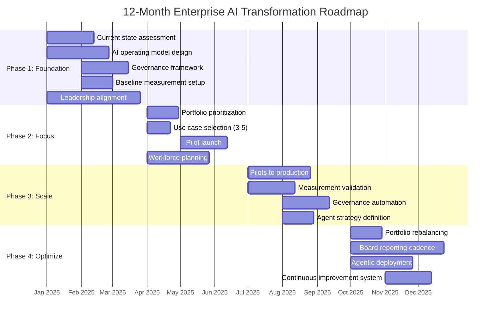

# 12-Month Roadmap

Enterprise AI transformation does not happen through a series of unconnected pilots. It requires a structured program with clear phases, defined deliverables, and deliberate decision points. This roadmap gives you a concrete 12-month plan organized around four phases, each with a specific purpose and a clear gate before proceeding to the next.

The phases are not calendar-driven. They are milestone-driven. An organization that completes the Foundation phase in two months is not ahead; it is probably cutting corners. An organization that takes five months is not behind; it may be doing the hard work that makes Scale possible.

---

## Speed vs. Foundation: The Core Tradeoff

The most common and most expensive sequencing mistake in AI transformation is rushing Phase 1 to get to Phase 2 faster. Phase 1 feels slow. It produces assessments, not AI. But skipping it means Phase 2 pilots lack baselines, governance, and operating model alignment, producing the pilot purgatory described in [The Problem](../position/the-problem.md). The pilots run. The results are unmeasurable. The board asks what was learned. The honest answer is: not much. Phase 1 is not overhead. It is the investment that makes everything downstream credible.

---

## Overview

---

## Phase 1: Foundation (Months 1-3)

**Purpose:** Understand where you are. Build the structures that make everything else possible. Do not deploy anything to users yet.

**Phase owner:** CAIO, supported by CIO and Legal. CEO accountability for leadership alignment deliverable.

The most common mistake in AI transformation is skipping this phase or treating it as overhead. Organizations that move directly to pilots without foundation work create problems that take 18 months to untangle.

### Key Activities

**Current State Assessment**

Conduct an honest inventory of your AI landscape. This includes approved tools, unapproved tools (shadow AI), data infrastructure maturity, process documentation quality, and talent capability gaps. Use the [AI Readiness Assessment checklist](../proof/checklists.md#ai-readiness-assessment) as a starting structure.

The assessment should produce findings that are uncomfortable. If the assessment produces only positive findings, it was not honest.

**AI Operating Model Design**

Decide how your organization will make AI decisions, fund AI initiatives, deploy AI safely, and scale what works. The three primary models are centralized, hub-and-spoke, and federated. Choose based on your organizational structure and governance culture, not on what is fashionable.

See the [Operating Model](../operating-model/structural-models.md) section for the full decision framework.

**Governance Framework**

Establish the minimum viable governance required to deploy AI responsibly. This includes: an AI policy, a use case intake process, a risk classification framework, and an incident response protocol. Governance that takes longer than three months to establish is governance that will never be established.

**Baseline Measurement Setup**

Document baselines for every process area targeted by Phase 2 pilots. This is non-negotiable. See [Measurement Design](../measurement/design.md) for methodology.

**Leadership Alignment**

Get explicit, documented commitment from the C-suite on: the operating model, the investment level, the timeline, the success criteria, and the tolerance for failure during pilot phases. Ambiguity at the leadership level becomes confusion at the delivery level.

### Deliverables

| Deliverable | Owner | Description |
|---|---|---|
| AI Readiness Report | CAIO / CTO | Current state assessment with gap analysis and prioritized findings |
| Operating Model Decision | CEO / CIO | Documented model selection with rationale |
| AI Policy v1.0 | Legal / CAIO | Approved policy covering use, risk, and employee obligations |
| Use Case Registry | CAIO | Initial inventory of proposed use cases with risk classification |
| Baseline Measurement Set | Finance / CAIO | Documented baselines for Phase 2 target processes |
| Leadership Charter | CEO | Signed commitment to transformation program scope and investment |

### Governance Cadence

| Cadence | Forum | Purpose |
|---|---|---|
| Monthly | Steering Committee | Progress against Phase 1 milestones, decision escalations, blocker resolution |
| End of Phase | Phase-Gate Review | Go/no-go decision with CAIO, CIO, CFO, and at least one business unit leader |

Board visibility in Phase 1 is through the CEO, not a formal board report. The first board AI update occurs at the Phase 2 gate.

### Decision Points

- Operating model: centralized vs. hub-and-spoke vs. federated
- Governance: build, buy, or hybrid
- Phase 2 candidate use cases: initial long-list for prioritization in Phase 2

### Risk Factors

:::warning
**Foundation Phase Risks**

- **Assessment fatigue:** Assessment becomes a multi-month consulting engagement with no clear endpoint. Cap the assessment at six weeks with a hard deadline.
- **Governance paralysis:** The governance design process gets caught in legal and compliance review cycles. Time-box it. Version 1.0 needs to be deployable, not perfect.
- **Leadership ambiguity:** Executive sponsors are supportive in principle but unavailable for decisions. This phase requires active executive time, not passive endorsement.
:::

---

## Phase 2: Focus (Months 4-6)

**Purpose:** Select the right use cases. Launch controlled pilots. Learn what works before committing to scale.

**Phase owner:** CAIO for portfolio and measurement. Business unit leaders for use case design and workforce planning. Platform team for technical deployment infrastructure.

### Key Activities

**Portfolio Prioritization**

Apply explicit criteria to the use case long-list from Phase 1. Select 3 to 5 use cases for pilot based on: business value potential, data readiness, process clarity, and implementation complexity. Do not select based on executive enthusiasm alone.

See [Portfolio Logic](../portfolio/prioritization.md) for the prioritization framework.

**Pilot Launch**

Launch pilots with full measurement infrastructure in place. Each pilot requires: a documented baseline, a measurement owner, a defined success threshold, and a scheduled evaluation date. Pilots without these elements are not pilots. They are experiments without controls.

**Workforce Planning**

Begin the skills gap analysis and learning path design. Identify roles most affected by each pilot use case. Start change management engagement with frontline managers before deployment, not after.

**Use Case Design**

Work with process owners to redesign workflows before deployment. Time saved by AI must have a designated use. This is where most productivity gains are won or lost.

### Deliverables

| Deliverable | Owner | Description |
|---|---|---|
| Prioritized Portfolio | CAIO | 3-5 selected use cases with scoring rationale |
| Pilot Plans | Use Case Owners | Per-pilot plan including measurement framework, timeline, success criteria |
| Workflow Redesign Specs | Process Owners | Documented future-state workflows for each pilot |
| Skills Gap Analysis | HR / CAIO | Capability gaps by role, with learning path recommendations |
| Pilot Launch Report | CAIO | Status at end of Phase 2: adoption, early signals, issues |

### Governance Cadence

| Cadence | Forum | Purpose |
|---|---|---|
| Monthly | Steering Committee | Pilot status, measurement readings, risk flags, workforce planning progress |
| Quarterly | Board Update | First board AI update: program status, Phase 1 findings, Phase 2 pilot portfolio |
| End of Phase | Phase-Gate Review | Gate 2 decision: which pilots proceed to Scale, with CAIO, business unit leaders, and CFO |

### Decision Points

- Which 3-5 use cases proceed to pilot (explicit selection and rejection decisions)
- Whether to proceed to Phase 3 at Gate 2 (see [Phase Gates](phase-gates.md))

### Risk Factors

:::warning
**Focus Phase Risks**

- **Pilot sprawl:** Pressure from business units causes the pilot count to expand beyond 5. More than 5 concurrent pilots overwhelms measurement capacity and dilutes focus. Hold the line.
- **Vendor-led selection:** Use cases are selected because a vendor has a ready solution, not because the use case is high priority. Selection criteria must come first.
- **Workflow redesign skipped:** Deployment happens before workflow redesign is complete. Time saved evaporates. Make redesign a launch prerequisite.
:::

---

## Phase 3: Scale (Months 7-9)

**Purpose:** Promote pilots that passed Gate 2 to production. Validate the measurement framework. Begin governance automation. Define the agent strategy.

**Phase owner:** CTO and CAIO jointly for production deployment and agent strategy. Finance for measurement validation. Legal / Compliance for governance systematization.

### Key Activities

**Pilots to Production**

Apply the [Production Deployment Gate checklist](../proof/checklists.md#production-deployment-gate) to each pilot candidate. Not every pilot will graduate. That is expected. Force the decision explicitly rather than letting pilots linger indefinitely.

**Measurement Validation**

Confirm that the measurement framework is producing reliable data. Compare pilot-phase measurements against production-phase measurements. Look for confounds, collection errors, and attribution gaps. Fix them before the quarterly board report.

**Governance Automation**

Manual governance does not scale. By Phase 3, the intake process, risk classification, and deployment approval steps should be systematized. This does not require sophisticated tooling. A well-designed workflow in existing platforms is sufficient.

**Agent Strategy**

As production deployments mature, the natural next question is: where do agents make sense? Define the criteria for agent deployment, the authorization model, and the human oversight requirements before any agent deployment occurs. See [Agentic Strategy](../agentic-strategy/the-shift.md).

### Deliverables

| Deliverable | Owner | Description |
|---|---|---|
| Production Deployment Reports | Use Case Owners | Outcome vs. baseline for each production deployment |
| Measurement Validation Report | Finance / CAIO | Confirmed attribution methodology and data quality |
| Governance Playbook | CAIO / Legal | Systematized intake, classification, and approval process |
| Agent Strategy Document | CTO / CAIO | Criteria, authorization model, and oversight framework for agents |
| Workforce Transition Update | HR | Progress against skills development and role transition plans |

### Governance Cadence

| Cadence | Forum | Purpose |
|---|---|---|
| Monthly | Steering Committee | Production deployment status, measurement validation, governance audit results |
| Quarterly | Board Update | Q3 board AI report: production outcomes, measurement actuals vs. projections, agent strategy |
| End of Phase | Phase-Gate Review | Gate 3 decision: portfolio promotion decisions, agent authorization, Phase 4 investment level |

### Decision Points

- Which pilots promote to production (Gate 2 decisions)
- Agent deployment authorization model
- Portfolio rebalancing candidates for Phase 4

### Risk Factors

:::warning
**Scale Phase Risks**

- **Governance lag:** Production deployments outpace governance capacity. Every deployment that bypasses governance creates a precedent that undermines the framework. Do not deploy faster than governance can keep up.
- **Measurement drift:** Production measurement diverges from pilot methodology. Results become incomparable. Maintain consistent measurement infrastructure across both phases.
- **Agent premature deployment:** Agent enthusiasm leads to deployment before authorization framework is established. Treat agent deployment with the same rigor as production deployment.
:::

---

## Phase 4: Optimize (Months 10-12)

**Purpose:** Rebalance the portfolio based on evidence. Establish permanent board reporting. Deploy agents where authorized. Build the continuous improvement system.

**Phase owner:** CAIO for portfolio management and board reporting. CFO for investment decisions. CTO for agent deployment. Business unit leaders for continuous improvement embedding within their functions.

### Key Activities

**Portfolio Rebalancing**

Review the portfolio against performance data. Make explicit decisions: which use cases to accelerate, which to maintain, which to redirect, and which to exit. Portfolio management is not a set-it-and-forget-it activity. It requires quarterly decisions based on evidence.

**Board Reporting Cadence**

By Month 10, the quarterly board AI report should be a standard agenda item. See [Board Reporting](../measurement/board-reporting.md) for format and content guidance. The first two quarters of reports are the hardest. Establish the cadence now so it is routine by Year 2.

**Agentic Deployment**

Deploy agents in use cases that meet the authorization criteria defined in Phase 3. Maintain human oversight at the boundaries defined in the agent strategy. Do not deploy agents in customer-facing contexts without established escalation protocols.

**Continuous Improvement System**

By the end of Month 12, the transformation program should be self-sustaining: a portfolio review cycle, a measurement cadence, a governance process, and a workforce development program that operate without a dedicated transformation team driving every decision. If the program still requires the same intensity of central oversight in Month 12 as in Month 1, the operating model was not embedded successfully.

### Deliverables

| Deliverable | Owner | Description |
|---|---|---|
| Portfolio Rebalance Decision | CAIO / CFO | Documented investment decisions by use case |
| Q4 Board AI Report | CAIO | First full-format board report with actuals vs. projections |
| Agentic Deployment Record | CTO | Deployed agents with authorization documentation |
| Year 2 Roadmap | CAIO | Next 12-month plan based on Year 1 learnings |
| Transformation Retrospective | CAIO | Honest assessment of what worked, what did not, and what changed |

### Governance Cadence

| Cadence | Forum | Purpose |
|---|---|---|
| Monthly | Steering Committee | Portfolio performance review, continuous improvement prioritization, Year 2 planning |
| Quarterly | Board Update | Q4 full-format board AI report: Year 1 actuals, Year 2 roadmap, investment recommendation |
| End of Phase | Annual Retrospective | CAIO-led review of Year 1: what worked, what did not, operating model assessment |

### Decision Points

- Portfolio investment decisions: accelerate, maintain, redirect, exit per use case
- Agent deployment approvals
- Year 2 scope and investment level

### Risk Factors

:::warning
**Optimize Phase Risks**

- **Premature declaration of success:** Leadership declares transformation complete at Month 12. AI transformation is a continuous program, not a project with an end date. Year 2 is when most of the value is actually captured.
- **Portfolio inertia:** Use cases that underperformed are maintained because stopping feels like failure. Exits are healthy portfolio management. Celebrate them.
- **Governance decay:** With the transformation team attention moving to Year 2, governance process quality degrades. Assign a permanent owner for governance operations before the transformation team disbands.
:::

---

## Adapting the Roadmap

This roadmap is a template, not a prescription. Adjust it based on:

- **Organizational scale:** Larger organizations need more stakeholder alignment time in Phase 1 and more parallel workstreams in Phase 2.
- **AI maturity:** Organizations with existing AI programs can compress Phase 1. Organizations with no AI experience should extend it.
- **Sector context:** Regulated industries (financial services, healthcare) need more governance time in Phase 1 and stricter gates at each transition.
- **Urgency:** Competitive pressure may justify compressing the timeline. Understand the tradeoffs. Compressed timelines produce compressed measurement and compressed governance. Name those tradeoffs explicitly before accepting them.
