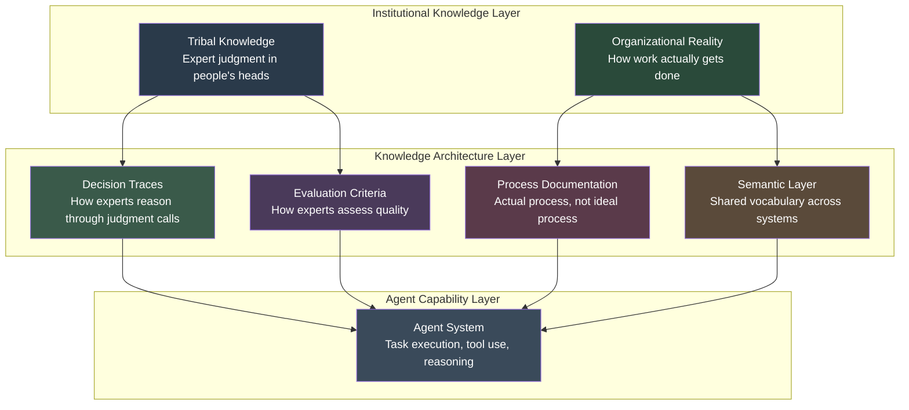

# Knowledge Architecture

Agents fail at the boundaries of what is written down.

Deploy an agent into a well-documented, process-rich environment with clean data and clear evaluation criteria, and it performs reliably. Deploy the same agent into a typical enterprise environment, where real process knowledge lives in the heads of experienced people rather than in systems, and it struggles precisely at the moments that matter most.

The technical sophistication of your agent stack is not the binding constraint on agent performance in most enterprises. The binding constraint is knowledge architecture: whether the information, judgment, and context that agents need actually exists in forms they can access and use.

---

## The Tribal Knowledge Problem

Every organization has experts who carry institutional judgment that is not documented anywhere. They are the people who know:

- Which exceptions to the standard process actually matter versus which can be safely handled by the rule
- Why a particular client or partner requires a different approach
- How to read a situation that does not fit the standard template
- What "good enough" looks like for a given output in a given context
- Where the system breaks and what the workaround is

This knowledge is tribal because it is transmitted person-to-person, through proximity, observation, and experience. A new employee learns it by sitting next to an expert and watching them work, not by reading documentation.

Agents cannot sit next to an expert. They can only work with what is made explicit, structured, and accessible.

The consequence: agents trained on documented processes handle the standard cases well and fail on exactly the non-standard cases where the tribal knowledge is most relevant. The experts observe these failures and conclude that AI cannot handle their domain. Both observations are correct. The actual problem is that the knowledge needed to handle the non-standard cases was never made available.

:::note
**The 80% Accuracy Floor**

Many organizations observe their agents performing at 70-80% accuracy on real-world tasks even when benchmark performance looks much higher. The gap is almost always explained by tribal knowledge: the 20-30% of cases where undocumented expert judgment is required.
:::

---

## What Knowledge Architecture Actually Is

Knowledge architecture is not documentation. The goal is not to produce more written content. Most organizations already produce too much written content that nobody reads and nothing uses.

Knowledge architecture is the deliberate structuring of organizational knowledge into forms that agent systems can access, interpret, and apply. It has four components.

### Decision Traces

A decision trace captures how an expert actually reasons through a judgment call. Not the official process. Not the simplified explanation they give in training. The actual reasoning: what they looked at, what made them uncertain, what resolved the uncertainty, what they decided, and why.

Decision traces are the raw material for agent reasoning. An agent that has access to ten decision traces from an expert handling a particular type of situation can generalize to new situations in the same category far more reliably than an agent that only has the policy document.

Capturing decision traces is an interview and observation process, not a writing process. Analysts sit with experts as they work, ask them to narrate their reasoning, and structure the output into a form that is reusable.

### Semantic Layers

Large organizations have a vocabulary problem. The same concept is called different things in different systems, different business units, and different regions. "Customer" means something different in your CRM, your financial system, and your support platform. "Product" means something different in engineering, sales, and manufacturing.

Agents that operate across systems need a semantic layer: a shared vocabulary and mapping that resolves ambiguity about what terms mean in each context. Without it, agents either guess at the right interpretation or fail to connect information across systems that uses different terminology for the same things.

This is not a new problem. Data governance programs have been working on semantic layers for years. What is new is the urgency: bad data governance was annoying before agents. With agents, it propagates incorrect decisions at scale.

### Process Documentation: Actual, Not Ideal

Most organizations have documentation for the process as it is supposed to work. Almost none have documentation for the process as it actually works: the workarounds, the informal escalation paths, the judgment calls about when to invoke which exception handling procedure, the sequence of steps people actually follow when the standard flow breaks.

Agents operating in real environments encounter real processes. If their process model reflects the official documentation rather than actual practice, they will attempt to execute steps that are not how the work is done and fail to execute steps that are.

Capturing actual process requires process observation, not process documentation review. Watch people work. Map what they actually do. Document the delta between the official process and the real one. Both matter.

### Evaluation Criteria

Agents need to know when they are done and whether what they produced is good. For routine, structured tasks, this is straightforward. For judgment-intensive tasks, the criteria are embedded in the heads of domain experts.

Evaluation criteria should be made explicit before deployment, not inferred from feedback after deployment. The questions to answer: What does a high-quality output look like for this task type? What are the common failure modes? What would cause an expert to reject an output? What would cause them to accept it despite minor issues?

These criteria become the evaluation harness for agent output and the basis for ongoing quality monitoring.

---

## The Knowledge Architecture Stack

The diagram illustrates the flow: institutional knowledge (tribal knowledge and organizational reality) is the raw material. Knowledge architecture converts it into structured forms. Agent systems consume those forms to execute tasks reliably.

Skipping the middle layer means agents operate directly on whatever documentation exists, which is typically the official process and formal policies. That is a foundation for 70% accuracy, not 90%.

---

## The Accuracy Impact

Alation's enterprise data intelligence research suggests that a robust knowledge layer increases agent accuracy by up to 80% on knowledge-intensive tasks. That number should be treated as a directional indicator rather than a universal guarantee: the actual improvement depends heavily on the task type, the quality of knowledge capture, and the baseline accuracy without it.

The directional insight is credible and consistent with what most organizations observe: agent performance on knowledge-intensive tasks is bounded by the quality of the knowledge they can access, and most organizations have significant room to improve that knowledge infrastructure.

---

## Knowledge Externalization Is Change Management

The central challenge of knowledge architecture is not technical. It is organizational.

Experts resist externalizing their judgment. The reasons are multiple:

- **Status protection:** Their knowledge is their differentiator. Documenting it reduces its scarcity.
- **Underestimation of tacit knowledge:** Experts often cannot fully articulate their own reasoning because much of it is automatic. "I just know" is a real phenomenon, not evasion.
- **Fear of the output:** If the agent can do what they do, what happens to their role?
- **Time cost:** Knowledge capture takes time away from doing the work.

Treating knowledge architecture as a technical project, asking the IT team to "gather requirements from subject matter experts," will not work. It will produce surface-level documentation that misses the judgment calls and results in agents that handle the documented cases and fail on everything else.

Effective knowledge externalization requires:

**Executive sponsorship of the knowledge capture process.** Domain experts need to see that leadership views this as critical work, not a documentation side project.

**Dedicated time allocation.** Knowledge capture cannot happen in the margins. Block time explicitly. Protect it.

**Role reframing for the experts.** The narrative cannot be "we are documenting your job so an agent can do it." It needs to be "we are scaling your judgment so it benefits the whole organization instead of just the people who sit near you." This is true, and it lands differently.

**Iterative validation.** Experts do not trust their knowledge has been captured correctly until they see an agent apply it and evaluate the output. Build feedback loops that let experts validate what was captured and correct what was missed.

**Recognition for contribution.** Knowledge externalization should be a visible, valued contribution, not an invisible operational task. Experts who invest in it should receive recognition that makes the investment worthwhile.

:::insight
**The Pilot Knowledge Architecture**

Start with one domain, one expert, and one well-scoped task type. Capture decision traces, build the evaluation criteria, document the actual process, resolve semantic ambiguities. Deploy an agent. Measure the accuracy improvement. That case study is your organizational argument for expanding the investment.
:::

Knowledge architecture is how you convert your organization's accumulated institutional intelligence into a durable, scalable asset. Without it, that intelligence retires when your experts do. With it, you compound it.

---

## Sources

1. Alation. "The Agentic AI Era: 5 Strategic Shifts Every CIO Must Navigate in 2026." 2026.

For the complete source list and methodology, see [Sources & Methodology](../sources.md).
