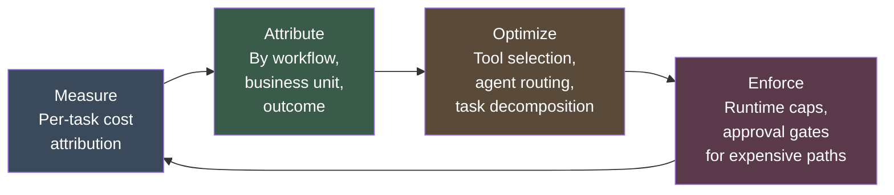

# FinOps for Agents

Traditional AI FinOps is predictable. You run a model. You pay per inference or per token. You know your cost per call, you multiply by volume, and you have your budget.

Agent costs are not predictable. An agent receives a goal and decides how to achieve it. That decision includes which tools to call, how many times, how deeply to process results, and whether to spawn sub-agents. The cost of that goal completion is determined at runtime, not at design time.

Without a FinOps framework designed for this unpredictability, operational budgets for agentic systems become uncontrollable. This is not a theoretical concern. It is one of the primary reasons Gartner projects that more than 40% of agentic AI projects will be cancelled by 2027.

---

## Why Agent Costs Are Fundamentally Different

When you call a traditional model, the cost is bounded. A classifier runs in milliseconds. An LLM call has a token count. You can instrument these, set budgets, and enforce them at the API gateway level.

When an agent executes a task:

- It may call an LLM multiple times as it reasons through the problem
- It may invoke external APIs, each with their own cost structure
- It may spawn sub-agents that each incur their own costs
- It may process retrieved documents, execute code, search the web, write and read files
- It decides how deeply to pursue each avenue based on what it finds

A task that costs $0.12 in one execution may cost $1.80 in the next if the agent encounters ambiguity and expands its search. The variance is not a bug. It is the nature of dynamic task execution.

!!! warning "The Runaway Agent Problem"
    Without runtime budget controls, a single misbehaving agent can exhaust a monthly budget in hours. This is not hypothetical. Reported incidents of runaway agent costs in cloud environments increased significantly through 2024-2025 as organizations deployed agents without appropriate FinOps infrastructure.

---

## Cost Architecture for Agents

### Per-Task Cost Tracking and Attribution

The unit of measurement shifts from API calls to tasks. Every task an agent handles must have a cost identifier attached from initiation to completion. This identifier travels through every sub-call, every tool invocation, every sub-agent spawn.

This requires instrumentation at the agent runtime layer, not at the billing layer. By the time costs appear in your cloud bill, attribution is lost. You need to capture cost metadata as the task executes.

**What to track per task:**
- LLM tokens consumed (input and output, by model)
- External API calls (type, cost, response tokens if applicable)
- Compute resources (if running code or processing data)
- Sub-agent invocations (with their own per-task cost breakdown)
- Total wall-clock duration (for timeout and resource planning)

### Budget Caps Enforced at the Runtime Layer

Budget caps belong in the agent runtime, not in the system prompt.

Telling an agent "keep costs under $2" in a prompt is not a control mechanism. It is a suggestion that the agent may or may not follow, and that it has no mechanism to enforce even if it wants to. Runtime budget enforcement means the orchestration layer tracks accumulated cost in real time and halts execution when a budget boundary is reached.

**Budget enforcement mechanisms:**
- Hard caps: execution stops when the budget is exhausted. The agent returns a partial result and a reason code.
- Soft caps: execution continues but triggers an alert and requires explicit override approval.
- Escalation caps: tasks approaching a budget threshold are flagged for human review before the agent decides whether to continue pursuing an expensive path.

### Cost-per-Outcome Metrics

Cost-per-call is a meaningless metric for agents. You need cost-per-outcome.

A task that costs $1.20 and produces a correctly resolved customer service case is better than a task that costs $0.40 and fails to resolve it, requiring human follow-up at $8.00 in labor cost. The cheap execution was more expensive.

Define outcomes for every agent workflow. Measure cost against those outcomes. Report cost-per-outcome alongside task completion rates.

**Example outcome metrics:**
- Cost per successfully resolved support ticket (vs. escalated)
- Cost per contract reviewed to approval-ready state (vs. requiring significant rework)
- Cost per lead qualified and handed to sales (vs. disqualified or incorrectly routed)

### Showback and Chargeback in Multi-Tenant Deployments

In organizations where multiple business units share agent infrastructure, cost attribution becomes a governance issue as much as a financial one. Without showback, all agent costs pool into a central technology budget that no business unit is accountable for.

**Showback:** Report cost consumption by business unit without direct charging. Creates visibility and behavioral change without the friction of internal pricing.

**Chargeback:** Directly charge business units for agent consumption. Creates strong accountability but requires a pricing model and internal billing infrastructure.

The choice between showback and chargeback depends on your organization's financial culture. What is non-negotiable is attribution. Business units that cannot see their agent costs will not make rational decisions about agent usage.

---

## Comparing Traditional ML FinOps vs. Agent FinOps

| Dimension | Traditional ML FinOps | Agent FinOps |
|---|---|---|
| **Cost unit** | Per inference or per token | Per task (variable composition) |
| **Cost predictability** | High (bounded by design) | Low (determined at runtime) |
| **Budget enforcement point** | API gateway or billing alerts | Agent runtime layer |
| **Attribution granularity** | Model, endpoint, team | Task, workflow, business unit, outcome |
| **Primary cost driver** | Inference volume | Tool usage, sub-agent spawning, reasoning depth |
| **Optimization lever** | Model selection, batching, caching | Task decomposition, tool budget caps, agent routing |
| **Anomaly detection** | Volume spikes vs. baseline | Cost-per-task spikes, runaway sub-agent chains |
| **Key metric** | Cost per inference | Cost per completed outcome |
| **Governance requirement** | Budget alerts | Runtime caps plus audit trail |

---

## The Cost Optimization Loop

Agent FinOps is not a one-time configuration. It is a continuous loop.

**Measure:** Instrument every task execution with cost tracking from day one. This is infrastructure work that is expensive to retrofit. Build it before you need it.

**Attribute:** Attach cost data to business units, workflows, and outcomes. Surfaces where the highest spend is occurring and whether it is justified by outcomes.

**Optimize:** Use attribution data to identify cost reduction opportunities. Common findings: agents calling expensive APIs when cheaper alternatives exist, sub-agents being spawned unnecessarily, retrieval steps pulling far more context than needed.

**Enforce:** Translate optimization insights into runtime controls. Budget caps, routing rules, tool selection constraints. Enforcement without measurement is arbitrary. Measurement without enforcement is reporting theater.

---

## Practical Priorities for Your First Agent FinOps Implementation

**Start with instrumentation, not optimization.** You cannot optimize what you cannot see. The first ninety days of any agent deployment should prioritize getting clean cost data out of the runtime before trying to reduce costs.

**Set conservative caps during pilot phases.** Agent pilots should run with strict budget caps that reflect learning budgets, not production budgets. Raise caps deliberately as reliability is established.

**Define outcomes before deployment.** Cost-per-outcome metrics require agreed-upon outcome definitions. These are business conversations, not technical ones. Have them before deployment, not after.

**Treat runaway costs as a signal, not a billing problem.** An agent that is consuming twenty times the expected budget for a task type is not primarily a finance issue. It is a signal about task decomposition failures, tool misuse, or adversarial inputs. Investigate the root cause before just raising the cap.

**Build cost visibility into every dashboard that shows agent performance.** Task completion rate without cost is a vanity metric. Cost-per-outcome is the metric that connects agent performance to business value.
