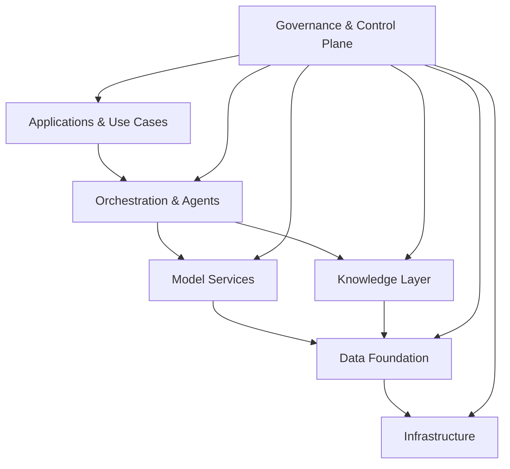

# Capability Stack

A layered view of AI architecture is not an academic exercise. It is the basis for investment decisions, ownership assignments, and risk exposure assessments. Without it, capital flows toward visible components and away from the foundational ones that make them work.

The capability stack is a capital allocation framework. Each layer requires investment. Skipping a layer does not save money -- it creates hidden costs that surface as incidents, rework, and regulatory exposure.

---

## The Seven Layers

The stack reads top to bottom as value delivery and bottom to top as dependency. The Governance & Control Plane is not a sequential layer. It operates across all layers simultaneously.

---

## Layer 1: Applications & Use Cases

### What it does

Applications are the business-facing surface of the stack: the tools, interfaces, and automated workflows that users and processes interact with directly. This is where value is visible. A customer service agent, a contract review tool, a financial report generator -- all are applications drawing on the layers below.

### Who owns it

Domain teams, with platform teams setting the guardrails and patterns for deployment.

### What goes wrong without it

Without deliberate application design, the stack becomes a platform that no one uses. Capability without adoption is sunk cost. The more common failure is the inverse: applications built without the layers below them, generating immediate adoption and deferred infrastructure debt.

**Build vs. buy:** Buy is usually correct for commodity applications (summarization, search). Build is correct for workflows that encode proprietary process logic or require deep integration with internal systems. The mistake is building commodity functions and buying proprietary-logic functions -- it inverts the competitive value.

---

## Layer 2: Orchestration & Agents

### What it does

Orchestration coordinates how models, tools, data sources, and external services are assembled into workflows. For agentic systems, this layer manages planning, tool selection, memory, and task execution across multi-step sequences. It is the operating logic of the AI system, sitting between what users ask for and what the infrastructure can deliver.

### Who owns it

Platform teams. Orchestration patterns need to be reusable, not rebuilt per use case. Domain teams configure orchestration; they should not be designing it from scratch each time.

### What goes wrong without it

Each use case becomes a bespoke integration, unmaintainable at scale. Agents built without shared orchestration infrastructure cannot share memory, tools, or control surfaces. Security controls are applied inconsistently because there is no central execution path to instrument.

**Build vs. buy:** Buy the framework (LangGraph, LlamaIndex, semantic kernel), build the enterprise integration layer on top. Organizations that try to build orchestration frameworks from scratch systematically underestimate the maintenance overhead.

---

## Layer 3: Model Services

### What it does

Model services is the abstraction layer that makes AI models available to the rest of the stack as callable capabilities: inference endpoints, fine-tuned models, embedding services, and rerankers. It decouples the applications and orchestration layers from the specifics of which model is running, which version, and where it is hosted.

### Who owns it

Platform teams. Centralizing model serving lets the organization manage cost, versioning, access control, and model governance in one place rather than across dozens of application teams.

### What goes wrong without it

Without a model services layer, teams provision their own models independently. This creates version fragmentation, redundant costs, inconsistent access controls, and a model inventory that no one can audit. When a model vendor announces a deprecation or a security vulnerability, the organization has no way to respond systematically.

**Build vs. buy:** Buy the inference infrastructure (managed APIs, cloud model endpoints). Build the internal abstraction, rate limiting, cost allocation, and access control layer on top. The common mistake is paying for enterprise AI platforms that bundle both -- and then paying again for the flexibility to swap models.

---

## Layer 4: Knowledge Layer

### What it does

The knowledge layer stores, indexes, and retrieves the context that models need to be useful in an enterprise setting: vector stores for semantic search, retrieval-augmented generation (RAG) pipelines, document repositories, and knowledge graphs. It is what separates a generic model from one that can reason over your data, your policies, and your processes.

### Who owns it

Shared ownership between platform teams (infrastructure and retrieval patterns) and domain teams (content curation and quality). The platform team cannot own what goes in the knowledge store; that requires domain expertise. The domain team cannot own the infrastructure; that requires platform expertise.

### What goes wrong without it

Models hallucinate on enterprise-specific questions, or retrieve the wrong context and produce confident, plausible, incorrect answers. Without the knowledge layer, organizations are paying for model capability they cannot access. The retrieval quality problem is consistently underestimated -- bad retrieval is harder to detect than bad generation because the model's output looks coherent even when the source was wrong.

**Build vs. buy:** The tooling (vector databases, embedding pipelines, RAG frameworks) is mature enough to buy. The knowledge curation and quality work cannot be bought. Organizations that deploy a knowledge layer without investing in content governance see retrieval quality degrade within quarters.

---

## Layer 5: Data Foundation

The data foundation is the layer that every AI application above it depends on. Quality, availability, lineage, and governance of enterprise data determine what AI can actually do -- not what it could theoretically do with perfect inputs.

A well-functioning data foundation for AI requires: data that is accessible where AI workloads run, consistent semantic definitions across domains, sufficient quality for AI inference (not just for reporting), lineage tracking that can satisfy regulatory queries, and governance structures that enable data sharing without removing accountability.

The most common architectural mistake is treating data as an AI project input rather than as infrastructure. Each AI use case then builds its own data preparation layer, which means fragmentation compounds over time and the underlying quality problems are never resolved.

For a comprehensive treatment of enterprise data architecture including data products, mesh patterns, quality frameworks, and platform design, see [Enterprise Data Architecture](https://sunilprakash.com/enterprise-data-architecture/).

---

## Layer 6: Governance & Control Plane

### What it does

The control plane provides identity, access management, policy enforcement, audit logging, observability, and human override capability across every layer of the stack. It is not a sequential layer -- it operates continuously across all others. Every model call, every agent action, every data access is a candidate for control plane instrumentation.

### Who owns it

A dedicated platform or governance function, with clear accountability lines to the CAIO and CISO. This layer cannot be owned by individual application teams; fragmented control surfaces are indistinguishable from no control surface.

### What goes wrong without it

Without a control plane, there is no reliable answer to: what AI systems are running in production, what decisions have they made, what data have they accessed, and who authorized what. Audits become reconstruction exercises. Incidents lack response playbooks. Regulatory inquiries cannot be answered. The organization is not ungoverned in spirit; it is ungoverned in fact.

**Build vs. buy:** Buy the components (observability platforms, policy engines, identity providers). Build the integration that ties them into a coherent governance surface. Most vendor AI governance tools cover subsets of the problem; assembling them into a working control plane is organizational and engineering work that cannot be outsourced.

---

## Layer 7: Infrastructure

### What it does

Infrastructure is the compute, networking, storage, and platform services that the rest of the stack runs on: GPU and accelerator capacity for inference and training, cloud or on-premise deployment environments, container orchestration, and the cost management layer that governs how resources are allocated across workloads.

### Who owns it

Platform and infrastructure teams. This layer is typically the best candidate for cloud procurement, though regulated industries may require hybrid or on-premise arrangements for specific workloads.

### What goes wrong without it

Infrastructure limits become AI strategy limits. Organizations that cannot provision the compute they need cannot deploy the models they want. The less obvious failure is cost infrastructure: without tagging, attribution, and budget controls at the infrastructure layer, AI costs are invisible until they appear as budget surprises. Agentic systems in particular generate unpredictable per-task costs that require real-time monitoring to govern.

**Build vs. buy:** Buy infrastructure. The question is which cloud provider, which managed services, and which abstraction layers to standardize on. The exception is organizations with specific data residency or latency requirements that mandate on-premise investment -- those requirements should be documented and not assumed.

---

## The Build vs. Buy Tension

Every layer in the stack generates the same organizational conflict: platform teams want to build (more control, better fit, engineering engagement); procurement wants to buy (faster, off-budget in some cases, vendor support). The right answer varies.

The general principle: **buy where the market has commoditized the capability; build where your process logic or data is the differentiator.** Infrastructure is almost always buy. Orchestration frameworks are buy. Enterprise integration layers, knowledge curation, control plane assembly -- those require build because they encode how your organization specifically works.

The dangerous pattern is reversing this: building commodity infrastructure (expensive, slow, no competitive value) and buying proprietary-logic layers (vendor lock-in, inability to differentiate). It happens when technology teams define "build" as high-status work and "buy" as compromise.

---

Investment decisions made without this stack view consistently misallocate capital toward visible layers (applications, models) and away from foundational ones (data, control plane, knowledge). The applications stop working when the foundation degrades. The costs are just deferred, not avoided.
