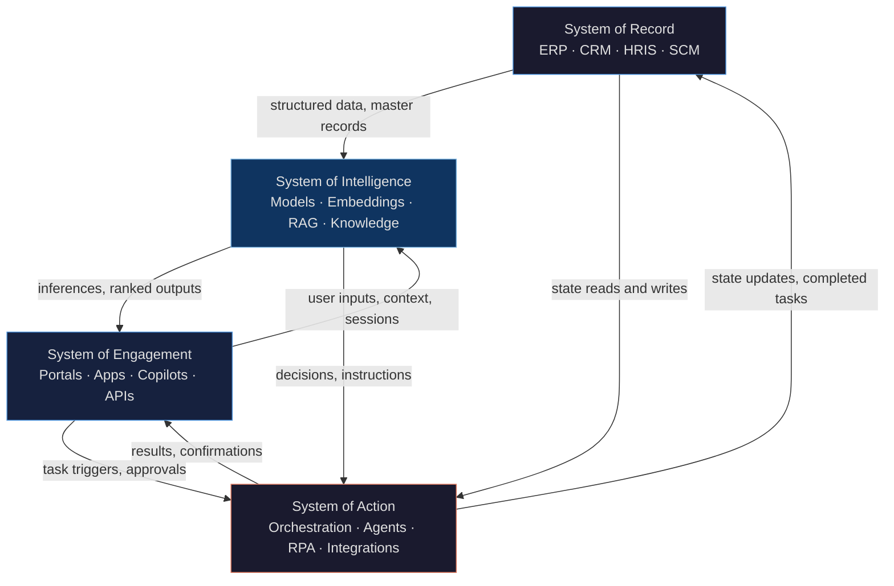

# Systems Model

Strategy describes what to change. Architecture describes what to build. The systems model answers the prior question: what are we actually operating, and how does AI fit inside it?

Every enterprise already runs four systems. They were not designed together. They evolved independently, from different vendors, over different decades, with different data models. AI transformation requires connecting them deliberately. Most programs do not. That is why most programs fail to generate value beyond the pilot.

## The Four Systems

The flow reads as: records feed intelligence, engagement surfaces intelligence to users, action closes the loop back into records. The control boundary runs across all four. A gap in any connection is where value leaks.

---

### System of Record

**What it contains:** ERP (SAP, Oracle, Workday), CRM (Salesforce, Dynamics), HRIS, supply chain management, financial ledgers. The authoritative source for customer accounts, product master data, employee records, financial positions, and operational state.

**AI's relationship to it:** Reads from. Writes back selectively. The System of Record is the source of ground truth that intelligence depends on. It is also the system of consequence: when an agent updates a purchase order or closes a customer case, the state change lands here.

**Integration challenge:** These systems were built for human operators and batch processes, not for real-time AI consumption. Data is often normalized in ways that strip context. APIs exist but were designed for synchronous transactions, not the high-frequency, low-latency reads that retrieval-augmented generation and agent tool calls require. Schema changes break downstream pipelines. Access control models were designed for users, not for service accounts running autonomous workflows. Most enterprises significantly underestimate how much data engineering work sits between "we have an ERP" and "AI can reliably use it."

---

### System of Engagement

**What it contains:** Customer portals, employee-facing apps, mobile interfaces, API gateways, copilot surfaces, chat interfaces, productivity tool integrations. Anywhere a person interacts with the enterprise digitally.

**AI's relationship to it:** The System of Engagement is where AI becomes visible. Models running in the background generate no business value until their outputs surface here. AI augments the interface (a copilot, a suggestion, an automated draft), or it replaces portions of it (a conversational interface substituting a form-based workflow).

**Integration challenge:** Engagement surfaces were designed for deterministic outputs. A form submits, a record updates, a page renders. AI outputs are probabilistic. Injecting AI into an engagement layer requires designing for uncertainty: how does the interface communicate confidence? What happens when the model is wrong? Who owns the output once a human acts on it? These are UX and product questions as much as engineering questions. They require more investment than most programs budget.

---

### System of Intelligence

**What it contains:** Foundation models (hosted or fine-tuned), embedding models, retrieval infrastructure, knowledge stores, vector databases, prompt management, evaluation pipelines, context assembly logic, RAG frameworks.

**AI's relationship to it:** This is AI. The System of Intelligence is where reasoning happens, knowledge is retrieved, and outputs are generated. It has no direct interface with users and no direct write access to operational systems. It receives context and produces outputs that flow into the other three systems.

**Integration challenge:** The System of Intelligence is the easiest to build in isolation. You can stand up a model, a vector database, and a RAG pipeline in days. The challenge is not intelligence. It is that the quality of what this system produces depends entirely on the quality of what it receives from the System of Record (clean, current, accessible data) and the System of Engagement (well-formed context, clear task framing). Garbage in from a poorly integrated record layer produces confident garbage out. The intelligence is fine. The inputs are not.

---

### System of Action

**What it contains:** Orchestration frameworks, AI agents, workflow automation, RPA integrations, API execution layers, approval routing, human-in-the-loop mechanisms, tool call infrastructure.

**AI's relationship to it:** This is where AI stops recommending and starts doing. The System of Action takes instructions from the System of Intelligence and executes them: calling APIs, updating records, triggering workflows, routing exceptions, completing multi-step tasks without human intervention at every step.

**Integration challenge:** Action systems operate in the System of Record's domain. Every tool call has potential consequences: a record changes, a message sends, a transaction executes. The integration challenge is twofold. First, technical: tool definitions must be precise, API contracts must be stable, and execution must be idempotent where possible. Second, governance: who authorized this action? What were the bounds of the agent's authority? What does the audit trail show? The System of Action is where autonomous AI creates regulatory and operational exposure. Integration without governance is the highest-risk pattern in enterprise AI.

---

## The Integration Imperative

!!! warning "Where the real architecture problem lives"
    Most enterprise AI investment concentrates in the System of Intelligence. New models, better embeddings, more sophisticated RAG pipelines. That investment is necessary but not sufficient. Value is realized only when intelligence connects to Systems of Engagement and Action, grounded in a System of Record that can support it. The architecture challenge is integration, not intelligence. You do not have an AI problem. You have a systems integration problem with an AI component inside it.

The implication is budget and team structure. Organizations that treat AI architecture as a model selection exercise will underfund the data engineering, API development, engagement design, and governance work that integration actually requires. The intelligence layer is 20% of the problem.

---

## Tight vs. Loose Integration

The decision facing every architecture team is how tightly to couple these four systems.

**Tight integration** connects systems directly: the agent calls the ERP API synchronously, the copilot reads live CRM data on every query, the orchestration layer writes directly to the record system on task completion. This delivers value faster. It is also harder to change. Swap the model provider and you rebuild the integration layer. Upgrade the ERP and you break the agent tool definitions. Tight coupling is a bet that today's architecture is close enough to correct that speed of value outweighs the cost of future change.

**Loose integration** connects systems through abstraction layers: an event bus between action and record, a data product layer between record and intelligence, a capability API between intelligence and engagement. Initial deployment takes longer. But individual components can be replaced without cascading rewrites. A new model plugs into the same capability API. A new ERP version surfaces through the same data product layer.

The right answer is not architectural purity. It is a deliberate bet on pace of change.

If you expect your underlying model infrastructure to change significantly in the next 18 months (a reasonable expectation given current market dynamics), loose integration in the intelligence layer pays for itself. If your record systems are stable and the use case is time-sensitive, tighter coupling may be the right tradeoff. The error is making this decision by default rather than by design.

Organizations that build tight integrations without documenting the coupling inherit technical debt that compounds. Every model upgrade, vendor switch, or ERP migration becomes a coordinated project across four systems instead of an isolated change in one.

The systems model exists to make those choices visible before they are made by accident.
