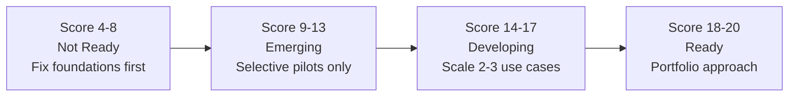

# AI Readiness Assessment

Most organizations believe they are more AI-ready than they actually are. The gap between leadership confidence and operational reality is where AI transformation programs go to die. A structured assessment is not a formality. It is the difference between deploying AI that compounds value and deploying AI that exposes organizational dysfunction at scale.

!!! warning "The readiness gap is widening"
    Only 40% of organizations report high AI strategy readiness, and that figure is declining year-over-year (Deloitte, 2026). Confidence is not dropping. Readiness is. The gap between what leaders believe and what their organizations can actually execute is growing.

---

## AI-Ready vs. AI-Active

These are not the same thing, and confusing them is costly.

**AI-Active** organizations have deployed tools. They have copilots in the hands of employees, LLMs integrated into support workflows, and a growing library of proofs of concept. Activity is visible. Progress is measured in projects launched, not value delivered.

**AI-Ready** organizations have the underlying conditions for AI to compound. Strategy is clear and tied to business outcomes. Data is accessible and governed. Processes are documented and auditable. Leadership is aligned on what AI is for and what it is not for.

You can be AI-Active and deeply unprepared for transformation. Many organizations are.

!!! tip "The diagnostic question"
    Ask your leadership team: "What business outcomes is AI accountable for delivering in the next 18 months, and how will we measure them?" Vague answers signal AI-Active, not AI-Ready.

---

## The Assessment Framework

This framework covers four dimensions. Each is scored on a five-point scale. An honest assessment requires input from leaders, practitioners, and frontline users, not just the AI program office.

### Dimension 1: Strategy Clarity

| Score | Criteria |
|-------|----------|
| 1 | No formal AI strategy. Initiatives are opportunistic and uncoordinated. |
| 2 | AI mentioned in digital transformation strategy but not specifically defined. |
| 3 | Dedicated AI strategy exists with use case priorities but no funding model or accountability. |
| 4 | AI strategy is tied to business unit P&Ls, with named owners and defined success metrics. |
| 5 | AI is integrated into corporate strategy with board-level visibility, multi-year investment thesis, and portfolio governance. |

### Dimension 2: Leadership Alignment

| Score | Criteria |
|-------|----------|
| 1 | AI is owned by IT or a single enthusiast executive. Other leaders are passive or skeptical. |
| 2 | CIO or CTO leads AI. Business unit heads are aware but not accountable. |
| 3 | Executive sponsor exists. Business unit leaders are engaged in use case selection. |
| 4 | Cross-functional AI leadership council with clear decision rights and escalation paths. |
| 5 | CEO-level ownership. Business unit leaders carry AI outcomes in their performance objectives. AI is a board agenda item. |

### Dimension 3: Technical Infrastructure

| Score | Criteria |
|-------|----------|
| 1 | Data is siloed, inconsistently formatted, poorly governed. No ML platform. |
| 2 | Some data consolidation. Cloud migration underway. Limited ML tooling. |
| 3 | Core data platform exists. ML experimentation infrastructure in place. API-first architecture partially adopted. |
| 4 | Unified data platform with access controls and lineage. MLOps pipeline supports production deployment. LLM access standardized. |
| 5 | Real-time data infrastructure. Automated data quality monitoring. Enterprise AI platform with self-service capabilities. Security and compliance integrated at the platform layer. |

### Dimension 4: Organizational Capacity

| Score | Criteria |
|-------|----------|
| 1 | No AI-dedicated roles. Ad-hoc project teams. No change management capability. |
| 2 | Small central AI team. No structured upskilling. Business units have no AI capacity. |
| 3 | Center of excellence established. AI literacy programs launched. Some business unit AI champions. |
| 4 | Federated AI capacity model. Business units have embedded AI leads. Upskilling is tracked and funded. |
| 5 | AI fluency is an organizational competency. Hiring, onboarding, and performance management reflect AI capability requirements. Change management is systematized. |

---

## Scoring Interpretation

| Total Score | Readiness State | Recommended Action |
|-------------|-----------------|-------------------|
| 4-8 | Not Ready | Do not scale AI. Address foundational gaps first. AI will surface and amplify existing dysfunction. |
| 9-13 | Emerging | Selective pilots in contained, high-signal areas. Invest heavily in the dimensions scoring below 3. |
| 14-17 | Developing | Scale 2-3 use cases. Governance and measurement framework required before expanding further. |
| 18-20 | Ready | Portfolio approach is viable. Governance, measurement, and operating model should be in place. |

!!! note "Score honestly"
    Most leadership teams overestimate by 2-3 points. Calibrate against external benchmarks and practitioner input, not executive self-assessment.

---

## Red Flags: Organizations Not Ready to Scale

These signals indicate systemic readiness problems that AI investment will worsen, not solve.

**Strategic red flags:**
- AI strategy is a slide deck with no budget owner
- "We want to be AI-first" with no definition of what that means operationally
- AI investments are evaluated project-by-project with no portfolio view
- The CAIO or AI lead has no authority over data, architecture, or business unit priorities

**Organizational red flags:**
- AI program is housed entirely in IT with no business unit accountability
- No executive has AI outcomes in their performance review
- Change management is treated as a communications exercise, not a program discipline
- Business units are running shadow AI without central visibility

**Technical red flags:**
- Data engineers spend more than 40% of time on data cleaning for each new AI project
- There is no single source of truth for core business entities (customers, products, transactions)
- ML models cannot be deployed to production without a bespoke engineering effort each time
- There is no monitoring or alerting on deployed AI model performance

**Governance red flags:**
- No AI risk policy exists
- AI procurement is handled by individual business units without central review
- There is no process for human review of high-stakes AI decisions
- Legal and compliance are consulted after deployment, not before

---

## Conducting the Assessment

### Who should participate

The assessment is not a self-assessment by the AI program office. It requires:

- C-suite and direct reports (for strategy and alignment dimensions)
- Data engineering and architecture teams (for infrastructure dimension)
- Business unit leaders who will own AI outcomes (for all dimensions)
- Frontline practitioners who work with data and processes daily (to calibrate infrastructure and capacity claims)

### Assessment cadence

Run a full assessment before launching a major AI initiative. Run a lightweight version (dimensions 1 and 4) quarterly during active transformation. Annual deep assessments provide trend data that reveals whether interventions are working.

### What to do with the results

The assessment is an input to the transformation roadmap, not an end in itself. Low scores in strategy clarity require governance decisions before technical work proceeds. Low scores in infrastructure require investment before use cases scale. Low scores in organizational capacity require a workforce plan that runs parallel to the technical program.

!!! danger "Common mistake"
    Treating the assessment as a one-time gate rather than a continuous diagnostic. Readiness conditions change as organizations scale. A score of 16 at program launch can deteriorate to 11 within a year if organizational capacity gaps are not addressed.

---

## Next Steps

- [Data Readiness Assessment](data-readiness.md): The most common and most underestimated gap
- [Process and Talent Readiness](process-talent.md): The dimensions most assessments miss entirely
- [AI Maturity Model](maturity-model.md): Where your organization sits and what the transition to the next level requires

---

## Sources

1. Deloitte. "State of AI in the Enterprise, 7th Edition." March 2026.

For the complete source list and methodology, see [Sources & Methodology](../sources.md).
