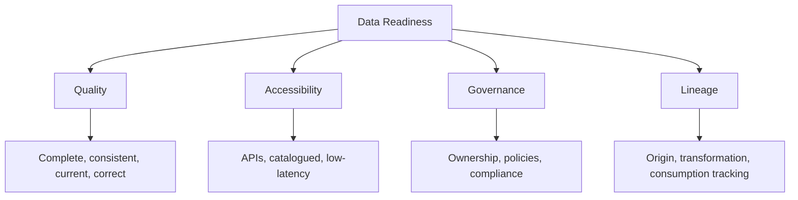

# Data Readiness

Data is the most common blocker of enterprise AI transformation and the least honestly assessed. Organizations invest in models, platforms, and talent while the underlying data remains inconsistent, inaccessible, ungoverned, and untraced. The result is predictable: AI initiatives stall, timelines extend, and leadership confidence erodes.

The numbers are unambiguous. Fifty-seven percent of organizations say their data is not AI-ready (Gartner). Only 14% of leaders believe their data maturity can support AI at scale (Gartner). And Gartner projects that 60% of agentic AI projects will fail because of poor data foundations. These are not edge cases. They are the norm.

!!! danger "The stakes are higher for agentic AI"
    Copilots and standalone LLM tools can tolerate imperfect data. They fail quietly. Agentic systems, which act autonomously across systems and workflows, fail loudly and consequentially. Bad data plus autonomous action equals compounding errors at machine speed. Data readiness is not a prerequisite for experimentation. It is a prerequisite for production-grade AI.

---

## The Data Cleansing Trap

Every organization that has scaled AI knows this pattern. A use case looks compelling. The team builds a proof of concept. The POC works in a controlled environment. Production deployment begins. Then the data issues surface.

The source system has 12 conflicting customer ID formats. Product codes are inconsistent across regions. Timestamps are stored in six different timezones without standardization. Fields that should be required are empty 30% of the time. The "single source of truth" has three competing versions.

What was scoped as a three-month AI project becomes a six-to-twelve-month data remediation project. The AI work is blocked, waiting on upstream data fixes. Business stakeholders lose confidence. The use case gets deprioritized. A new use case is selected, and the cycle repeats.

The trap is structural, not incidental. Most organizations have not invested in data quality as a platform capability. They treat data cleansing as a per-project cost. At scale, this approach fails completely.

!!! tip "The diagnostic test"
    Ask your data engineering team how long it takes to onboard a new data source for an AI project. If the answer is more than four weeks, you are in the trap. The fix is not faster data cleaning. It is data quality infrastructure.

---

## The Four Dimensions of Data Readiness

### Dimension 1: Data Quality

Quality is not a binary state. It is a spectrum across four properties: completeness, consistency, currency, and correctness.

**Assessment checklist:**

- [ ] Core business entities (customers, products, transactions, employees) have defined schemas with documented field-level quality standards
- [ ] Data quality metrics are monitored continuously, not audited quarterly
- [ ] Null rates, duplicate rates, and format error rates are measured and tracked over time
- [ ] Quality SLAs exist for data used in production AI systems
- [ ] Data quality issues are routed to owners with defined resolution timelines
- [ ] Historical data has been profiled and documented, not just assumed to be clean

**Red flags:**
- Quality is assessed at project start, not maintained continuously
- No team owns data quality as a standing responsibility
- "Good enough for reporting" is used as the standard for AI readiness

### Dimension 2: Data Accessibility

Data that exists but cannot be accessed is not useful. Accessibility means the right data can reach the right systems with appropriate controls, at the latency AI systems require.

**Assessment checklist:**

- [ ] A data catalog exists and is actively maintained with accurate metadata
- [ ] Data is accessible via APIs or query interfaces, not only via manual export
- [ ] Access control is role-based and auditable, not file-share-level
- [ ] Real-time or near-real-time data is available for use cases that require it
- [ ] Cross-system data joins are possible without bespoke engineering for each use case
- [ ] Self-service data access exists for approved use cases, reducing bottlenecks on the data engineering team

**Red flags:**
- The answer to "can we get that data?" is always "yes, but it will take a few weeks"
- Data lives in spreadsheets, email attachments, or legacy systems with no API
- Every new AI use case requires a new data pipeline built from scratch

### Dimension 3: Data Governance

Governance is the framework of accountability that determines who owns data, how it is used, who can access it, and what compliance obligations apply. AI amplifies the consequences of weak governance.

**Assessment checklist:**

- [ ] Data domains are defined with named owners who are accountable for quality and policy compliance
- [ ] A data classification policy exists (public, internal, confidential, restricted)
- [ ] PII and sensitive data are identified, tagged, and subject to access controls
- [ ] A data retention and deletion policy exists and is enforced technically, not just as a document
- [ ] Regulatory requirements (GDPR, CCPA, HIPAA, or industry-specific) are mapped to specific data assets
- [ ] AI-specific data governance policies exist, covering training data, inference data, and model output storage

**Red flags:**
- Data governance exists as a policy document but has no technical enforcement
- No one can answer "who owns this data?" for a given critical dataset
- Compliance reviews happen after AI systems are deployed, not before

### Dimension 4: Data Lineage

Lineage is the ability to trace data from its origin through every transformation to its point of consumption. For AI, lineage is not optional. It is the foundation of explainability, auditability, and trust.

**Assessment checklist:**

- [ ] Data lineage is tracked automatically, not documented manually after the fact
- [ ] For any AI model output, you can trace the data that produced it
- [ ] Transformation logic is version-controlled and auditable
- [ ] You can identify the downstream impact of a change to an upstream data source
- [ ] Model training data is catalogued and version-controlled alongside the model itself
- [ ] Lineage documentation satisfies audit requirements in regulated domains

**Red flags:**
- Lineage is a spreadsheet that someone maintains sporadically
- Training data provenance is unknown or undocumented
- A data source change can silently break downstream AI systems without detection

---

## What AI-Ready Data Actually Looks Like

This is concrete. Organizations that have reached genuine data readiness for AI share these characteristics:

**Structural characteristics:**
- A unified data platform (lakehouse, warehouse, or federated architecture) serves as the authoritative source for core entities
- Data contracts exist between producer systems and consumer systems, enforced at the infrastructure layer
- Schema evolution is managed with versioning and backward compatibility guarantees
- Data quality is monitored with automated alerting on degradation

**Operational characteristics:**
- New data sources can be onboarded to the AI-ready platform in under two weeks
- Data engineering team spends less than 20% of time on ad-hoc data cleaning
- Business users can find and understand available datasets without engineering assistance
- Data issues are caught before they reach AI systems, not discovered when model performance degrades

**Governance characteristics:**
- Every dataset used in a production AI system has a named owner, a classification, and documented quality standards
- Access to sensitive data requires approval workflow and is audited
- AI training data is version-controlled and reproducible

!!! note "The 80/20 reality"
    You do not need perfect data to start. You need good enough data for a specific, well-scoped use case. The goal of data readiness assessment is not to achieve perfect data quality organization-wide before doing any AI. It is to ensure that the data required for a specific use case meets the quality, accessibility, governance, and lineage standards that use case requires. Assess per use case. Build platform capability in parallel.

---

## Data Readiness Scoring

| Dimension | Score 1 | Score 3 | Score 5 |
|-----------|---------|---------|---------|
| Quality | No quality standards. No monitoring. | Quality standards defined for major entities. Periodic audits. | Continuous monitoring. Automated alerting. Quality SLAs enforced. |
| Accessibility | Data in silos. Manual exports only. | Data catalog exists. Core APIs available. | Self-service access. Real-time APIs. Cross-system joins without custom engineering. |
| Governance | No policies. No owners. | Domain owners defined. Classification policy exists. | Technical enforcement. AI-specific policies. Regulatory mapping complete. |
| Lineage | No lineage tracking. | Lineage documented manually for major pipelines. | Automated lineage tracking. Training data versioned. Audit-ready. |

**Interpretation:**

| Total Score | State | Action |
|-------------|-------|--------|
| 4-8 | Not AI-ready | Data remediation is the AI program. No use case should scale until at least two dimensions reach 3. |
| 9-13 | Partially ready | Scope use cases tightly to data that is already ready. Build platform capability in parallel. |
| 14-17 | Mostly ready | Address remaining gaps dimension by dimension. Scale use cases incrementally. |
| 18-20 | AI-ready | Data is not the binding constraint. Focus assessment effort on process and talent. |

---

## The Path Forward

Data readiness is not achieved in a single initiative. It is built through consistent investment in platform capability, governance practice, and organizational accountability over 18-36 months. The organizations that have done this work are seeing compound returns on AI investment. The organizations that skipped it are running the data cleansing trap on repeat.

The three investments that move the needle most, in order of impact:

1. **A unified data platform** with automated quality monitoring. This removes the per-project data engineering bottleneck.
2. **Data ownership assignment** with accountability. Every domain needs a named owner who carries data quality in their performance objectives.
3. **A data contract framework** between producer and consumer systems. This forces quality standards upstream, where they belong.

---

## Related Assessments

- [AI Readiness Assessment](ai-readiness.md): The broader organizational context that data readiness sits within
- [Process and Talent Readiness](process-talent.md): The capability gaps that compound data problems
- [AI Maturity Model](maturity-model.md): How data maturity maps to overall organizational AI maturity

---

## Sources

1. Gartner. "Lack of AI-Ready Data Puts AI Projects at Risk." February 2025.

For the complete source list and methodology, see [Sources & Methodology](../sources.md).
