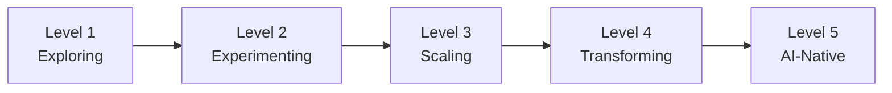
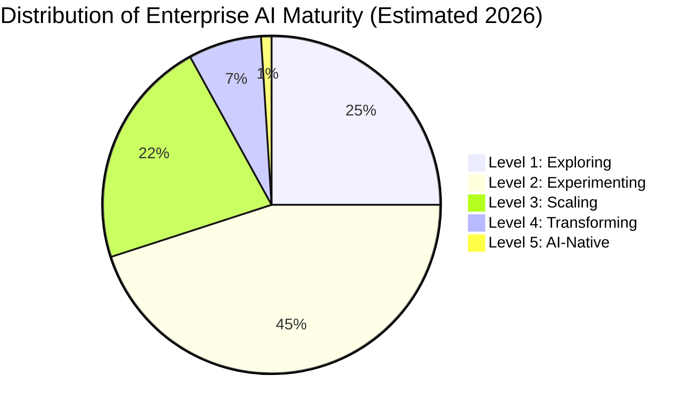

# AI Maturity Model

Maturity models are useful when they describe organizational reality, not aspirational state. This model is built from patterns across enterprise AI programs: what distinguishes organizations at each level, what holds them there, and what triggers the transition forward.

Most organizations sit at Level 2. A meaningful number believe they are at Level 3. Very few are at Level 4 or above.

!!! note "How to use this model"
    Use it as a diagnostic, not a report card. Identify which level most accurately describes your current state across all indicators, not just the ones where your organization performs well. The transition triggers at each level are the most actionable part of the model.

---

## The Five Levels

---

## Level 1: Exploring

**Description.** AI activity is ad-hoc, opportunistic, and uncoordinated. Individual teams or leaders are experimenting with AI tools independently. There is no formal AI strategy. The organization's knowledge of AI capability is shallow and largely driven by vendor marketing and media coverage. Shadow AI is common: employees are using consumer AI tools for work tasks without IT visibility or governance.

### Level 1 Indicators

| Dimension | Indicators |
|-----------|------------|
| Organizational | No AI strategy document. No dedicated AI budget. No AI leadership role. Projects are self-funded by business units or individuals. |
| Technical | No AI-specific infrastructure. Data is siloed. Experiments use off-the-shelf tools with minimal integration. No MLOps capability. |
| Governance | No AI policy. No risk assessment process for AI tools. Shadow AI is widespread and unmonitored. |
| Typical Challenges | Proof of concepts proliferate with no path to production. Duplication of effort across teams. Security and compliance exposure from ungoverned tool use. Leadership skepticism due to lack of visible outcomes. |

### Transition Triggers to Level 2

- Executive sponsor appointed with visible commitment and initial budget
- AI strategy document approved at the leadership team level
- Shadow AI policy enacted (even if permissive) to create governance baseline
- At least two centrally managed AI pilots underway with defined success metrics

---

## Level 2: Experimenting

**Description.** The organization has centralized AI coordination under a sponsor or small team. Pilots are running in structured ways with defined scope and success criteria. Governance exists on paper. Funding is project-based: each initiative requires its own business case and budget approval. Results are mixed, but the organization is learning what works and what does not. Most value created is in productivity tools (copilots, writing assistants, summarization) rather than core business processes.

### Level 2 Indicators

| Dimension | Indicators |
|-----------|------------|
| Organizational | Dedicated AI team or center of excellence (small). Executive sponsor with budget authority. Business unit participation in pilot selection. No AI outcomes in individual performance reviews. |
| Technical | Cloud infrastructure in place. Data platform exists but is fragmented. LLM access available via central procurement. No unified MLOps pipeline. |
| Governance | AI policy drafted. Vendor risk assessment process initiated. No automated policy enforcement. Compliance engagement reactive rather than proactive. |
| Typical Challenges | Each pilot is a one-off. No reuse of infrastructure, tooling, or learnings. Project funding model makes scaling any single use case politically difficult. "Pilot purgatory": successful POCs with no production pathway. |

### Transition Triggers to Level 3

- At least one use case successfully in production with measured business outcomes
- AI operating model defined (how the central team and business units relate, who owns what)
- Portfolio-level view of AI investments established, replacing project-by-project funding
- Measurement framework in place: leading and lagging indicators defined for AI program health
- Data platform investment approved and underway

---

## Level 3: Scaling

**Description.** The organization is moving from pilots to a portfolio. A repeatable operating model exists for deploying AI: use case intake, prioritization, development, and production deployment follow defined processes. Infrastructure is shared rather than rebuilt per project. The measurement framework is active, and the organization is managing AI as a program discipline, not a series of independent projects. AI outcomes are beginning to appear in business unit accountability frameworks.

### Level 3 Indicators

| Dimension | Indicators |
|-----------|------------|
| Organizational | AI center of excellence with established processes. Business unit AI leads or champions. AI outcomes in at least some business unit leader performance objectives. Structured upskilling underway. |
| Technical | Unified data platform (or active program to build it). Shared MLOps pipeline for model development and deployment. API-first architecture adopted for new AI integrations. LLM operations standardized. |
| Governance | AI risk framework adopted. AI ethics principles operationalized into review processes. Model monitoring and alerting in place for production systems. Regulatory mapping completed for relevant jurisdictions. |
| Typical Challenges | Scaling generates complexity that processes cannot yet handle. Governance becomes a bottleneck as volume increases. High-performing AI team members are at risk of attrition. Business units that lack AI capacity fall behind those that have it, creating internal friction. |

### Transition Triggers to Level 4

- Workflow redesign underway: AI is changing how work is done, not just augmenting existing workflows
- Agentic AI pilots in production or active development
- Real-time governance capabilities being built (not just post-hoc review)
- AI fluency measurably increasing across the organization, not just in the central team
- Business unit leaders are proactively bringing use cases to the AI team rather than being recruited

---

## Level 4: Transforming

**Description.** AI is redesigning how the organization operates, not just supporting existing operations. Agentic systems are in production or active deployment, handling complex multi-step tasks with human oversight at defined decision points. Workflow redesign is an active discipline: job roles, team structures, and process flows are being redesigned around AI capability. Governance is real-time and embedded in AI systems rather than applied as a periodic review. Business unit accountability for AI outcomes is standard.

### Level 4 Indicators

| Dimension | Indicators |
|-----------|------------|
| Organizational | AI fluency is a hiring criterion across all senior roles. AI outcomes are embedded in business unit P&L accountability. Workforce redesign programs address role evolution systematically. AI program has board-level visibility. |
| Technical | Agentic systems in production. Real-time data infrastructure supporting AI decision-making. Enterprise AI platform with self-service capabilities for business units. Human-AI handoff protocols defined and monitored. |
| Governance | Automated policy enforcement at the platform layer. Real-time monitoring of AI decisions for bias, drift, and compliance. AI audit capability exists and has been exercised. Regulatory engagement is proactive. |
| Typical Challenges | Managing the human impact of workflow redesign at scale. Agentic system failures that require rapid response and clear accountability. Governance keeping pace with the rate of AI deployment. Leadership transitions that destabilize the AI program. |

### Transition Triggers to Level 5

- AI is embedded in the operating model as a core capability, not a separate program
- Human-agent collaboration is the norm in high-value workflows, not an exception
- Continuous optimization of AI systems is automated, not dependent on manual intervention
- The organization acquires or builds AI capabilities that differentiate it competitively, not just operationally
- AI governance is a competitive advantage, not a compliance cost

---

## Level 5: AI-Native

**Description.** AI is not a transformation initiative. It is how the organization operates. The distinction between "AI-enabled" and "standard" processes does not exist: all major workflows involve AI in some capacity. Human-agent collaboration is the default model for knowledge work. The organization continuously optimizes its AI systems through automated feedback loops, and the rate of improvement is itself a competitive moat. AI governance is mature, proactive, and increasingly a source of market differentiation in regulated industries.

### Level 5 Indicators

| Dimension | Indicators |
|-----------|------------|
| Organizational | AI fluency is an organizational competency, not a specialized skill. Hiring, onboarding, and leadership development reflect AI-native expectations. The AI "program" has dissolved into operational management. Continuous learning is institutionalized. |
| Technical | Real-time AI across all high-value workflows. Automated model optimization with human governance at defined thresholds. Self-improving systems with robust guardrails. AI capabilities that are proprietary and defensible. |
| Governance | Governance is embedded in AI systems, not applied to them. Audit is automated. The organization contributes to regulatory frameworks rather than just complying with them. AI risk management is a board-level competency. |
| Typical Challenges | Competitive commoditization as AI capabilities become available to all. Preventing over-reliance on AI systems for decisions that require human judgment. Maintaining organizational learning capacity as AI handles more cognitive work. Managing talent development when AI is doing an increasing share of work. |

---

## Full Maturity Model Reference Table

| Dimension | Level 1: Exploring | Level 2: Experimenting | Level 3: Scaling | Level 4: Transforming | Level 5: AI-Native |
|-----------|-------------------|----------------------|-----------------|----------------------|-------------------|
| Strategy | None | Project-based, reactive | Portfolio approach, defined outcomes | Business-unit integrated, board visibility | AI embedded in corporate strategy |
| Funding | Ad-hoc | Per-project business cases | Portfolio budget | P&L accountability | AI as core operating investment |
| Governance | None | Policy drafted | Risk framework active | Real-time, automated enforcement | Governance as competitive advantage |
| Data | Siloed, ungoverned | Platform initiated | Unified platform, quality monitoring | Real-time data infrastructure | Self-optimizing data pipelines |
| Talent | No AI roles | Small central team | COE with business unit links | AI fluency across all senior roles | AI-native organizational competency |
| Deployment | Ad-hoc tools | Structured pilots | Portfolio in production | Agentic systems, workflow redesign | Human-agent collaboration as norm |
| Measurement | None | Pilot-level metrics | Program-level measurement framework | Business outcome attribution | Continuous automated optimization |

---

## Where Most Organizations Actually Are

The concentration at Level 2 reflects a structural challenge: the transition from Experimenting to Scaling requires governance, operating model, and funding changes that are organizationally difficult, not technically difficult. Organizations that cannot make these changes stay at Level 2 indefinitely, accumulating pilot experience with no production outcomes.

!!! danger "The Level 2 trap"
    Many organizations have been at Level 2 for two or three years. The pilots are sophisticated. The central team is experienced. But the operating model has not been built, the funding model has not changed, and the business unit accountability structures have not shifted. Without those changes, sophistication at Level 2 does not produce transition to Level 3. It produces better pilots with the same structural ceiling.

---

## Using the Model to Build Your Roadmap

The maturity model is a starting point for roadmap development, not a destination in itself. The key questions for each organization are:

1. What level are we at honestly, across all dimensions?
2. What are the specific blockers preventing transition to the next level?
3. Which blockers are organizational (governance, accountability, funding) vs. technical (data, infrastructure, tooling)?
4. What is the sequence of interventions that addresses the organizational blockers first, since those are typically the binding constraints?

The answer to question 4 is usually: organizational change comes before technical investment. Organizations that make the organizational and governance changes required for Level 3 typically find that the technical work is accelerated by the clarity those changes provide. Organizations that invest in technology while deferring organizational change find that the technology sits underutilized.

---

## Related Assessments

- [AI Readiness Assessment](ai-readiness.md): Dimensional scoring that maps to this maturity model
- [Data Readiness Assessment](data-readiness.md): Data maturity as a specific dimension within the broader model
- [Process and Talent Readiness](process-talent.md): The organizational dimensions that most often determine maturity level transitions
