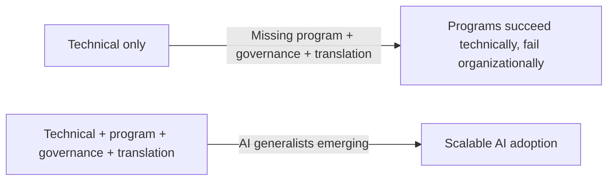

# Process and Talent Readiness

Two dimensions of AI readiness are systematically underassessed: process and talent. Organizations invest heavily in technology and strategy while underestimating how much process fragmentation and talent scarcity will constrain their ability to execute. The result is programs that are well-funded and well-intentioned but chronically underperforming.

---

## Process Readiness

### AI Surfaces What Organizations Did Not Know They Had

The most uncomfortable property of AI deployment is diagnostic. When you apply AI to a business process, you see the process as it actually operates, not as it was designed to operate. What emerges is frequently disturbing.

Processes that leadership believed were standardized turn out to be executed in dozens of different ways across geographies, business units, and teams. Decisions that appeared rule-based turn out to depend on institutional knowledge held by a handful of individuals. Workflows that seemed efficient turn out to have redundant steps, approval loops with no clear owner, and exception handling that exists nowhere in any system.

AI does not fix these problems. It exposes them. And then it amplifies them. An AI system trained on fragmented process data learns fragmented process behavior. A workflow automation built on a poorly documented process automates inconsistency at scale.

!!! warning "The uncomfortable truth"
    Process audits are almost never included in AI readiness assessments. Organizations evaluate their data, their technology, and their talent. They rarely ask: "Is this process documented, standardized, and stable enough for AI to learn from and operate within?" The omission is expensive.

### The Fragmentation Pattern

This pattern appears in nearly every enterprise AI engagement at scale:

1. Leadership identifies a high-value process for AI deployment (invoice processing, customer onboarding, demand forecasting)
2. The AI team begins discovery and finds the process is executed materially differently across regions, business units, or teams
3. The variation is not documented anywhere. It exists as tribal knowledge
4. The AI project cannot proceed without first standardizing the process
5. Process standardization requires cross-functional alignment that takes months
6. The AI project timeline extends. Stakeholder confidence drops.

The same process executed dozens of ways across geographies is not a data problem or a technology problem. It is a process governance problem that predates AI and that AI has now made impossible to ignore.

!!! example "Where this shows up most"
    High-fragmentation processes include: procurement approval workflows, customer contract negotiation, employee onboarding, regulatory reporting, and any process that was "standardized" by a policy document but never enforced at the system level.

### Process Readiness Assessment

For each candidate AI use case, assess the underlying process across these dimensions:

| Dimension | Questions to Ask |
|-----------|------------------|
| Documentation | Is the process formally documented? Is documentation current and accurate? Do practitioners recognize it as reflecting how they actually work? |
| Standardization | Is the process executed consistently across all instances, or does significant variation exist? Is variation intentional (for legitimate reasons) or accidental? |
| Measurability | Are process inputs, outputs, and cycle times measured? Is baseline performance data available? |
| Stability | Has the process been stable for at least 12 months? Is it likely to change significantly in the next 12 months? |
| Ownership | Is there a named process owner with authority to make and enforce standardization decisions? |

**Scoring:**

| Score | State | Implication |
|-------|-------|-------------|
| 1-2 across most dimensions | Process is not ready | Process remediation must precede AI deployment. Estimate 3-9 months of process work. |
| 3 across most dimensions | Process is partially ready | Pilot in the most standardized instance first. Use pilot to drive standardization in others. |
| 4-5 across most dimensions | Process is ready | AI deployment can proceed. Monitor for process drift post-deployment. |

### What AI-Ready Processes Look Like

A process is AI-ready when:

- It is documented and the documentation is accurate
- It is executed consistently enough that training data reflects intended behavior, not accumulated workarounds
- Its inputs and outputs are defined, measurable, and available in accessible systems
- It has a named owner who can make decisions about scope, exceptions, and change management
- It is stable enough that the process will not materially change before the AI system is in production

---

## Talent Readiness

### The Scale of the Gap

Only 20% of organizations report having the AI talent needed to execute their strategy (Deloitte, 2026). This is not a pipeline problem that will resolve itself in 18 months. It is a structural gap that requires deliberate intervention.

The conventional response is to hire data scientists. This is necessary but insufficient. The talent gap in enterprise AI is broader, and the missing roles are less visible.

### The Talent Gap Is Not What You Think

Organizations tend to underinvest in the roles that determine whether AI programs succeed at scale, while overinvesting in the roles that determine whether individual models perform well.

**Roles that are well-understood (and usually prioritized):**
- Data scientists and ML engineers
- Data engineers
- AI/ML platform engineers

**Roles that are systematically neglected:**

**AI process architects.** These are practitioners who understand both business process design and AI capability. They translate between what AI can do and what business processes need. They conduct process audits, identify automation opportunities, and design the human-AI handoff points that determine whether a system is usable. Most organizations have none.

**AI program leads.** Deploying AI at scale requires program management discipline that most IT or data science leaders do not have. AI program leads manage cross-functional dependencies, stakeholder alignment, change management integration, and the portfolio-level view of initiative sequencing. The role sits at the intersection of transformation program management and AI domain knowledge.

**AI governance specialists.** Risk, compliance, and audit functions need practitioners who understand AI-specific risks: model drift, data provenance failures, algorithmic bias, and regulatory exposure. Most governance functions are staffed with generalists who are learning AI on the job.

**Business translators.** The capability gap between technical AI teams and business unit leaders is real and costly. Business translators bridge it. They are not data scientists and they are not business analysts in the traditional sense. They understand AI well enough to identify valuable use cases and communicate technical constraints to business stakeholders, and they understand the business well enough to identify where AI creates genuine leverage.

### The Emerging AI Generalist

PwC (2026) identifies the emergence of the "AI generalist" as a defining talent trend. These are professionals with broad AI fluency and deep domain expertise in a specific business function. They are not AI specialists in the technical sense. They are domain experts who can identify, scope, evaluate, and adopt AI tools within their function without depending on a central AI team for every decision.

The AI generalist is what happens when AI literacy programs work. Organizations that have invested in structured upskilling over 18-24 months are seeing AI generalists emerge in their finance, operations, and commercial functions. These practitioners are disproportionately valuable because they reduce the bottleneck on the central AI team and accelerate use case adoption in the business units.

### The Access vs. Usage Gap

A critical distinction that most talent readiness assessments miss: access to AI tools is not the same as effective use of AI tools.

Approximately 60% of knowledge workers now have access to enterprise AI tools. Fewer than 60% of those with access use them daily (PwC, 2026). The gap between access and daily usage is where AI adoption programs fail.

The reasons for the gap are consistent across organizations:

- Tools are available but workers do not understand how to use them for their specific tasks
- There is no structured workflow integration; tools are add-ons rather than embedded in daily work
- Managers do not model AI use, so it remains optional in practice
- Workers lack confidence and fear making visible mistakes with new tools
- There is no feedback mechanism that helps workers improve their AI fluency over time

!!! tip "Closing the access-usage gap"
    The organizations making fastest progress on the access-usage gap are doing three things: embedding AI tools in specific workflows rather than offering them as general-purpose tools, having managers use AI publicly and share outputs in team settings, and measuring usage as a management metric alongside business outcomes.

### Talent Readiness Assessment

| Role Category | Questions |
|---------------|-----------|
| Technical (data science, ML engineering, data engineering) | Do we have enough capacity to run 3-5 concurrent production AI projects? Is there a career path that retains senior practitioners? |
| Program and process | Do we have AI program leads with transformation experience? Do we have process architects who can conduct process audits for AI readiness? |
| Governance and risk | Does legal, compliance, and risk have practitioners who understand AI-specific risks? Is there an AI governance function with teeth? |
| Business translation | Do business units have AI translators who can identify and scope use cases without depending entirely on the central team? |
| AI generalists | Are we actively building AI fluency in domain roles? Do we measure usage, not just access? |

**Interpretation:**

A talent portfolio that covers only technical roles will produce AI systems that work as engineered and fail as organizational interventions. The full talent portfolio is required for transformation.

### Building the Talent Capability

**Short-term (0-6 months):**
- Identify and formally charter AI program lead and process architect roles
- Assess current governance staff for AI literacy gaps and begin targeted upskilling
- Launch a structured AI fluency program for business unit leaders, not just practitioners
- Measure tool usage rates and identify the business units with the largest access-usage gaps

**Medium-term (6-18 months):**
- Hire or develop AI governance specialists in legal, compliance, and risk
- Identify AI generalist candidates in high-value business functions and invest in their development
- Create formal career paths for AI practitioners to prevent attrition to competitors and hyperscalers
- Integrate AI fluency into hiring criteria for senior roles, not just technical ones

**Long-term (18+ months):**
- AI generalists exist in every major business function
- AI literacy is a criteria in leadership development programs
- The central AI team is a platform and governance function, not the bottleneck for every deployment

---

## The Integrated View

Process and talent readiness are connected. Organizations with strong process documentation and standardization can onboard AI generalists into business functions because those generalists have stable processes to work with. Organizations with deep AI talent can accelerate process standardization because they have the practitioners to conduct rigorous process audits.

The failure mode is treating both as separate workstreams that can be addressed sequentially. They are not. The organizations that scale AI successfully address process and talent in parallel, as integrated components of the same transformation program.

---

## Related Assessments

- [AI Readiness Assessment](ai-readiness.md): Strategy, leadership, and infrastructure dimensions
- [Data Readiness Assessment](data-readiness.md): The data foundation process and talent work depends on
- [AI Maturity Model](maturity-model.md): How process and talent maturity map to overall AI maturity levels
