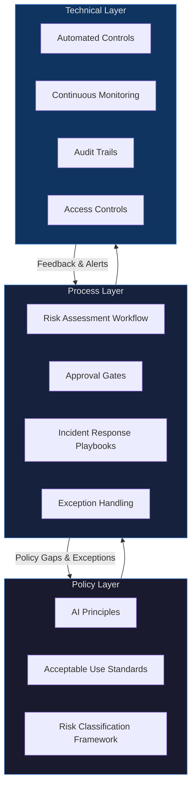

# Governance Architecture

AI governance is not a policy document. It is an operating system. Most enterprises have built the document. Almost none have built the operating system.

Only 18% of enterprises have fully implemented AI governance frameworks, despite 90% using AI in daily operations (McKinsey, 2024). That gap is not a knowledge problem. It is an architectural problem.

## Why "Governance as a Document" Fails

The traditional governance model works like this: a committee writes principles, legal reviews them, leadership approves them, and the document gets published on the intranet. Done.

This fails for AI for one reason: deployment velocity.

A capable engineering team can deploy a new AI model, integrate a third-party API, or ship a GenAI feature in days. Manual governance processes operate on timescales of weeks. The math does not work. Governance that cannot keep pace with deployment is governance that does not exist in practice.

The patterns that follow from document-only governance are predictable:

- Teams route around the process because it takes too long
- Governance is applied retrospectively after incidents occur
- Risk assessments are checkbox exercises, not real evaluations
- No one can tell you what AI systems are running in production right now

This is not a failure of intent. It is a failure of architecture.

!!! warning "The Retrofit Tax"
    Organizations that deploy AI without embedded governance consistently face a retrofit problem. Applying governance controls after deployment requires auditing undocumented systems, negotiating with teams who have built processes on ungoverned tools, and often renegotiating vendor contracts. The cost of retrofitting governance is typically 3 to 5 times the cost of building it in from the start. This is the AI equivalent of technical debt, but with regulatory and reputational dimensions.

## The Three-Layer Governance Architecture

Effective AI governance requires three distinct layers that operate simultaneously and reinforce each other. Treating them as a single layer is the most common structural mistake.

### Layer 1: Policy

The policy layer defines the rules. It answers: what are we allowed to do, and what are we not allowed to do?

This layer should be opinionated and specific. Generic principles like "use AI responsibly" are not policies. They are aspirations. Policies are actionable and auditable.

| Component | What It Defines | Common Failure Mode |
|---|---|---|
| AI Principles | Values and commitments that govern all AI use | Too abstract to apply in practice |
| Acceptable Use Policy | What employees can and cannot use AI for | Not updated as new tools emerge |
| Risk Classification | How to categorize AI systems by risk level | Binary (high/low) instead of graduated |
| Data Use Standards | What data can train, fine-tune, or be processed by AI | Missing third-party and vendor scope |

The policy layer must be reviewed on a cadence that matches the pace of the AI market. Annual reviews are insufficient. Quarterly is a reasonable minimum.

### Layer 2: Process

The process layer operationalizes the policy. It answers: given our policies, how does a team actually get an AI system approved and into production?

The key processes are:

**Risk Assessment.** Every AI system deployment should go through a structured risk assessment before production. The assessment should classify the system, identify the data it touches, evaluate the failure modes, and determine the required controls. This should take hours, not weeks. If it takes weeks, teams will skip it.

**Approval Workflows.** Approvals should be tiered by risk level. Low-risk systems (autocomplete, summarization of internal documents) should have lightweight or self-service approval. High-risk systems (automated decisions affecting customers, employees, or financial outcomes) require multi-stakeholder review. The mistake is applying the same process to everything.

**Incident Response.** When an AI system fails, produces harmful outputs, or takes unauthorized actions, there must be a documented playbook. Who is notified? What is the escalation path? What are the criteria for taking a system offline? These questions cannot be answered for the first time during an incident.

**Exception Handling.** Teams will request exceptions. The process for handling exceptions should be explicit, time-bounded, and audited. Informal exceptions are how governance erodes.

### Layer 3: Technical

The technical layer automates what cannot be manually enforced at scale. This is where most organizations underinvest.

At deployment velocity, you cannot rely on humans to check every model output, review every API call, or verify every access control. The controls must be embedded in the systems themselves.

| Control Type | Examples | Why It Matters |
|---|---|---|
| Input/Output Filtering | PII detection, prompt injection screening, output classifiers | Catches policy violations before they reach users |
| Access Controls | Role-based model access, data namespace isolation | Enforces trust boundaries without manual intervention |
| Continuous Monitoring | Drift detection, accuracy tracking, anomaly alerts | Finds problems before they compound |
| Audit Trails | Immutable logs of model calls, inputs, outputs, and decisions | Required for incident response and regulatory compliance |
| Cost Controls | Runtime budget limits, rate limiting, usage alerts | Prevents runaway costs from autonomous systems |

!!! info "Automation is Not Optional"
    An organization deploying 20 AI systems can govern them manually. An organization deploying 200 cannot. The technical layer is what makes governance scale. Build the automation before you need it, not after.

## Governance Velocity Must Match Deployment Velocity

This is the governing principle of the architecture. It is also the most commonly violated.

Governance teams often see their role as providing friction: slowing down deployment to ensure adequate review. This framing is wrong, and it is why governance teams lose influence over time.

The goal is not to slow deployment. The goal is to make safe deployment fast. Those are different objectives with different architectures.

Fast, safe deployment requires:

- Self-service risk assessments for lower-risk use cases
- Pre-approved patterns and reference architectures teams can deploy without full review
- Automated controls that enforce policy without human review at each step
- Governance teams embedded in product and platform teams, not sitting outside them

When governance is fast enough to match deployment, teams stop routing around it. When it is slower, they route around it regardless of policy.

## Building Governance In vs. Retrofitting

The inflection point for most organizations is around 50 active AI systems in production. Before that, manual governance is painful but possible. After it, manual governance has already failed; teams just have not admitted it yet.

The cost comparison is not subtle:

| Approach | Upfront Cost | Ongoing Cost | Incident Risk |
|---|---|---|---|
| Governance built in from start | High | Low | Low |
| Governance retrofitted after deployment | Medium | Very high | High |
| No governance | None | Extreme (incident-driven) | Very high |

The organizations that invested in governance architecture early are not slowing down. They are deploying faster, because they have pre-approved patterns, automated controls, and teams that trust the process.

!!! tip "Starting Point for Leaders"
    If you are building this from scratch, start with the technical layer, not the policy layer. Implement audit trails and monitoring before you have finalized your principles document. You can update principles; you cannot reconstruct an audit trail retroactively.

## Summary

Governance architecture is an engineering problem as much as it is a policy problem. The three-layer model separates concerns clearly: policy sets the rules, process operationalizes them, and technology enforces them at scale. Any organization treating governance as a document is not governing its AI. It is hoping nothing goes wrong.

The 82% of enterprises without fully implemented governance frameworks are not lacking principles. They are lacking architecture.

---

## Sources

1. McKinsey & Company. "The State of AI in 2025: Agents, Innovation, and Transformation." 2025.

For the complete source list and methodology, see [Sources & Methodology](../sources.md).
