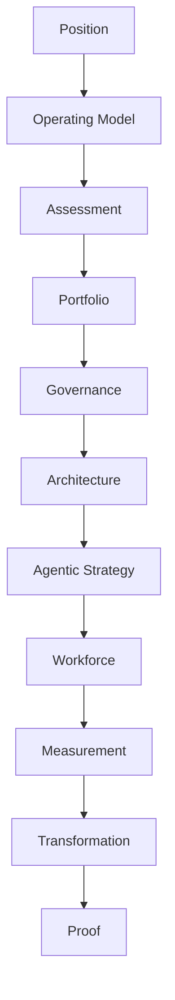

# Enterprise AI Transformation Playbook

Global enterprises will spend $644 billion on AI in 2025. Fewer than 40% will see measurable impact on earnings. The gap is not technological. It is organizational.

> **Enterprise AI underperforms not because models are weak, but because firms lack the management system to convert model capability into economic value.**

---

## What Separates the 5% Who Succeed

The companies that extract real returns from AI do not have better models. They make better organizational decisions.

- They design operating models before selecting tools
- They build governance as infrastructure, not as policy documents
- They measure AI by business outcomes, not by adoption metrics
- They treat agentic AI as delegated authority requiring control architecture, not as smarter automation

---

## What This Playbook Equips You to Do

- **Sequence AI investments** by business value, not by technical novelty
- **Design governance** that scales with deployment velocity
- **Structure the CAIO function** with real authority and accountability
- **Build the control architecture** for autonomous AI agents
- **Tie AI outcomes to P&L** with baseline-first measurement
- **Govern AI across regulatory jurisdictions** with precision

---

## The Decision Sequence

This playbook follows the decisions leaders face, in the order they face them.

- **Position** -- why transformation fails and what it actually requires
- **Operating Model** -- how to structure the AI function, the CAIO role, decision rights
- **Assessment** -- readiness across data, process, talent, and organizational maturity
- **Portfolio** -- where to invest, what to prioritize, how to move from pilots to production
- **Governance** -- architecture, model risk, agent governance, regulatory compliance
- **Architecture** -- capability stack, systems model, control plane, operating architecture
- **Agentic Strategy** -- the shift to autonomous AI, protocols, human-agent collaboration
- **Workforce** -- role evolution, middle management, knowledge architecture
- **Measurement** -- design, financial linkage, board reporting
- **Transformation** -- 12-month roadmap and phase gates
- **Proof** -- case studies, decision records, artifacts, checklists

Not sure where to start? See [Reading Paths](reading-paths.md) for role-specific guides.

---

## The Evidence

| Metric | Figure | Source |
|--------|--------|--------|
| Global enterprise AI spending, 2025 | $644B | IDC |
| Companies that scrapped most AI initiatives | 42% (up from 17% in 2024) | BCG |
| Companies classified as "future-built" | 5% | BCG |
| GenAI POCs abandoned after pilot | 30% | Gartner |
| Enterprises reporting meaningful EBIT impact | 39% | McKinsey |

The money is moving. The results are not.

---

## About This Work

This playbook synthesizes large-scale research from McKinsey, BCG, Deloitte, Gartner, IBM, and academic sources with direct experience building AI platforms, governance frameworks, and agent infrastructure at enterprise scale.

Related research on AI agent protocols and reasoning infrastructure:

- Lightweight Decision Protocol: [arXiv:2603.08852](https://arxiv.org/abs/2603.08852)
- Dynamic Contextual Identity: [arXiv:2603.11781](https://arxiv.org/abs/2603.11781)

For methodology and full source list, see [Sources and Methodology](sources.md).

---

## Who This Is For

This playbook is written for the people who own the outcomes, not the experiments.

- **Chief Information Officers** leading AI integration across enterprise systems
- **Chief AI Officers** building and scaling AI programs from the center
- **Chief Data Officers** who know the data problems are the real blocker
- **VPs of AI, Data, and Engineering** who have to make strategy operational
- **Senior business leaders** who own P&L and need to evaluate AI investment decisions

## What This Is Not

This is not a guide to selecting vendors, tuning models, or configuring infrastructure. Those are implementation details. They matter, but they are not why AI programs fail. The problems this playbook addresses are organizational: strategy, governance, operating models, workforce design, and measurement.

45 pages. No vendor pitches. No tutorials. Decisions and tradeoffs.
