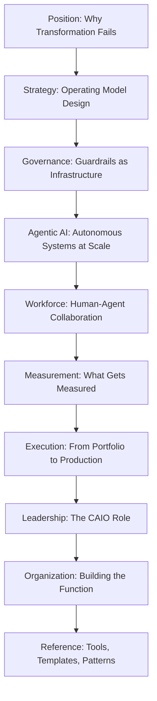

# Enterprise AI Transformation Playbook

**95% of AI pilots never deliver measurable P&L impact.**

Not because the technology doesn't work. Because organizations treat AI as a technology project when it is an organizational transformation. The gap between a compelling demo and a line on the income statement is not a model problem. It is an operating model problem.

This playbook is a practitioner's guide to closing that gap. It covers the failure patterns, the structural decisions, the governance models, the workforce strategies, and the measurement frameworks that separate the 5% who get real returns from the 95% who accumulate proof-of-concepts.

**34 pages. No vendor pitches. No tutorials. Decisions and tradeoffs.**

---

## The Scale of the Opportunity and the Waste

| Metric | Figure | Source |
|--------|--------|--------|
| Global enterprise AI spending, 2025 | $644B | IDC |
| Companies that scrapped most AI initiatives | 42% (up from 17% in 2024) | BCG |
| Companies classified as "future-built" | 5% | BCG |
| GenAI POCs abandoned after pilot | 30% | Gartner |
| Enterprises reporting meaningful EBIT impact | 39% | McKinsey |

The money is moving. The results are not.

---

## Who This Is For

This playbook is written for the people who own the outcomes, not the experiments.

- **Chief Information Officers** leading AI integration across enterprise systems
- **Chief AI Officers** building and scaling AI programs from the center
- **Chief Data Officers** who know the data problems are the real blocker
- **VPs of AI, Data, and Engineering** who have to make strategy operational
- **Senior business leaders** who own P&L and need to evaluate AI investment decisions

If you are responsible for turning AI investment into business results, this is for you.

---

## What This Is Not

This is not a guide to selecting vendors or evaluating tools. It does not cover prompt engineering, model fine-tuning, or MLOps infrastructure. It will not tell you which large language model to use or how to configure a vector database.

Those are implementation details. They matter, but they are not why 95% of AI programs fail. The problems this playbook addresses are organizational: strategy, governance, operating models, workforce design, and measurement. Fix those first.

---

## What You Will Find Here

### Section 1: Position

Establish the honest baseline. Why AI programs fail, what the data actually shows, and what transformation means versus automation or optimization.

- [The Problem](position/the-problem.md): The $644B gap between AI investment and AI impact
- [Seven Failure Modes](position/failure-modes.md): The patterns that kill programs before they scale
- [What Transformation Actually Means](position/what-transformation-means.md): The distinction that changes everything

### Section 2: Strategy

How to build an AI portfolio with top-down logic, not bottom-up experimentation.

### Section 3: Governance

Governance as an operating system, not a compliance exercise.

### Section 4: Agentic AI

Strategic decisions for autonomous AI systems: when to deploy them, how to control them, and what breaks when you don't design for failure.

### Section 5: Workforce

Redesigning work, not just adding tools. The human-agent collaboration layer that determines whether productivity gains are real or reabsorbed.

### Section 6: Measurement

The measurement architecture that connects AI activity to business outcomes. Established before deployment, not after.

### Section 7: Execution

Taking use cases from pilot to production. Portfolio sequencing, prioritization frameworks, and the organizational machinery required to scale.

### Section 8: Leadership

The Chief AI Officer role: scope, authority, relationships, and the decisions that belong at the executive table.

### Section 9: Organization

Structuring the AI function. Centralized, federated, and hybrid models. When each works and when each fails.

### Section 10: Reference

Templates, checklists, and frameworks you can apply directly.

---

!!! note "On Sources"
    Data throughout this playbook is drawn from BCG, McKinsey, Gartner, IDC, and other named research organizations. Where figures are cited, the source is named inline. The interpretations and recommendations are the author's own.
