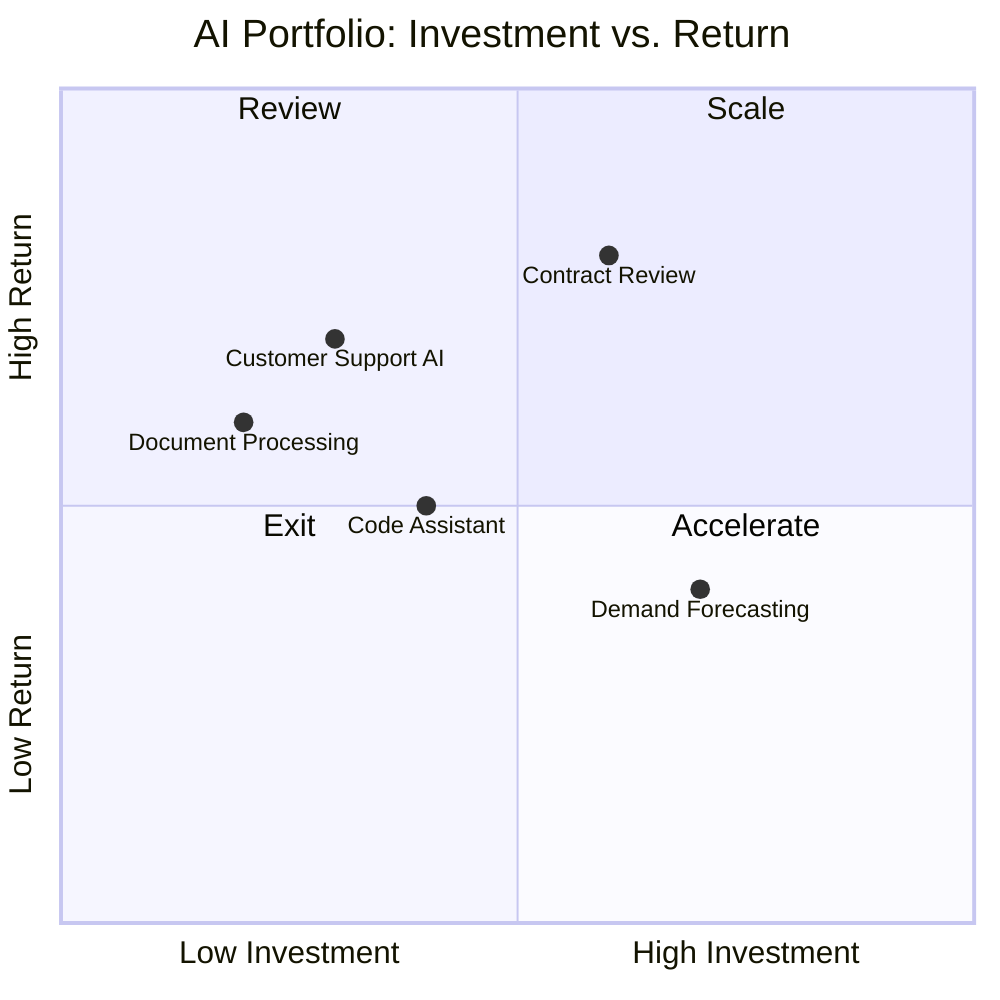

# Board Reporting

Less than 30% of AI leaders report that their CEO is satisfied with AI returns, despite average enterprise AI spend of $1.9M per year.[^1] The problem is rarely the technology. It is almost always the reporting. Leadership teams are receiving updates that describe model performance instead of business performance, pilot counts instead of P&L impact, and activity trends instead of strategic progress.

Boards do not need to know your model accuracy. They need to know whether the business is better off.

[^1]: Gartner, "AI ROI and CEO Satisfaction Survey," 2025.

---

## What Boards Actually Need

A board's job is to oversee the organization's strategic trajectory, risk posture, and resource allocation. AI reporting must connect to all three.

| Board Concern | What They Are Asking | What Bad AI Reports Provide |
|---|---|---|
| Strategic value | Is AI improving our competitive position? | Pilot counts and adoption rates |
| Financial return | Are we getting a return on this investment? | Projected savings and model benchmarks |
| Risk exposure | What could go wrong and are we managing it? | No risk section at all |
| Resource allocation | Should we invest more, less, or differently? | No portfolio view or prioritization logic |

The gap between what boards need and what AI teams typically report is wide. Closing it requires treating AI reporting as a business reporting problem, not a technology communication problem.

---

## The Board-Ready AI Dashboard

A board-ready AI report is not a slide deck full of charts. It is a structured view of four things: portfolio health, risk posture, value delivered, and strategic alignment. Each section should fit on one page. The entire report should be readable in fifteen minutes.

### Section 1: Portfolio Health

Show the current state of the AI initiative portfolio in a single view.

| Metric | Description |
|---|---|
| Initiatives by stage | How many are in discovery, pilot, scaling, production |
| Investment to date | Cumulative spend by initiative or category |
| Investment vs. return | Side-by-side of spend and realized value by cohort |
| Portfolio age | How long initiatives have been at each stage (flags stalled pilots) |

### Section 2: Risk Posture

Boards have fiduciary responsibility for risk. AI introduces risk categories that traditional risk frameworks did not anticipate. Boards need a structured view of:

- **Incident history:** AI-related errors, failures, or unintended outputs in the reporting period. Count, severity, and resolution status.
- **Compliance status:** Regulatory requirements applicable to AI deployments and current compliance posture against each.
- **Shadow AI exposure:** Estimate of unapproved AI tool usage across the organization. This is uncomfortable to report. It is also essential.
- **Data exposure:** Known instances of sensitive data processed by AI systems outside approved boundaries.

!!! warning "Reporting Shadow AI to the Board"
    Most AI leaders are reluctant to report shadow AI exposure because it implies loss of control. The alternative is worse: boards discover the exposure through a breach, an audit finding, or a regulatory inquiry. Proactive disclosure with a mitigation plan builds credibility. Reactive disclosure after an incident destroys it.

### Section 3: Value Delivered

This is the section most AI reports get wrong. Present realized value only. Do not blend actuals with projections without clearly labeling both.

For each production use case, report:

- Business outcome targeted
- Baseline value (pre-AI)
- Current value (post-AI)
- Delta (the measured improvement)
- Confidence level in the attribution

| Use Case | Baseline | Current | Delta | Attribution Confidence |
|---|---|---|---|---|
| Contract review | 4.2 hrs/contract | 1.6 hrs/contract | -62% cycle time | High (controlled pilot) |
| Support resolution | 14.3 min MTTR | 9.1 min MTTR | -36% handle time | Medium (matched cohort) |
| Invoice processing | $11.80/invoice | $4.20/invoice | -64% process cost | High (full deployment) |

When results are not yet visible, report leading indicators explicitly labeled as such. See the section below on pre-result reporting.

### Section 4: Strategic Alignment

Show how the AI portfolio connects to stated business priorities. This is the most important section for boards who question whether AI investment is being directed toward the right problems.

Map each major AI initiative to a named strategic priority. If an initiative cannot be mapped to a strategic priority, it should not be in the portfolio.

| AI Initiative | Strategic Priority | Stage | Target Outcome |
|---|---|---|---|
| Customer support AI | Improve NPS by 15 points | Production | 36% reduction in handle time |
| Contract review AI | Legal cost reduction target | Scaling | $2.1M annual cost avoidance |
| Demand forecasting AI | Supply chain resilience | Pilot | 8% reduction in forecast error |

---

## Reporting Cadence

!!! info "Two-Cadence Model"
    Board-level and executive committee AI reporting works best on two distinct cycles: quarterly portfolio reviews for strategic decisions and monthly operational reviews for tactical management. Conflating them leads to boards drowning in operational detail and executives lacking the operational visibility to intervene early.

### Quarterly Portfolio Review (Board Level)

Agenda:
1. Portfolio health snapshot (10 minutes)
2. Value delivered vs. investment (10 minutes)
3. Risk posture update (5 minutes)
4. Strategic alignment review (5 minutes)
5. Resource and investment decisions (10 minutes)

Output: a documented portfolio decision for each initiative: continue, accelerate, redirect, or exit.

### Monthly Operational Review (Executive Committee)

Agenda:
1. Deployment velocity: initiatives moved between stages
2. Measurement update: outcome metrics vs. targets
3. Risk incidents and open issues
4. Workforce and change management progress
5. Upcoming decisions and dependencies

Output: an action log with owners and deadlines.

---

## Reporting When Results Are Not Yet Visible

Most AI programs spend 12 to 24 months in pre-revenue stages. Boards who receive only "we are still in pilot" updates will lose confidence. The solution is a structured approach to leading indicator reporting.

Leading indicators are early signals that the program is on track to deliver results. They do not replace lagging indicators (actual results), but they give boards something to evaluate before results materialize.

| Leading Indicator | What It Signals | How to Measure |
|---|---|---|
| Baseline completion | Measurement discipline is in place | % of active pilots with documented baselines |
| Pilot velocity | Deployment capability is improving | Days from pilot approval to first user |
| Adoption trajectory | Users are engaging with the tool | Week-over-week active user growth |
| Workflow redesign completion | Efficiency gains will be captured | % of use cases with redesigned workflows |
| Finance partnership | Financial attribution is established | % of pilots with finance partner sign-off |

When leading indicators are strong and lagging indicators are absent, report it clearly: "These pilots are 90 days from first measurable outcomes. The leading indicators are tracking at or above plan. Here is what we expect to see, and here is when."

!!! tip "The Honest Report"
    A board report that says "results are not yet visible, here is why, here is what we are measuring, and here is when we expect to see them" is stronger than a report that inflates progress. Boards respect honesty about timelines. They lose trust in programs that promise results that do not materialize quarter after quarter.

---

## Reporting Format Principles

**One page per section.** If a section requires more than one page to explain, you do not have a reporting problem. You have a clarity problem.

**Actuals before projections.** Always separate measured results from forward projections. Never blend them in the same number.

**Named risks.** Every risk section should name specific risks, not generic categories. "Model hallucination in customer-facing deployments" is a named risk. "AI risks" is not.

**Decisions, not updates.** Structure board material around decisions the board is being asked to make or ratify. "Here is what happened" is an update. "Here is what happened and here is what we need from you" is a board-ready report.

**Consistent format.** Use the same report structure every quarter. Boards develop the ability to read reports quickly when the format is stable. Format changes force re-orientation and suggest the team is uncertain about what matters.
