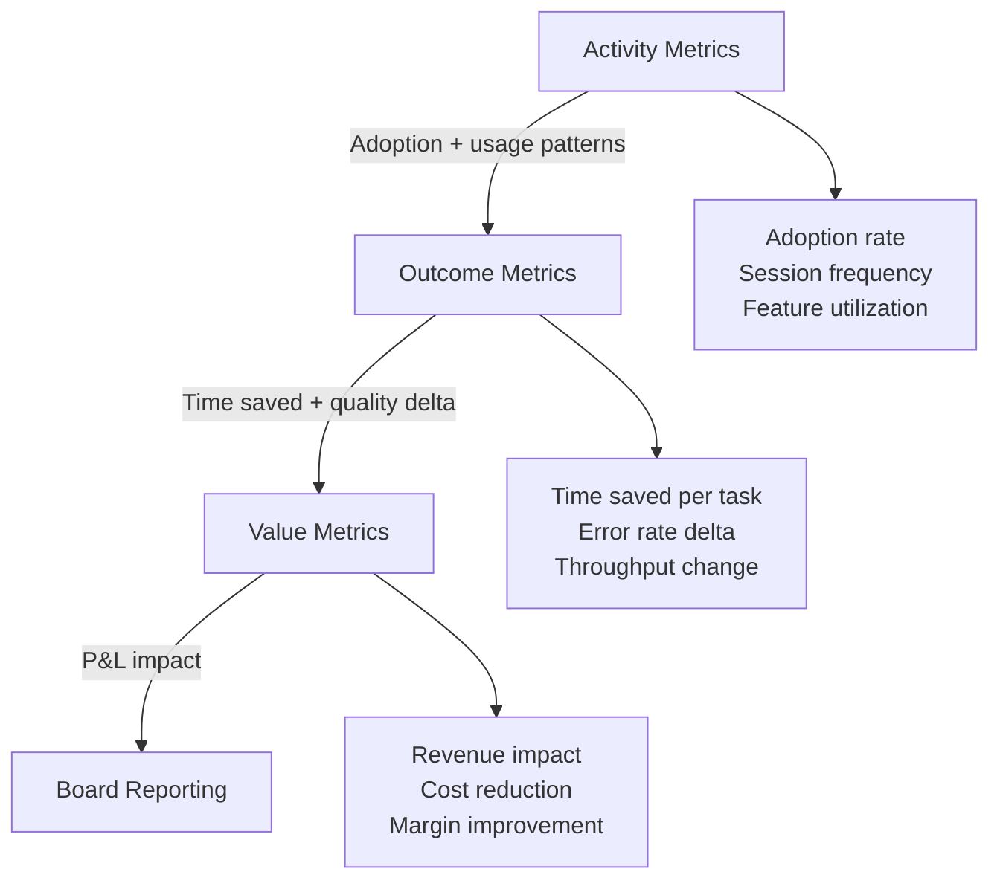

# Measurement Design

91% of organizations report that AI has "improved productivity." Only 23% can quantify it with hard data.[^1] That gap is not a communication problem. It is a measurement failure. Organizations deployed AI first and tried to prove value afterward. That approach does not work.

This section explains how to build a measurement system that produces numbers boards will believe and business leaders can act on.

[^1]: Forbes AI Study 2025.

---

## The Core Problem: No Baseline

The single most common measurement failure is deploying AI before establishing what "before" looks like. Without a baseline, every claim of improvement is an approximation. You cannot measure the distance you have traveled if you do not know where you started.

This happens for understandable reasons. Pilots move fast. Vendors promise results. Executive pressure to ship is real. Measurement feels like overhead. It is not. It is the only way to know whether the investment is working.

!!! danger "The Baseline Trap"
    Organizations that deploy AI without baselines will spend months reconstructing pre-deployment data from logs, interviews, and approximations. That reconstructed data will always be challenged. The investment case will never be airtight.

The fix is simple in principle and difficult in practice: **define your metrics before deployment, not after.**

---

## Baseline-First Measurement Design

A baseline is not just a number. It is a documented, agreed-upon snapshot of how a process performs before AI intervention. It includes:

- The metric being measured
- The time period it covers
- The data source and collection method
- The owner who signed off on it
- Known confounds that could affect interpretation

Do this work before a pilot launches. If it cannot be done before launch, delay the launch by two weeks. The cost of the delay is trivial compared to the cost of an unmeasurable outcome.

### What to Baseline

| Process Area | Example Metrics to Baseline |
|---|---|
| Customer support | Handle time, resolution rate, escalation rate, CSAT |
| Software development | PR cycle time, defect rate, review turnaround |
| Finance operations | Invoice processing time, error rate, exception volume |
| Sales | Proposal turnaround, pipeline conversion rate, deal velocity |
| Legal and compliance | Contract review time, exception frequency, cycle time |

---

## The Three Measurement Layers

Most organizations measure AI at the wrong layer. They count adoption and call it success. A rigorous measurement system has three layers, and they are not interchangeable.

```
┌─────────────────────────────────────────┐
│           VALUE METRICS                 │  ← Boards care about this
│   Revenue, cost, margin impact          │
├─────────────────────────────────────────┤
│          OUTCOME METRICS                │  ← Managers care about this
│   Time saved, errors reduced, throughput│
├─────────────────────────────────────────┤
│          ACTIVITY METRICS               │  ← Vendors care about this
│   Adoption, usage, completion rates     │
└─────────────────────────────────────────┘
```

### Layer 1: Activity Metrics

Activity metrics answer: "Is the tool being used?"

- Adoption rate (active users / eligible users)
- Session frequency (average sessions per user per week)
- Feature utilization (which capabilities are being used)
- Completion rate (tasks started vs. tasks completed with AI assistance)

**These are necessary but not sufficient.** High adoption with no outcome change means the tool is being used as a toy, a novelty, or a replacement for something that worked fine before. Do not report activity metrics to leadership as evidence of value.

### Layer 2: Outcome Metrics

Outcome metrics answer: "Is the work changing?"

- Time saved per task (measured, not estimated)
- Error rate before and after
- Throughput (volume processed per unit of time)
- Quality scores (where measurable)

**These are useful but incomplete.** Time saved is only valuable if that time is redirected to higher-value work. An employee who saves two hours per day using AI and fills those two hours with lower-value activity has not delivered productivity. They have shifted effort.

See [Financial Linkage](financial-linkage.md) for how to convert outcome metrics into P&L impact.

### Layer 3: Value Metrics

Value metrics answer: "Is the business better off?"

- Revenue impact (new revenue enabled or protected)
- Cost reduction (actual cost removed from the business, not projected)
- Margin improvement (pricing, yield, waste)
- Risk reduction (quantified exposure avoided)

**These are the only metrics that matter to boards.** Every measurement program should be designed backward from value metrics. Start by asking what financial outcome you are trying to influence, then identify the outcome metrics that drive it, then identify the activity metrics that drive those.

---

## The Measurement Stack

The three layers connect in one direction: activity feeds outcome, outcome feeds value. This is not automatic. Each transition requires deliberate design.



The transition from activity to outcome requires workflow instrumentation. You need to know not just that people are using the tool, but what they are doing differently as a result.

The transition from outcome to value requires financial modeling. Time saved must be converted to FTE capacity released, then to cost or revenue impact. This is where most measurement programs stall.

---

## Common Measurement Anti-Patterns

### Vanity Metrics

Reporting model accuracy, token counts, API call volumes, or user satisfaction scores as evidence of business value. These numbers say nothing about whether the business is better off.

### Measuring Adoption, Not Impact

Celebrating 80% adoption without measuring what changed in work output. Adoption is a precondition for value, not evidence of it.

### Post-Hoc Rationalization

Deploying AI, then searching for metrics that happened to move in the right direction during the same period. This is not measurement. It is confirmation bias with a spreadsheet.

### The Single-Metric Trap

Choosing one metric (usually the most favorable one) and ignoring contradicting signals. A rigorous measurement system tracks a balanced portfolio of metrics that includes leading and lagging indicators.

### Projected vs. Actual

Reporting projected value as though it were realized. Boards lose confidence in AI programs when projections consistently exceed actuals. Report what has been measured. Flag what is projected.

!!! tip "The Measurement Charter"
    Before any pilot launches, publish a one-page measurement charter that documents: the business outcome being targeted, the metrics at each layer, the baseline values, the data sources, the measurement period, and the threshold that defines success. Get sign-off from the business owner and the finance partner. This document becomes the single source of truth for post-deployment evaluation.

---

## Measurement Cadence

| Frequency | What to Review |
|---|---|
| Weekly | Activity metrics: adoption, usage, anomalies |
| Monthly | Outcome metrics: time saved, quality, throughput vs. baseline |
| Quarterly | Value metrics: P&L impact, portfolio performance, strategic alignment |
| At phase gates | Full measurement review: baseline vs. actuals, attribution analysis |

---

## Getting Started

1. Before the next pilot launches, document baselines for the three metrics most directly connected to the target business outcome.
2. Assign a measurement owner who is distinct from the deployment team. Separation of concerns matters.
3. Build the reporting structure before you need it. A dashboard that takes six weeks to build will not be ready when the board asks.
4. Run a measurement retrospective on your most recent completed pilot. What did you actually measure? What would you measure differently?

The organizations that get this right are not more sophisticated analysts. They are more disciplined planners. Measurement design is a pre-deployment activity, not a post-deployment one.
