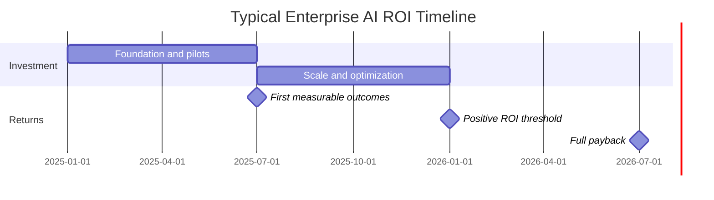

# Financial Linkage

A payments network achieved 99% copilot adoption across its engineering organization. Productivity gains never appeared on the balance sheet. The CFO asked why. Nobody had a good answer.

This is the most common failure mode in enterprise AI programs: efficiency gains that are real at the task level but invisible at the financial level. The gap between "AI made us faster" and "AI reduced our costs" is not a measurement gap. It is a workflow redesign gap.

---

## The Vanishing Productivity Gap

When AI saves time, that time does not automatically convert to value. It redistributes. Employees fill recaptured time with the next item on their queue, with meetings, with lower-priority tasks, or with nothing at all. The efficiency gain exists. The financial benefit does not.

This is what researchers call the "productivity paradox" of AI adoption. Tools that demonstrably accelerate individual tasks fail to improve aggregate output because the surrounding system was not redesigned to capture the gain.[^1]

[^1]: McKinsey Global Institute, "The Economic Potential of Generative AI," 2024.

!!! warning "The Redistribution Problem"
    Time saved by AI does not disappear. It gets redistributed. Without deliberate workflow redesign, efficiency gains evaporate into expanded scope, additional review cycles, or simply more meetings. The financial benefit requires capturing the released capacity and redeploying it intentionally.

---

## Why Workflow Redesign Is Not Optional

Consider a contract review process where AI reduces attorney review time from four hours to ninety minutes. That is a genuine 62% reduction in task time. Now ask: what happens to the 2.5 hours saved?

- Option A: The attorney reviews more contracts in the same day. Throughput increases. Legal capacity expands without headcount growth. This is value.
- Option B: The attorney uses the time to add more commentary to each contract, conduct more thorough due diligence, and attend more client calls. Quality may improve. Cost does not change. This is effort redistribution.
- Option C: The attorney does approximately the same work in a shorter day and finishes earlier. The time disappears. This is value destruction.

Only Option A produces financial impact. Options B and C are what happen by default, without deliberate redesign.

Workflow redesign means defining, in advance, what the recaptured time will be used for. This is a management decision, not a technology decision.

---

## Linking AI Metrics to Financial Statements

Every AI use case connects to one of three financial statement lines. The measurement program must make that connection explicit.

### Revenue

AI creates revenue impact through:

| Mechanism | How to Measure | Example |
|---|---|---|
| Conversion rate improvement | Conversion delta vs. control group | AI-drafted proposals vs. manual proposals |
| Deal velocity | Days from lead to close, pre/post | Sales AI reducing proposal turnaround from 5 days to 1 |
| Customer acquisition cost | Total acquisition spend / new customers | AI-assisted outreach reducing CAC by 15% |
| Retention improvement | Churn rate delta | Proactive AI-surfaced risk signals reducing churn |

### Cost

AI creates cost impact through:

| Mechanism | How to Measure | Example |
|---|---|---|
| FTE reallocation | Capacity released, redeployed to higher-value work | Avoiding 3 FTE hires through AI-augmented throughput |
| Process cost reduction | Cost per transaction, pre/post | Invoice processing cost from $12 to $4 per invoice |
| Error cost reduction | Exception volume x cost-per-exception | Fewer compliance exceptions at $8K average remediation cost |
| Vendor spend reduction | Contract spend delta | AI replacing third-party data enrichment subscriptions |

!!! note "FTE Reallocation vs. FTE Elimination"
    Boards often expect AI to reduce headcount. The more realistic and sustainable impact is reallocation: the same people doing higher-value work, or the same team handling greater volume without adding headcount. This is harder to quantify but more defensible and less organizationally damaging. Frame reallocation clearly: "We handled 40% more volume with the same team" is a strong statement that does not require a reduction-in-force narrative.

### Margin

AI creates margin impact through:

| Mechanism | How to Measure | Example |
|---|---|---|
| Pricing optimization | Revenue per unit, margin per deal | Dynamic pricing AI improving yield by 2.3 points |
| Yield improvement | Output per input unit | AI-optimized scheduling increasing utilization |
| Waste reduction | Defect rate, rework cost, scrap rate | AI quality control reducing manufacturing rework |

---

## The Attribution Problem

Isolating AI's contribution from other factors is genuinely difficult. Business results are the product of many simultaneous changes. AI was deployed the same quarter the company launched a new product, hired a new sales leader, and changed pricing. Which variable explains the improvement?

There is no perfect answer. But there are defensible approaches:

**Controlled pilots.** Run AI-assisted and non-AI-assisted versions of the same process in parallel. Compare outcomes. This is the most rigorous approach and often feasible in customer-facing and operations contexts.

**Matched cohort analysis.** Compare users who adopted AI heavily vs. users with low adoption. Control for tenure, role, and territory. The difference in outcomes is attributable to AI usage, with caveats.

**Pre/post with controls.** Measure the target process before and after AI deployment. Simultaneously measure a comparable process that did not change. If the AI-affected process improves and the control process does not, the delta is attributable to AI.

**Triangulation.** Use multiple imperfect measures that all point in the same direction. No single measurement is definitive. Convergence across three independent measurements is more persuasive than one clean number.

!!! tip "Document Your Attribution Methodology"
    Whatever approach you use, document it before the measurement period begins. Post-hoc methodology selection is a red flag to any finance partner or board member who has seen AI programs oversell results. Pre-registered methodology is credible methodology.

---

## ROI Timeline Reality

One of the most common causes of AI program failure is misaligned ROI expectations. When boards expect payback in 12 months and the program is designed for 36-month payback, disappointment is guaranteed.

The data on AI ROI timelines is sobering:

- Only 6% of organizations see AI payoff in under 1 year.[^2]
- The majority of enterprise AI programs require 2 to 4 years to reach meaningful ROI.
- Organizations that invest in workflow redesign and change management alongside technology deployment reach ROI faster than those that treat AI as a technology-only initiative.

[^2]: Gartner, "AI Investment Sentiment Survey," 2025.

This timeline assumes disciplined execution. Programs with poor measurement design, weak workflow redesign, or low adoption take longer.

---

## Presenting the Investment Case

When presenting AI ROI to a board or executive committee, structure the argument in three parts.

**Part 1: What we have measured.** Present actual results from completed pilots. Use the three-layer measurement framework. Show baselines, actuals, and the delta. Do not project. Do not extrapolate. Present what happened.

**Part 2: What we expect.** Present the forward-looking case based on planned use cases at planned scale. Be explicit about assumptions. Use ranges, not point estimates. A range of $8M to $12M annual cost reduction is more credible than a precise $10.3M claim.

**Part 3: What it requires.** Present the investment required to achieve the expected returns. Include technology cost, implementation cost, change management cost, and the opportunity cost of internal resources. A credible investment case includes all costs, not just licensing fees.

| Reporting Element | What to Show | What to Avoid |
|---|---|---|
| Results to date | Measured actuals with methodology footnote | Projected numbers labeled as results |
| Forward expectations | Range with explicit assumptions | Single-point estimates without sensitivity analysis |
| Investment required | Full cost including people and change management | Licensing cost only |
| Timeline | Phase-gated milestones with decision points | Linear projections with no contingency |
| Risk | Named risks with mitigation approaches | No risk section |

---

## Building the Finance Partnership

The most effective AI measurement programs involve finance partners from the start, not from the reporting stage. A finance business partner who helps design the measurement framework will defend the results when challenged. One who is handed results at the end will scrutinize them skeptically.

Engage finance before the pilot launches. Agree on:

- Which financial statement lines the use case connects to
- The attribution methodology
- The reporting period
- What counts as "realized" vs. "projected" value
- The threshold that defines a successful outcome

This conversation is uncomfortable for AI teams that are not certain of results. That discomfort is appropriate. If you cannot define what success looks like before you start, you are not ready to start.

---

## Sources

1. McKinsey & Company. "The State of AI in 2025: Agents, Innovation, and Transformation." 2025.
2. Gartner. "Identifies Critical GenAI Blind Spots That CIOs Must Urgently Address." November 2025.

For the complete source list and methodology, see [Sources & Methodology](../sources.md).
