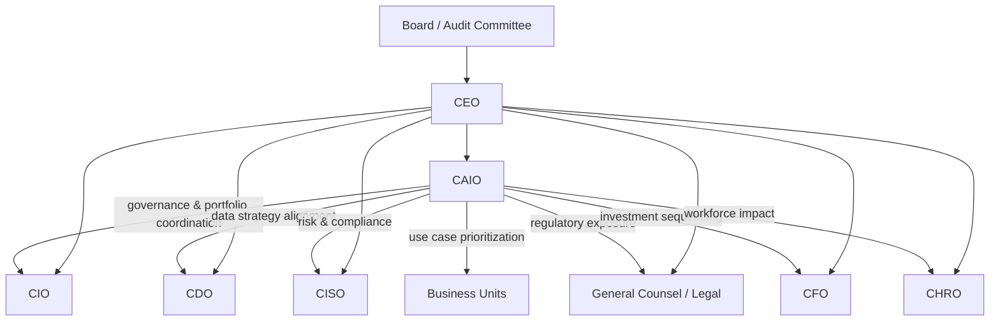

# The CAIO Mandate

The Chief AI Officer role is no longer experimental. As of 2025, 26% of organizations have appointed a CAIO, up from single digits two years prior (IBM Institute for Business Value, 2025, n=2,300). That number is accelerating. But the role is widely misunderstood, and organizations that get it wrong pay for it in fragmentation, rework, and governance failure.

---

## What the CAIO Is Not

The CAIO is not a senior data scientist. Not a chief evangelist. Not a technology translator whose job is to help the board understand machine learning.

Those functions matter. They are not the mandate.

The CAIO mandate is operational and structural: sequence the AI portfolio, govern the model inventory, drive testing and monitoring, manage incidents, and coordinate across CIO, CDO, CISO, Finance, and Legal. It is, above all, a coordination and accountability function at the executive level.

!!! warning "The Advisory Trap"
    Many organizations hire a CAIO and then treat the role as advisory. The CAIO participates in steering committees, reviews vendor proposals, produces strategy documents, and issues guidance that other functions may or may not follow. This is the advisory trap. An advisory CAIO has no accountability for outcomes and no authority to enforce alignment. The result is the appearance of AI governance without the substance.

---

## Board-Level Positioning

More than half of CAIOs report directly to the CEO or board (IBM, 2025). This is not a coincidence. It reflects the nature of the mandate.

AI strategy intersects with risk, capital allocation, regulatory exposure, and workforce transformation simultaneously. These are not IT decisions. They are enterprise decisions. A CAIO buried three levels below the CIO will be outranked by every business unit head who wants to move faster, and outmaneuvered by every vendor relationship the procurement team manages independently.

The reporting line is a proxy for authority. Without authority, coordination does not happen.

---

## The Six Operational Responsibilities

### 1. Portfolio Sequencing

The CAIO owns the enterprise AI portfolio as a managed investment portfolio, not a project backlog. This means applying ROI criteria, risk weighting, dependency analysis, and strategic alignment before approving use cases. It means saying no, and explaining why in terms leadership understands.

### 2. Model Inventory Governance

Every production AI model is a liability as well as an asset. The CAIO maintains visibility into what models are running, what data they consume, what decisions they influence, and what the monitoring status is. Without this inventory, the organization cannot respond to incidents, satisfy regulators, or assess exposure.

### 3. Testing and Monitoring Standards

The CAIO defines minimum standards for pre-deployment testing and post-deployment monitoring. This includes bias and fairness evaluation, adversarial robustness, performance drift detection, and output auditing. Standards without enforcement are suggestions.

### 4. Incident Management

When an AI system fails, produces harmful outputs, or causes a compliance breach, the CAIO leads the response. This requires pre-defined incident classification levels, escalation paths, and a standing response process. Most organizations do not have this until after their first significant failure.

### 5. Cross-Functional Coordination

This is the core of the role. The CAIO runs the mechanism that keeps CIO, CDO, CISO, Legal, Finance, and business units aligned. Without active coordination, each function pursues its own AI agenda on its own timeline with its own standards. The result is redundancy, incompatibility, and governance gaps.

### 6. Regulatory and Policy Interface

The CAIO tracks the regulatory environment: EU AI Act, US executive orders, sector-specific requirements, emerging state legislation. The CAIO translates regulatory obligations into operational requirements before Legal creates a backlog of retroactive compliance fixes.

---

## The Hub-and-Spoke Model

IBM's research across 2,300 organizations found that a hub-and-spoke CAIO structure produces 36% higher AI ROI compared to centralized or fully distributed models (IBM Institute for Business Value, 2025).

The hub is the CAIO function: strategy, governance standards, portfolio oversight, tooling, and coordination mechanisms. The spokes are embedded AI leads within each business unit or major function who operate within the governance framework while owning execution locally.

This structure solves the core tension in enterprise AI: the need for consistent governance and the need for domain-specific speed. Centralized control creates bottlenecks. Full decentralization creates fragmentation. Hub-and-spoke creates accountability at both levels.

!!! success "Hub-and-Spoke Outcome"
    Organizations with hub-and-spoke CAIO structures report 36% higher AI ROI than those with purely centralized or distributed models (IBM IBV, 2025). The mechanism is coordination efficiency: less rework, faster approvals for pre-cleared use case patterns, and shared infrastructure that business units do not have to rebuild independently.

---

## What Happens Without a CAIO

The absence of a CAIO is not neutral. It produces a specific outcome: every function does AI independently.

The CIO purchases AI infrastructure and cloud AI services as technology decisions. The CDO builds models to improve data products. Business units sign vendor agreements for AI-enabled software without security or legal review. Finance evaluates AI investments using the same ROI framework they use for ERP upgrades. Legal engages after deployment when problems surface.

The result is:

- Duplicate capability investments across functions
- Incompatible data and model standards
- No consolidated view of AI risk exposure
- Regulatory gaps discovered under pressure
- No mechanism to sequence the portfolio by strategic priority

This is not hypothetical. It describes the current state at most large enterprises that have not made the CAIO appointment. The cost accumulates quietly until an incident, a regulatory inquiry, or a failed transformation initiative makes it visible.

---

## The Expiration Date Debate

A common argument is that the CAIO is a transitional role. Once AI is embedded in normal operations, the function dissolves back into CIO, CDO, and business unit leadership.

This argument is wrong for two reasons.

First, AI governance does not become simpler as adoption scales. It becomes more complex. More models in production means more inventory to manage, more incidents to respond to, more regulatory surface to track. The coordination burden grows with the portfolio.

Second, the cross-functional coordination mechanism does not naturally persist when the dedicated role disappears. CIO, CDO, CISO, and business units will revert to local optimization without an explicit coordination function. This is not a failure of intention. It is the default behavior of large organizations under resource pressure.

The CAIO becomes a permanent executive function, not a temporary transformation role. The scope evolves, but the accountability structure remains.

!!! note "Transition vs. Permanent"
    The debate about whether the CAIO is transitional often reflects a misunderstanding of the role. If the CAIO is defined as "the person who explains AI to the board," then yes, that function eventually becomes unnecessary. If the CAIO is defined as the executive accountable for AI portfolio performance, governance, and cross-functional coordination, then the role does not expire. It matures.

---

## Indicators That the CAIO Mandate Is Failing

- The CAIO produces strategy documents but does not have authority over use case approval
- Business units bypass the CAIO office for vendor AI procurement
- The model inventory is incomplete or not current
- Incidents are handled ad hoc with no defined process
- The CAIO is not in the room when the CFO allocates AI budget

These are not edge cases. They are the default failure modes. Recognizing them early is the difference between course-correcting and rebuilding after a significant failure.

---

---

## Sources

1. IBM Institute for Business Value. "How Chief AI Officers Deliver AI ROI." 2025.

For the complete source list and methodology, see [Sources & Methodology](../sources.md).
