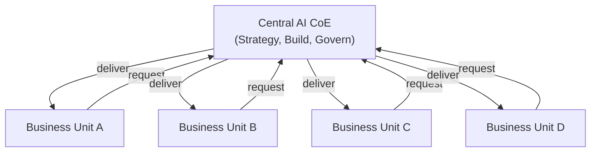
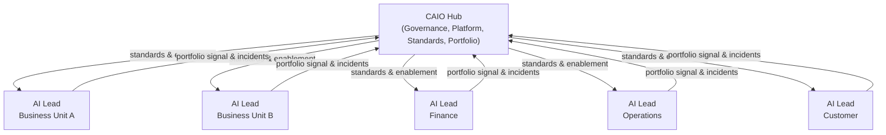
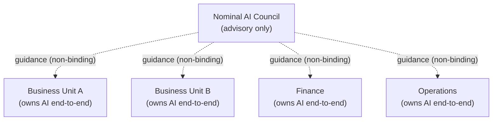
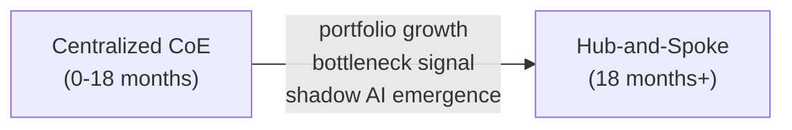
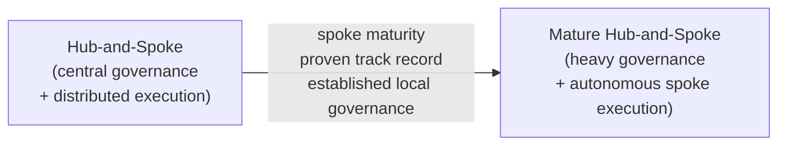

# Structural Models for Enterprise AI

How you structure AI ownership is one of the most consequential decisions in an AI transformation. Structure determines who has authority, where decisions get made, how fast the organization can move, and how well governance actually holds. Most organizations choose their structure by default rather than by design. The result is a structure that fits their early stage but creates serious problems as the portfolio scales.

There are three dominant models. Each has a legitimate use case and a specific failure mode. Knowing when to use each, and when to transition between them, separates organizations that scale AI successfully from those that plateau or regress.

---

## The Three Models

### Model 1: Centralized CoE

A single central team controls AI strategy, development, deployment, and governance. Business units submit requests. The CoE prioritizes, builds, and delivers.

**When it works:** Early-stage organizations that need to establish capability, set standards, and avoid the chaos of distributed experimentation. The CoE builds the first wave of production systems, establishes the reference architecture, and demonstrates what good looks like before handing the playbook to the business.

**When it breaks:** Once the portfolio grows beyond what a single team can handle without becoming a bottleneck. Business units with high-frequency AI needs will route around the CoE. Shadow AI appears. Talent concentrates in the center while the organization fails to build distributed capability.

!!! warning "The Bottleneck Failure Mode"
    A centralized CoE that cannot process use case demand fast enough becomes the primary obstacle to AI adoption. Business units stop submitting requests and start finding workarounds. By the time leadership recognizes the problem, a significant shadow AI footprint has already developed.

---

### Model 2: Hub-and-Spoke

A central governance and capability function (the hub) sets standards, owns the platform, manages the model inventory, and coordinates across functions. Embedded AI teams within each business unit or major function (the spokes) own execution within the governance framework.

**When it works:** At mid-to-large scale, where the portfolio is too large for centralized delivery but too complex for distributed ownership without governance guardrails. This is the structure IBM recommends based on analysis of 2,300 organizations, and it produces 36% higher AI ROI than the alternatives (IBM IBV, 2025).

**When it breaks:** When the hub becomes administrative rather than enabling, issuing checklists instead of accelerators. When spoke teams lack sufficient AI expertise to execute without excessive hub involvement. When the governance framework is so heavy that spoke teams treat it as overhead rather than infrastructure.

!!! success "Why Hub-and-Spoke Outperforms"
    The 36% ROI advantage (IBM IBV, 2025) comes from three compounding effects: shared infrastructure reduces duplication costs; governance consistency reduces rework from non-compliant deployments; embedded spoke expertise reduces the time from use case identification to production deployment.

---

### Model 3: Federated

AI ownership is distributed across business units with minimal central coordination. Each unit hires its own AI talent, selects its own tools, and sets its own priorities. A nominal central function may exist but has limited authority.

**When it works:** In organizations where business units operate highly independently, have differentiated AI needs, and have sufficient AI maturity to govern themselves. Fast-moving consumer-facing divisions, for example, often cannot wait for central processes. Some highly regulated sectors run federated models within business-unit-level compliance structures.

**When it breaks:** When the organization needs a consolidated view of AI risk, when regulators ask for enterprise-wide AI documentation, or when redundant investments across units become visible to the CFO. Federated models also make it nearly impossible to build shared platform capability, because no single unit will fund infrastructure that benefits others.

---

## Comparison Table

| Dimension | Centralized CoE | Hub-and-Spoke | Federated |
|---|---|---|---|
| Decision authority | Central team | Hub governance, spoke execution | Business units |
| Speed to deploy | Slow at scale | Moderate, accelerates over time | Fast |
| Governance quality | High | High | Variable |
| Innovation surface | Narrow | Broad | Broad |
| Duplication risk | Low | Low | High |
| Talent distribution | Concentrated | Distributed with center of excellence | Fully distributed |
| Bottleneck risk | High | Moderate | Low |
| Regulatory readiness | High | High | Low to moderate |
| Best stage | Early (0-2 years) | Growth (2+ years) | Specialized/mature BUs |
| IBM ROI data | Baseline | +36% (IBM IBV, 2025) | Below baseline |

---

## Structural Diagrams

### Centralized CoE

---

### Hub-and-Spoke

---

### Federated

---

## Transition Paths

### Centralized CoE to Hub-and-Spoke

This is the most common and necessary transition. The trigger is usually one of three signals: the CoE has a multi-month backlog, business units are building outside the process, or the CoE talent is overwhelmed and attrition risk is high.

The transition requires:

1. Auditing the existing portfolio to identify which capabilities can be productized as shared services vs. which require embedded expertise
2. Identifying and hiring AI leads within major business units, ideally from people who already understand the domain
3. Transferring governance accountability while retaining platform ownership in the hub
4. Defining the escalation path from spoke to hub for risk decisions, model approvals, and incidents

Expect 9 to 18 months for this transition to stabilize. The governance framework must be ready before spokes go independent, or they will develop local variants that are incompatible with each other.

---

### Hub-and-Spoke to Federated (Partial)

Full federation is rarely the right outcome. What more commonly happens is that mature, large business units develop sufficient AI capability to operate more independently within the governance framework. The hub retains governance authority but reduces operational involvement.

This is not a transition to full federation. It is hub-and-spoke with lighter hub touch for mature spokes. The governance framework remains mandatory. The platform remains shared. The model inventory remains centrally tracked.

---

### Federated to Hub-and-Spoke (Remediation)

Organizations that started federated often reach a point where the governance gaps become unacceptable, usually triggered by a regulatory event, a significant model failure, or a CFO-level reckoning with duplicate investments.

This transition is harder than building hub-and-spoke from the start. Business units have already established local processes, local vendor relationships, and local talent with local loyalties. Introducing central governance retroactively is a political exercise as much as an operational one.

The remediation path requires executive mandate, not persuasion. The CAIO must have authority to require model inventory registration, set minimum standards for new deployments, and sunset non-compliant systems on a defined timeline.

---

## Maturity Indicators

Use these indicators to assess where your organization currently sits and whether the structural model is appropriate for your maturity level.

| Indicator | Centralized CoE Fit | Hub-and-Spoke Fit | Federated Fit |
|---|---|---|---|
| Models in production | Under 10 | 10 to 100+ | Varies by unit |
| AI portfolio age | Under 2 years | 2 to 5 years | 3+ years per unit |
| Business unit AI literacy | Low | Moderate to high | High |
| Governance framework maturity | Building | Established | Established per unit |
| Regulatory pressure | Moderate | High | Varies |
| CoE backlog weeks | Under 4 | Under 2 | N/A |
| Shadow AI prevalence | Low | Low to moderate | High |
| Dedicated spoke AI leads | None | Yes, in major units | Yes, in all units |

!!! tip "Structural Misalignment"
    The most common structural mistake is staying in centralized CoE mode past the point where it serves the organization. The CoE becomes a prestige function that controls access rather than enabling capability. Business units route around it. By the time the transition to hub-and-spoke happens, there is a significant remediation effort to bring shadow AI into the governance framework.

---

*Sources: IBM Institute for Business Value, "AI in Action" (2025), n=2,300 organizations.*
