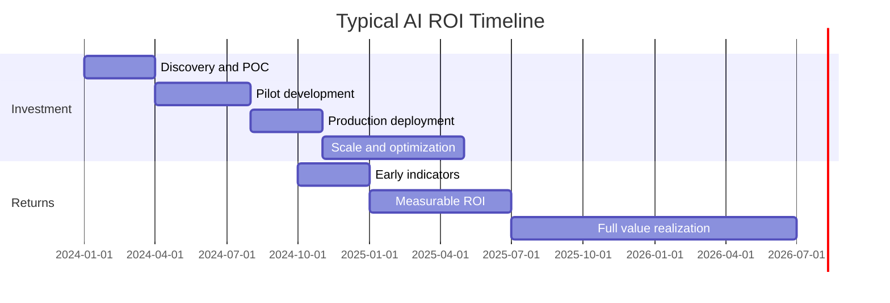

# From Pilot to Production

The most common failure mode in enterprise AI is not a failed proof of concept. It is a successful one that never becomes anything more.

Only 25% of organizations have moved 40% or more of their AI experiments to production (Deloitte, 2026). Gartner puts the full-scale production rate at 5%. Five percent. The rest are pilots: technically successful, organizationally stranded, consuming resources and generating no sustained business value.

This is the "missing middle": the space between a POC that works in a controlled environment and an enterprise system that runs in production, is maintained, is adopted by the people it was built for, and delivers measurable outcomes at scale. Most organizations have not built the organizational infrastructure to cross it.

!!! warning "The production rate reality"
    Only 6% of organizations see AI ROI payoff in under a year. Most organizations that achieve production-grade deployment report ROI timelines of 2-4 years (Gartner). This is not because AI does not work. It is because production deployment, adoption, and optimization take time that most AI business cases do not account for.

---

## Why Pilots Stall

The blockers are not technical. Organizations that are failing to move from pilot to production have solved the technical problems. They are stalling on organizational problems that were never addressed.

### No Production Funding Model

Pilots are funded as project-based experiments. They have a budget, a timeline, and a success criterion: does the model work?

Production systems are funded as operational infrastructure. They require ongoing investment in maintenance, monitoring, retraining, and support. They have no natural end date.

The transition from project funding to operational funding requires a decision that most organizations never force themselves to make: which business unit owns this system, and where does it sit in their budget? Without that decision, the pilot lives in the AI program budget indefinitely, consuming capacity that should go to new use cases, and never receiving the investment required to become a real operational system.

### No Change Management

A pilot can succeed without adoption. It runs in a controlled environment with willing participants who are motivated by the novelty of the work. Production success requires adoption at scale by users who were not part of the pilot, who have existing workflows, and who need a reason to change.

Most AI programs treat change management as a communications activity: a launch email, a training video, some internal marketing. Real change management is a program discipline that runs parallel to technical development from the start. It identifies resistance, redesigns workflows around the new capability, trains practitioners in context, and measures adoption as seriously as it measures model performance.

Organizations that do not have change management capacity cannot cross the missing middle. Technical delivery without adoption is not production. It is a pilot with a longer timeline.

### No Operations Team

Who monitors the model in production? Who detects when performance degrades? Who handles exception cases? Who retrains the model when the underlying data distribution shifts? Who responds when the system fails?

Pilots do not have answers to these questions because they do not need them. Production systems cannot function without them. The absence of an AI operations capability is one of the most common and most underacknowledged blockers of production deployment.

MLOps as a discipline is well understood in organizations with mature AI programs. It is largely absent in the organizations that most need it: those trying to cross from Level 2 to Level 3 on the maturity model. Building MLOps capability takes time, and it requires investment before the systems that depend on it are deployed.

---

## The Stage-Gate Framework

A stage-gate framework makes the path from idea to production explicit. Each stage has a defined purpose. Each gate has explicit decision criteria, required artifacts, and named approvers. Nothing proceeds without a gate decision.

---

### Stage 1: Discovery

**Purpose.** Validate that the use case is worth pursuing. Assess feasibility, value potential, data availability, and organizational readiness before any engineering work begins.

**Duration:** 2-4 weeks.

**Activities:**
- Use case scoring against prioritization framework
- Stakeholder interviews to validate business value assumptions
- Data discovery: what exists, where, in what condition
- Process audit: is the underlying process stable and standardized
- Preliminary risk assessment

**Gate 1 Decision Criteria:**

| Criterion | Requirement |
|-----------|-------------|
| Business value | Quantified outcome with executive sign-off on the assumption |
| Data availability | Core data sources identified and confirmed accessible |
| Process maturity | Process documented and stable enough to proceed |
| Risk | No regulatory or ethical blockers identified that would prevent production |
| Sponsorship | Named business unit sponsor who will own the outcome |

**Gate 1 Artifacts:** Use case scorecard, data availability assessment, preliminary risk assessment, business value hypothesis with assumptions documented.

**Gate 1 Approvers:** AI program lead, business unit sponsor.

---

### Stage 2: Proof of Concept

**Purpose.** Validate technical feasibility. Demonstrate that the AI approach works on real data and produces outputs that meet quality thresholds. The POC is not a production system. It is a learning exercise.

**Duration:** 4-8 weeks.

**Activities:**
- Data pipeline for POC (not production-grade)
- Model development and evaluation against defined metrics
- Output quality review with domain experts
- Identification of technical risks and data gaps
- Preliminary production architecture design

**Gate 2 Decision Criteria:**

| Criterion | Requirement |
|-----------|-------------|
| Technical performance | Model meets or exceeds defined accuracy, precision, or other performance threshold |
| Data quality | Data issues identified and remediation path defined |
| User validation | Domain experts confirm output quality is useful |
| Production feasibility | Technical architecture for production is defined and scoped |
| Funding commitment | Production funding pathway identified (not necessarily approved) |

**Gate 2 Artifacts:** Model performance report, data quality assessment, user validation summary, production architecture design, updated business case with refined estimates.

**Gate 2 Approvers:** AI program lead, technical lead, business unit sponsor.

!!! note "POC ≠ production"
    The most important governance rule at Gate 2: a successful POC does not automatically fund a production build. Gate 2 is a decision point, not a rubber stamp. Organizations that treat POC success as automatic production approval are the ones accumulating zombie projects.

---

### Stage 3: Pilot

**Purpose.** Validate production readiness in a real business environment with real users and real consequences. The pilot is production-quality engineering deployed at limited scope.

**Duration:** 8-16 weeks.

**Activities:**
- Production-grade system built and deployed to pilot scope
- Change management program launched: workflow design, user training, manager briefings
- MLOps monitoring and alerting in place
- User feedback collected systematically
- Business outcome measurement established
- Production operations runbook drafted

**Gate 3 Decision Criteria:**

| Criterion | Requirement |
|-----------|-------------|
| System stability | Uptime, latency, and error rate meet production SLAs |
| Adoption | Usage rate among pilot users meets defined threshold (typically 60%+) |
| Outcome evidence | Leading indicators suggest business outcomes are achievable at scale |
| Operations readiness | Monitoring, alerting, and incident response processes tested and functional |
| Production funding | Budget approved and business unit ownership formalized |
| Change management | Workflow redesign complete, training delivered, manager engagement confirmed |

**Gate 3 Artifacts:** Pilot outcomes report, adoption metrics, operations runbook, production funding approval, change management completion summary, updated risk assessment.

**Gate 3 Approvers:** AI program lead, CIO or CTO, business unit head, risk or compliance (if applicable).

---

### Stage 4: Production

**Purpose.** Deploy at full intended scope with full production operations support. This is not an extended pilot. It is an operational system with business unit ownership.

**Duration:** 4-8 weeks for full rollout.

**Activities:**
- Full deployment to intended user base and scope
- Production operations handed to owning team (AI ops or business unit ops)
- Ongoing monitoring and retraining cadence established
- Business outcome tracking formalized in business unit reporting
- Hypercare support period for initial full-production phase

**Gate 4 Decision Criteria:**

| Criterion | Requirement |
|-----------|-------------|
| Adoption at scale | Usage rate at full scope meets or exceeds pilot rate |
| Outcome delivery | Business outcomes tracking against plan |
| Operations ownership | AI ops team or business unit owns and operates system independently |
| Measurement | Business outcome metrics in regular reporting cadence |
| Sustainability | Retraining, monitoring, and incident response processes running without AI program involvement |

**Gate 4 Artifacts:** Full production adoption metrics, business outcome tracking report, operations ownership transfer documentation.

**Gate 4 Approvers:** Business unit head, AI program lead.

---

### Stage 5: Scale

**Purpose.** Expand the use case to additional geographies, business units, or adjacent applications. Scale decisions are driven by production evidence, not pilot performance.

**Activities:**
- Expansion scoping based on production learnings
- Infrastructure scaling for increased load
- Change management for additional user populations
- Capability reuse assessment: what from this use case can be applied elsewhere

---

## ROI Timeline Reality

The ROI timeline for production AI is longer than most business cases project. Setting honest expectations prevents the credibility erosion that comes from missed projections.

**The realistic timeline distribution:**
- 6% of organizations see AI ROI payoff in under one year (Gartner)
- The majority of organizations that achieve production report ROI timelines of 2-4 years
- ROI timelines for agentic AI systems are longer than for copilot or automation AI due to the complexity of production deployment

The implications for business case construction:

1. Project ROI over a 3-year horizon, not a 12-month one
2. Distinguish between leading indicators (adoption, productivity improvement) and lagging indicators (revenue impact, cost reduction)
3. Build the business case on conservative assumptions and document the sensitivity to key variables
4. Set expectations with the sponsoring executive before the pilot begins, not after production deployment

!!! tip "Leading vs. lagging indicators"
    Track leading indicators (usage rate, task completion time, error rate reduction) in the first 6-12 months of production. These predict lagging outcomes (revenue, margin, cost) but are available sooner. Leading indicators protect program credibility during the period before financial outcomes are measurable.

---

## Building the Missing Middle

The organizational infrastructure required to cross the missing middle is not complex. It is just absent in most organizations.

**What needs to exist before you launch a production program:**

| Capability | What It Requires |
|------------|------------------|
| Production funding model | Clear decision process for transitioning from project to operational budget. Named business unit owner for each production system. |
| Change management | Dedicated change management resource embedded in AI program. Workflow redesign as a standard deliverable. Adoption metrics tracked alongside technical metrics. |
| AI operations | MLOps team or function with monitoring, alerting, retraining, and incident response capability. On-call rotation for production AI systems. |
| Stage-gate governance | Named approvers at each gate with authority to stop, proceed, or redirect. Regular governance cadence enforced by AI program lead. |
| Outcome measurement | Business outcome metrics defined before production deployment. Reporting cadence established. Business unit accountable for the numbers. |

Organizations that build this infrastructure before scaling their AI portfolio cross the missing middle at materially higher rates. Organizations that treat production deployment as a technical problem, not an organizational one, stay trapped in pilot purgatory.

---

## Related Topics

- [Value Concentration](value-concentration.md): Why concentrated investment increases production success rates
- [Use Case Prioritization](prioritization.md): Selecting the use cases worth building production infrastructure for
- [AI Maturity Model](../assessment/maturity-model.md): The Level 2 to Level 3 transition that the stage-gate framework enables
