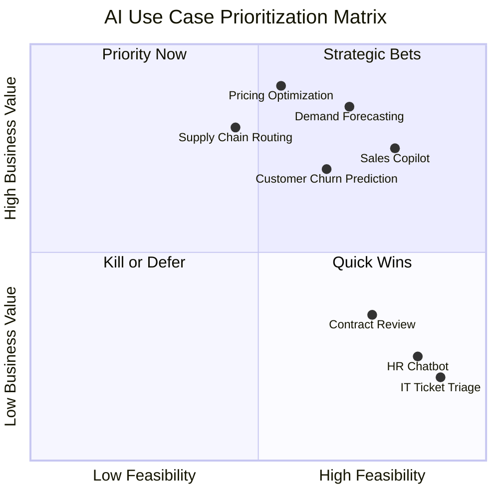
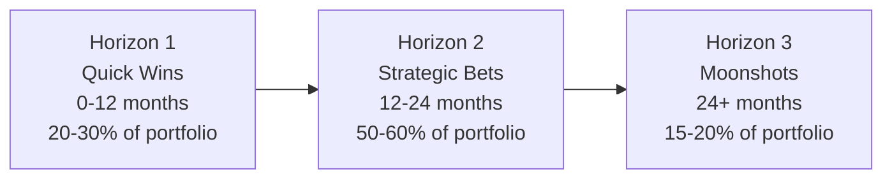

# Use Case Prioritization

Most organizations prioritize AI use cases wrong. They deploy in the places where deployment is easiest, not where it matters most. The result is a portfolio of AI investments that generates impressive activity metrics and disappointing business outcomes.

The structural bias is predictable: IT, HR, and legal functions are better organized, more digitized, and more willing to participate in AI pilots. They also represent a fraction of the value at stake. The core revenue functions (sales, manufacturing, supply chain, pricing) are harder to work with and worth far more.

!!! warning "The supporting function trap"
    BCG research shows that 70% of AI value potential is concentrated in sales, manufacturing, supply chain, and pricing. Most organizations have their AI investments concentrated in the opposite direction: HR, IT, legal, and finance support. The gap between where AI is deployed and where value is generated is the single largest driver of disappointing AI ROI.

---

## The Prioritization Matrix

Effective prioritization requires evaluating three variables simultaneously. Business value alone produces unrealistic portfolios. Feasibility alone produces low-impact portfolios. Risk alone paralyzes programs. The matrix holds all three in tension.



**Priority Now (high value, high feasibility):** These are the use cases to fund and execute immediately. They have a clear path to production and material business impact. They should anchor the near-term portfolio.

**Strategic Bets (high value, lower feasibility):** These are worth investing in, but they require prerequisite work: data readiness, process standardization, or technical infrastructure. Fund the prerequisites in parallel with Priority Now use cases.

**Quick Wins (lower value, high feasibility):** These are useful for building organizational AI capability and confidence, but they should not dominate the portfolio. Time-box them and move on.

**Kill or Defer (low value, low feasibility):** These should not be in the active portfolio. Many organizations carry a long tail of these because no one wants to kill an executive's pet project.

---

## Why Organizations Prioritize Wrong

The systematic failure mode has three causes:

**Access drives selection.** Business units that are organized, engaged, and present in planning processes get their use cases selected. Business units that are harder to engage (sales, operations, manufacturing) are underrepresented in the portfolio despite representing the majority of value.

**Feasibility is confused with priority.** Easy-to-implement use cases look attractive because they show early results. They are selected over harder, higher-value use cases. The portfolio fills up with feasible-but-marginal work.

**Risk aversion creates a floor.** High-value use cases often involve consequential decisions (pricing, underwriting, supply chain commitments). Risk aversion pushes programs toward lower-stakes applications where mistakes are less visible. Lower stakes correlates with lower value.

The correction is explicit: prioritize by value first, then assess feasibility and risk as factors that determine sequencing and prerequisites, not as factors that override value in the selection decision.

---

## The Scoring Framework

Use this framework to score use cases systematically. Score each criterion 1-5. Apply weights to reflect your organization's priorities.

| Criterion | Weight | Scoring Guide |
|-----------|--------|---------------|
| Revenue or cost impact | 30% | 1: Under $500K. 3: $1-5M. 5: Over $10M annually |
| Decision frequency | 20% | 1: Monthly or less. 3: Daily. 5: Real-time or continuous |
| Data availability | 20% | 1: Data does not exist or is inaccessible. 3: Data exists with quality issues. 5: Clean, accessible, governed |
| Process maturity | 15% | 1: Undocumented, highly variable. 3: Documented, some variation. 5: Standardized and stable |
| Time to value | 10% | 1: Over 24 months. 3: 12-18 months. 5: Under 6 months |
| Risk level (inverse) | 5% | 1: Highly regulated, high-stakes decisions. 3: Moderate. 5: Low stakes, low regulatory exposure |

**Weighted score calculation:**

```
Score = (Impact × 0.30) + (Frequency × 0.20) + (Data × 0.20) + (Process × 0.15) + (Time × 0.10) + (Risk × 0.05)
```

Use cases scoring above 3.5 (on a 5-point weighted scale) belong in the active portfolio. Use cases scoring below 2.5 should be killed or deferred. The middle band (2.5-3.5) requires a judgment call on whether the prerequisites can be addressed within an acceptable timeframe.

!!! tip "Calibrate the weights"
    The default weights above are reasonable starting points. Adjust them to reflect your organization's actual constraints. If data quality is consistently the binding constraint, increase the data availability weight. If regulatory risk is unusually high in your industry, increase the risk weight.

---

## Kill Criteria: When to Stop a Use Case

Many organizations have zombie AI projects: use cases that are technically alive (someone is working on them) but have no credible path to production value. Zombies consume capacity, distract leadership, and demoralize practitioners.

A use case should be killed when any of the following conditions are met:

**Strategic misalignment:**
- The business case has not been updated in more than six months
- The executive sponsor is no longer engaged
- The use case does not appear in any current business unit plan

**Data failure:**
- Required data cannot be made available within a defined timeframe (typically 90 days)
- Data quality issues are being cited in project reviews for the third consecutive cycle
- The data remediation cost exceeds 50% of the projected use case value

**Process failure:**
- The underlying process cannot be standardized within the program timeline
- Key subject matter experts are unavailable or disengaged
- Process owners cannot articulate what success looks like

**Technical failure:**
- Model performance has not met threshold requirements after two development cycles
- The technical approach requires infrastructure that is not on the roadmap
- The use case has been in POC for more than 12 months without a production pathway

**Commercial failure:**
- The ROI case has changed materially since original approval (due to market changes, organizational changes, or more accurate estimates)
- An alternative solution (non-AI) has emerged that delivers comparable value at lower cost and risk

!!! danger "Kill criteria require governance teeth"
    Kill criteria only work if the governance process has authority to act on them. Many AI program offices can identify zombie projects but cannot kill them without executive conflict. The governance model must include explicit authority to terminate investments, not just assess them.

---

## The Three Horizons Approach

A well-structured AI portfolio is not a single list prioritized by score. It is a portfolio structured across three investment horizons with different objectives, timelines, and risk profiles.



**Horizon 1: Quick Wins (0-12 months)**

Use cases with high feasibility, clear data readiness, and measurable outcomes achievable within the year. Primary purpose: build organizational confidence, demonstrate ROI, develop internal capability, and generate funding credibility for larger investments. These should not be trivial (an HR chatbot is not a quick win, it is a distraction), but they should be genuinely achievable within the timeframe.

Target examples: sales rep AI assist for call preparation, demand signal integration into existing forecasting tools, automated exception detection in a well-governed operational process.

**Horizon 2: Strategic Bets (12-24 months)**

High-value use cases in core business functions that require prerequisite work (data readiness, process standardization, infrastructure build). These should represent the majority of the portfolio budget because they represent the majority of the value. They are harder, which is why most organizations underinvest in them.

Target examples: pricing optimization with real-time market signal integration, supply chain disruption prediction and automated routing, AI-augmented customer renewal management.

**Horizon 3: Moonshots (24+ months)**

Transformational use cases that depend on capabilities the organization does not yet have and that would fundamentally change the competitive position if they succeed. These carry high uncertainty and should represent a minority of investment. They are not speculative for their own sake; they are aligned to a specific strategic thesis about where the industry is going.

Target examples: fully agentic customer acquisition workflows, real-time adaptive pricing at the individual customer level, AI-native product development cycles.

---

## Building the Priority Portfolio

The output of the prioritization process is a portfolio view, not a ranked list. The portfolio should show:

1. **Use cases by horizon**, with resource allocation per horizon visible
2. **Use cases by business function**, to make the value concentration decision visible
3. **Prerequisites by use case**, so infrastructure and data investments can be coordinated
4. **Dependencies between use cases**, to sequence work that shares infrastructure or data
5. **Kill candidates**, explicitly labeled so the governance process has a decision to make

Review the portfolio quarterly. Use case scores change as organizational conditions change (data becomes available, processes are standardized, market conditions shift). A quarterly review also creates a natural forcing function for kill decisions.

---

## Related Topics

- [Value Concentration](value-concentration.md): Why fewer, deeper investments outperform broad experimentation
- [From Pilot to Production](pilot-to-production.md): The stage-gate framework for moving prioritized use cases forward
- [AI Readiness Assessment](../assessment/ai-readiness.md): Whether organizational conditions support the portfolio you are building

---

## Sources

1. Boston Consulting Group. "Are You Generating Value from AI? The Widening Gap." September 2025.

For the complete source list and methodology, see [Sources & Methodology](../sources.md).
