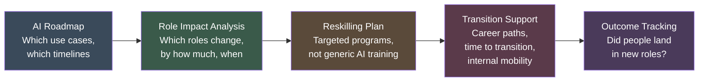

# Role Evolution

AI does not eliminate all jobs. That framing is both wrong and unhelpful. What it does is change the composition of work within almost every knowledge worker role, and eliminate the economic justification for roles whose primary function is information processing, routine analysis, or first-level triage.

The organizations that navigate this well are not the ones that either ignore the change or catastrophize it. They are the ones that plan for it specifically: which roles shrink, which roles grow, which new roles emerge, and how do people move between them.

**89% of workers express concern about AI's impact on job security** (WEF, 2025). That anxiety is not irrational. The appropriate organizational response is not reassurance. It is specificity: here is what is changing, here is what you will do next, here is the support available.

Only **46% of organizations integrate workforce planning into their AI roadmaps** (WEF, 2025). That gap is where transformation programs fail. You cannot deploy agents that change how work gets done without simultaneously changing how work is organized and who does it.

---

## Roles That Shrink

These roles are not eliminated overnight. They shrink through attrition, headcount reallocation, and redefinition rather than mass layoffs in most cases. But the volume of pure-play work they represent declines substantially.

**Manual data processing:** Data entry, format conversion, extraction from unstructured documents, report compilation from multiple sources. Agents handle these at near-zero marginal cost with acceptable accuracy for most business contexts.

**Routine analysis:** Standard variance analysis, templated reporting, first-cut competitive intelligence from public sources, summary generation from structured data. These tasks represent a significant fraction of analyst time at most organizations. Agents do not do analysis better than skilled analysts. They do the routine 60% faster and cheaper, which means fewer analysts are needed for the same throughput.

**First-level support:** Tier-1 customer service, IT helpdesk triage, HR policy lookups, internal knowledge retrieval. Well-designed agents resolve a large fraction of these interactions without human involvement. The fraction depends heavily on the quality of the underlying knowledge architecture.

**Scheduled reporting:** Any role whose primary output is a recurring report assembled from existing systems is at high substitution risk.

!!! note "On Attrition vs. Displacement"
    Most organizations will reduce these role categories through natural attrition rather than active layoffs. The ethical and practical priority is ensuring that people in these roles have a visible path to adjacent roles where human judgment still dominates. That path requires investment in reskilling. Most organizations are underinvesting.

---

## Emerging Roles

These roles either did not exist before or existed only in mature technology organizations. They are becoming standard requirements for any organization operating agentic systems at scale.

### AI Process Architect

The AI Process Architect converts how work actually gets done into formats that agents can execute. This is not documentation work. It is knowledge engineering: capturing decision logic, exception handling patterns, escalation criteria, and evaluation standards in structured, machine-readable forms.

The output of this role is the input that allows agents to perform reliably. Without it, agents either refuse to act (too many unknowns) or act badly (operating on incorrect assumptions about process).

This role requires a hybrid of business process expertise and technical fluency. The best candidates often come from management consulting, business analysis, or operations backgrounds with exposure to workflow automation. It is a new skill combination, not a renamed existing role.

### AI Program Lead / AI Generalist

PwC's 2026 workforce research identifies the AI Generalist as one of the highest-demand emerging roles across professional services. The core function is translation: between technical teams building agents and business teams who need to specify what those agents should accomplish and evaluate whether they succeed.

AI Program Leads understand enough about how agents work to identify what is technically feasible. They understand enough about business operations to identify what is actually valuable. They manage the program of agent deployments across a business unit or function.

This role absorbs many of the coordination and stakeholder management functions that previously sat in project management and business analysis roles, augmented with AI-specific knowledge.

### Agent Supervisor

As agents handle increasing volumes of work autonomously, someone needs to be accountable for monitoring that work: catching failure patterns, handling escalations, adjusting exception boundaries, and investigating anomalies.

The Agent Supervisor is not a technical role in the traditional sense. It requires judgment about when an agent's output is good enough versus when it requires human correction. It requires the domain knowledge to recognize a wrong output and the process knowledge to handle it.

Think of this role as analogous to a team leader in a contact center, but with a team of agents instead of humans. The span of supervision is much larger. The nature of the interventions is different. The skills required are a mix of domain expertise, process judgment, and operational oversight.

### Governance Specialist

AI governance has historically been an annual audit function: review the model, document the decisions, file the report. That model does not work for agents running thousands of decisions per day.

The Governance Specialist is a real-time function: monitoring agent behavior against policy constraints, flagging decisions that exceed authorization boundaries, managing the documentation of agent actions for regulatory purposes, and escalating systemic issues before they become incidents.

This role requires understanding both what the agents are doing and what the regulatory and policy constraints require. It is closer to a compliance operations role than a traditional audit function.

---

## Roles That Grow

The following capabilities become more valuable, not less, as agents handle more routine work.

**Judgment-heavy decision making:** Decisions that require weighing incomplete information, stakeholder relationships, ethical considerations, and long-term strategic context. These resist agent automation because they resist clean specification. Human judgment in these areas becomes a scarcer, more valued resource as routine analysis is automated away.

**Exception handling:** When agents handle the standard case, humans handle the non-standard cases. These are, by definition, the hard cases: unusual situations, adversarial actors, novel circumstances, emotionally charged interactions. The humans who handle these well need strong judgment, domain depth, and resilience. These become premium capabilities.

**Creative and strategic work:** Product direction, organizational strategy, customer relationship management at senior levels, innovation identification. These grow in relative importance as execution becomes cheaper and the bottleneck shifts to direction-setting.

**AI evaluation and feedback:** Someone needs to assess whether agent outputs are correct, appropriate, and aligned with organizational values. This requires domain expertise combined with understanding of what agents can and cannot do. It is skilled work that scales with agent deployment.

---

## The Workforce Planning Imperative

Role evolution is not self-managing. It requires explicit planning, investment, and accountability.

Workforce planning that is integrated with AI roadmaps looks like this: every agent deployment decision is accompanied by a workforce impact assessment that identifies which roles change, what the magnitude of change is, what the timeline is, and what the transition path is for affected people.

Workforce planning that is not integrated looks like: technology teams deploy agents, business units manage headcount decisions separately, HR runs generic AI literacy training that is unconnected to actual role changes, and the organization navigates the friction through attrition and quiet restructuring.

The second approach is the default. The first approach is the one that works.

---

## Sources

1. World Economic Forum. "Scaling AI with Strategy, Data and Workforce Readiness." October 2025.
2. PwC. "2026 AI Business Predictions." 2026.

For the complete source list and methodology, see [Sources & Methodology](../sources.md).
